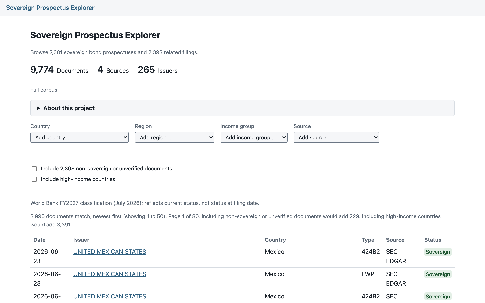
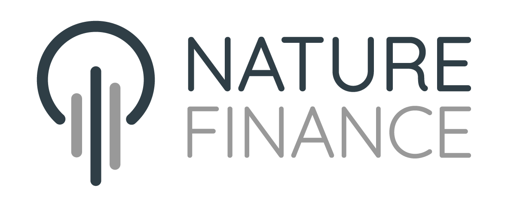

# Searching the Fine Print (at Scale)

An open source pipeline and web explorer for searching sovereign bond prospectuses and the contract terms inside them. Informed by the expert annotations from [#PublicDebtIsPublic](https://publicdebtispublic.mdi.georgetown.edu/).

## The explorer



Browse the full corpus at [prospectus.tealinsights.com](https://prospectus.tealinsights.com): 9,795 documents from 268 source-provided issuer names across five sources, filterable by country, region, income group, and source, with full-text reading and in-document search. Every document has a stable, shareable URL and, where the source provides one, a link to its original filing.

The explorer is a static site (Astro + DuckDB-WASM). No server, no database process, no accounts. The hosted version is this repository's code with Teal Insights branding on top; see [Open core](#open-core).

### Run your own copy

Verified end to end on a fresh clone (Node 22+):

```bash
git clone https://github.com/Teal-Insights/sovereign-prospectus-corpus.git
cd sovereign-prospectus-corpus/explorer-web
npm ci

# fetch the published snapshot index (1.8 MB; document text stays on the CDN)
mkdir -p ../data/snapshot
curl --compressed -o ../data/snapshot/MANIFEST.json https://data.tealinsights.com/prospectus/snapshot/MANIFEST.json
curl --compressed -o ../data/snapshot/documents.parquet https://data.tealinsights.com/prospectus/snapshot/documents.parquet

# build all ~9,800 pages (about 5 seconds on a laptop) and serve
SNAPSHOT_DIR=../data/snapshot \
PUBLIC_DATA_BASE_URL=https://data.tealinsights.com/prospectus/snapshot \
npm run build
node scripts/serve-static.mjs --dir dist --port 8080
```

That serves the complete explorer at `http://127.0.0.1:8080`, reading document text from the published data host. `dist/` is plain static files; host them on any CDN or web server that serves the app from the origin root. Routes are root-relative (`/doc/<slug>/`), so a GitHub Pages user or organization site or a custom domain works; a project site under a `/repo/` subpath does not.

To be fully independent of our hosting: run the pipeline to build your own corpus, generate a snapshot from the repo root with `uv run python scripts/build_snapshot.py`, host the snapshot directory on any static host that satisfies the checklist in [`explorer-web/ARCHITECTURE.md`](explorer-web/ARCHITECTURE.md) (section "Hosting constraints"), and point `PUBLIC_DATA_BASE_URL` at it.

To re-theme a fork: swap `explorer-web/src/styles/tokens.css` (the complete style-value inventory) and optionally drop `Head.astro` / `Header.astro` components into `explorer-web/src/brand/`. The theme contract is documented in [`explorer-web/ARCHITECTURE.md`](explorer-web/ARCHITECTURE.md) (section "Theme").

## What this does

1. **Collects** sovereign bond prospectuses from SEC EDGAR, the Luxembourg Stock Exchange, the London Stock Exchange, the FCA National Storage Mechanism, and the PDIP corpus. LSE coverage currently uses a bounded, verified manual ingest; an automated adapter is tracked separately.
2. **Locates** likely clause sections using deterministic pattern matching
3. **Extracts** clauses using LLMs with multi-shot prompts derived from PDIP's expert-annotated contracts
4. **Verifies** every extraction against the source text (95% verbatim match threshold)

The result: **9,145 potential clause matches** across **59 countries** and 6 clause families (collective action clauses, pari passu, governing law, sovereign immunity, negative pledge, events of default) from **4,800+ documents**.

These are potential matches, not validated findings. Validation requires expert legal review.

## Why

Sovereign debt legal expertise is scarce and expensive. The contract terms that govern how nations borrow, restructure, and default are buried in dense prospectuses. This pipeline narrows thousands of documents down to a manageable set of likely matches so lawyers can focus their time on judgment, not search.

## The proposal

This project was presented at the [#PublicDebtIsPublic Infrastructure Scoping Roundtable](https://publicdebtispublic.mdi.georgetown.edu/) on March 30, 2026 at Georgetown University Law Center. The accompanying proposal is available as a [Quarto book](https://teal-insights.github.io/sovereign-prospectus-corpus/).

## Quick start

```bash
git clone https://github.com/Teal-Insights/sovereign-prospectus-corpus.git
cd sovereign-prospectus-corpus
uv sync
uv run pytest -v
```

## Static snapshot for the web explorer

The web explorer consumes a static snapshot generated from the corpus database:

```bash
uv run python scripts/build_snapshot.py
```

This reads `data/db/corpus.duckdb` (read-only) and writes to `data/snapshot/`:

| Component | Contents |
|---|---|
| `documents.parquet` | One row per in-scope document: stable URL slug, issuer, display title, optional raw source title when normalization was applied, country, region, income group (World Bank classifications), source, publication date, document type, original-filing URL, text availability and size. Snappy-compressed, Int32 numeric columns (JS parquet-reader friendly) |
| `text/<slug>.json` | Per-document full text (Docling markdown, with per-page text as fallback) plus structure: `toc` (markdown headings h2 through h5, mojibake-filtered, capped at 2,000 entries) and `pages` (page-number/offset pairs, only for pages-sourced text; markdown text has no page anchors). Plain JSON, gzip-friendly |
| `MANIFEST.json` | Snapshot date, document counts by source, schema version, component sizes, unmapped-issuer and sovereign-flag audit lists |

Contract notes for consumers:

- **Identity:** the slug (derived from the pipeline's stable storage key `{source}__{native_id}`, e.g. `nsm__101126915` becomes `nsm-101126915`) is the only stable document identity; `document_id` is an internal sequence and may change on a DB rebuild.
- **Versioning and caching:** `MANIFEST.json` is the schema-version authority and must be read first, uncached; its presence marks a complete build (the builder deletes it at start and writes it last), and its `generated_at` works as a cache-busting token for text fetches, since text files are overwritten in place at stable URLs.
- **Offsets:** `toc[].offset` and `pages[].offset` are Unicode code point indices into `text`; `toc[].offset_utf16` carries the UTF-16 equivalent for JavaScript string indexing.
- **Nullable fields:** `issuer_name`, `title`, `raw_title`, `doc_type`, `publication_date`, `filing_url`, `page_count`, `country_code`, `lending_category`, `is_sovereign`, `text_source`, and `no_text_reason` can be null; `raw_title` is populated only when the displayed title was normalized from the source. `country_name`, `region`, and `income_group` use the string `"Unknown"` for unmapped issuers instead. Text JSON files up to ~29 MB exist (`text_bytes` in the parquet is the exact fetch size).
- **Text provenance:** document text is machine-converted (Docling markdown or extracted page text), faithful to the database but not a verbatim facsimile of the PDF layout; researchers should verify quotes against `filing_url`.

Options: `--db-path`, `--output-dir`, `--limit N` (smoke tests; requires an explicit `--output-dir` so a partial index never overwrites `data/snapshot`). The builder logic lives in `src/corpus/snapshot.py`; the script prints total size by component when it finishes.

The web explorer that consumes this snapshot lives in [`explorer-web/`](explorer-web/) (Astro + DuckDB-WASM; decisions and spike measurements in [`explorer-web/ARCHITECTURE.md`](explorer-web/ARCHITECTURE.md)).

## Tech stack

Pipeline: Python 3.12, DuckDB, Docling (PDF parsing), Click CLI, Plotly, Shiny. Explorer: Astro, TypeScript, DuckDB-WASM. MIT licensed.

## Open core

Everything that makes this tool work is MIT-licensed and public: the pipeline, the corpus snapshot builder, and the web application with its clean default theme. Everything that makes it ours (our name, our fonts, our hosted conveniences) sits in a thin private layer on top, and removing that layer costs a user nothing but the branding.

[prospectus.tealinsights.com](https://prospectus.tealinsights.com) is this repository's code, pinned at a public commit, with our house style applied through the documented theme contract: brand tokens and typefaces we license commercially and cannot redistribute. If you never touch our website, you lose nothing but the branding. Anyone can diff the deployed behavior against this repository and find no functional gap.

The Teal Insights name and logo are trademarks and are not part of the MIT grant. Details, including source-document provenance, are in [NOTICE](NOTICE).

## Part of SovTech

This project is part of the [SovTech](https://tealinsights.com) initiative, building open source infrastructure for sovereign debt analysis. Other SovTech tools include [QCraft](https://teal-insights.github.io/QCraft-App/), a user-friendly interface for the IMF's QCRAFT debt sustainability tool that also serves as a proof of concept for modular open source architecture. Supported by [NatureFinance](https://www.naturefinance.net/).

<p>
  <a href="https://tealinsights.com"></a>
  &nbsp;&nbsp;&nbsp;
  <a href="https://www.naturefinance.net/"></a>
</p>

## Contact

Teal Emery | [lte@tealinsights.com](mailto:lte@tealinsights.com) | [Teal Insights](https://tealinsights.com)
