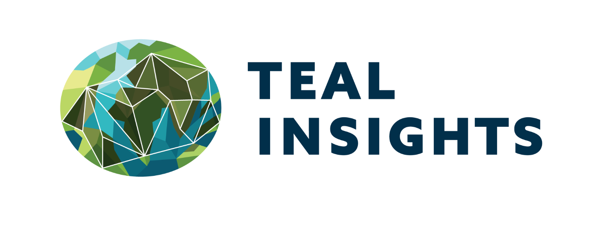
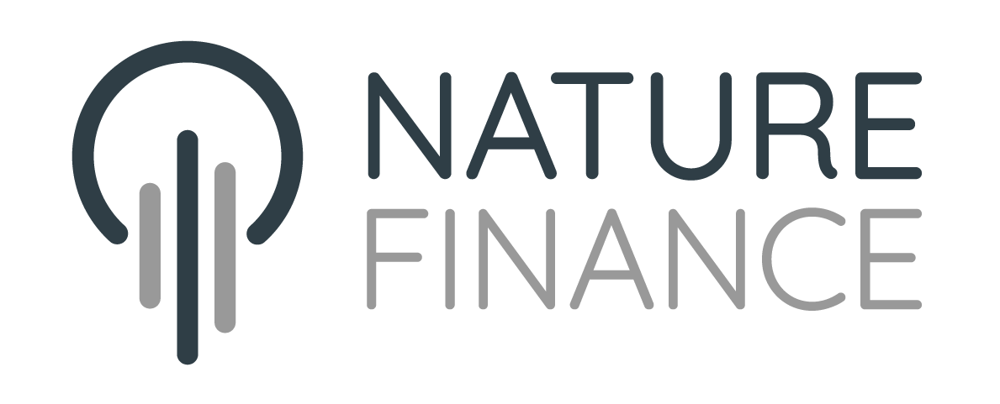

# Searching the Fine Print (at Scale) {.unnumbered}

**A proposal shared at the [#PublicDebtIsPublic](https://publicdebtispublic.mdi.georgetown.edu/) Infrastructure Scoping Roundtable, March 30, 2026, Georgetown University Law Center.**

```{python}
#| echo: false
#| fig-cap: "Countries with clause extractions in the corpus. Darker shading indicates more extracted clauses."

import pandas as pd
import plotly.express as px

country_to_iso3 = {
    "Albania": "ALB", "Angola": "AGO", "Argentina": "ARG", "Armenia": "ARM",
    "Austria": "AUT", "Bahrain": "BHR", "Belarus": "BLR", "Belize": "BLZ",
    "Bosnia and Herzegovina": "BIH", "Brazil": "BRA", "Cameroon": "CMR",
    "Canada": "CAN", "Chile": "CHL", "Colombia": "COL", "Cyprus": "CYP",
    "Ecuador": "ECU", "Egypt": "EGY", "Fiji": "FJI", "Finland": "FIN",
    "Gabon": "GAB", "Ghana": "GHA", "Hungary": "HUN", "Iceland": "ISL",
    "Indonesia": "IDN", "Israel": "ISR", "Italy": "ITA", "Jamaica": "JAM",
    "Jordan": "JOR", "Kazakhstan": "KAZ", "Kenya": "KEN", "Kuwait": "KWT",
    "Mexico": "MEX", "Moldova": "MDA", "Montenegro": "MNE", "Morocco": "MAR",
    "Netherlands": "NLD", "Nigeria": "NGA", "Panama": "PAN", "Peru": "PER",
    "Philippines": "PHL", "Qatar": "QAT", "Rwanda": "RWA",
    "Saudi Arabia": "SAU", "Senegal": "SEN", "Serbia": "SRB",
    "Sierra Leone": "SLE", "South Africa": "ZAF", "South Korea": "KOR",
    "Sri Lanka": "LKA", "Sweden": "SWE", "Turkey": "TUR", "Uganda": "UGA",
    "Ukraine": "UKR", "United Arab Emirates": "ARE", "Uruguay": "URY",
    "Uzbekistan": "UZB", "Venezuela": "VEN", "Zambia": "ZMB",
}

df = pd.read_csv("data/corpus_summary.csv")
by_country = df.groupby("country")["count"].sum().reset_index()
by_country.columns = ["country", "total_clauses"]
by_country["iso3"] = by_country["country"].map(country_to_iso3)
by_country = by_country.dropna(subset=["iso3"])

fig = px.choropleth(
    by_country,
    locations="iso3",
    color="total_clauses",
    hover_name="country",
    hover_data={"total_clauses": True, "iso3": False},
    color_continuous_scale="Teal",
    labels={"total_clauses": "Clause extractions"},
    projection="natural earth",
)
fig.update_layout(
    margin=dict(l=0, r=0, t=30, b=0),
    coloraxis_colorbar=dict(title="Extractions"),
    geo=dict(showframe=False, showcoastlines=True, coastlinecolor="lightgray"),
    height=420,
)
fig.show()
```

## The binding constraint

Sovereign debt legal expertise is scarce and expensive. The contract terms that govern how nations borrow, restructure, and default are buried in dense prospectuses that only a handful of specialists can interpret. If you believe this knowledge should be accessible to everyone, that is a problem.

## PDIP's down payment

[#PublicDebtIsPublic](https://publicdebtispublic.mdi.georgetown.edu/) has put down a serious down payment. Over 900 contracts on a public platform, with more than 160 annotated by research assistants who tagged over 100 contract terms with expert judgment. Those annotations are gold. They can serve as ground truth for automated extraction. And they can scale things up.

## A prototype as a proposal

I am a former Wall Street sovereign debt research analyst who became a huge data nerd and now builds grant-funded open source sovereign debt analysis tools for finance ministries and other stakeholders. Instead of writing up a proposal, I figured a prototype would make this more tangible. Here is a first try at how PDIP's expert annotations can scale:

```{mermaid}
%%| fig-cap: "The pipeline from sources to validated clauses"
flowchart TD
    A["SEC EDGAR"] --> S1
    B["FCA NSM"] --> S1
    C["PDIP"] --> S1
    D["More sources"] -.-> S1

    S1["Step 1 - Ingest documents from key sources (static now, can be made continuous)"] --> S2

    S2["Step 2 - Parse documents and preserve structure"] --> S3

    S3["Step 3 - Use PDIP annotations + ICMA model clauses as ground truth"] --> S4
    S4["Step 4 - Find candidate clauses via text patterns and document heuristics"] --> S5

    S5["Step 5 - Use best LLMs plus detailed prompts to eliminate obvious false positives"] --> S6

    S6["Step 6 - Lawyer-in-the-loop: Legal experts evaluate likely matches and edge cases"] --> S7
    S7["Step 7 - The flywheel: Each review makes the system better"] --> K

    K["THE GOAL - A small number of legal experts can annotate a massive number of documents, with new filings processed accurately as they come in"]

    style S1 fill:#e8f0fe,stroke:#4285f4,color:#1a1a1a
    style S2 fill:#e8f0fe,stroke:#4285f4,color:#1a1a1a
    style S3 fill:#e6f4ea,stroke:#34a853,color:#1a1a1a
    style S4 fill:#e6f4ea,stroke:#34a853,color:#1a1a1a
    style S5 fill:#fef7e0,stroke:#f9ab00,color:#1a1a1a
    style S6 fill:#fce8e6,stroke:#ea4335,color:#1a1a1a
    style S7 fill:#fce8e6,stroke:#ea4335,color:#1a1a1a
    style K fill:#e8f5e9,stroke:#2e7d32,color:#1a1a1a,stroke-width:3px
```

This prototype built steps 1-4. It pulled **4,800+ sovereign bond prospectuses** from three sources, and found **9,145 potential clause matches** across 6 clause families covering **59 countries**. These are candidates, not validated findings. Step 5 is what this roundtable can help make happen.

## The asks

Two things would make this real.

**First: a shared methodology for credibility.** What does it mean for an extraction to be "correct"? How do we measure confidence? What error rate is acceptable? These are questions for this community, not for one person with a prototype.

**Second: an organized clause review program.** PDIP is uniquely positioned to recruit and coordinate legal experts: law professors and their students, sovereign debt lawyers who want to do pro bono work. Each clause a lawyer reviews has a multiplicative effect. It does not just verify one extraction. It makes every future extraction more accurate. The eval workflow chapter lays out a proposal for how to do this efficiently.

This is open source. Free for anyone to use. I am building it regardless because I believe in it. But I think our approaches are complementary, and I would love to help.

## What the data shows so far

This prototype uses PDIP's expert-annotated contracts as ground truth to find likely clause matches across 3,300 prospectuses from the SEC's EDGAR and 650 from the FCA's National Storage Mechanism, two large public repositories that are hard to navigate by hand. The remaining 820 PDIP documents are included too. These are potential matches, not validated findings. But it is a lot faster than going through PDFs one by one.

::: {.callout-note}
## AI: don't trust, verify
AI has the potential to do a lot of the drudge work of reading thousands of prospectuses. But AI can also hallucinate. We do not want to blindly trust AI. Two ways to improve this:

1 - **Use the best models.** This project used Opus 4.6 and Sonnet 4.6, the current strongest models from Anthropic. We prompt those models with clear examples and edge case handling.

2 - **Evaluate models against lawyer-reviewed benchmarks.** This allows us to have quantitative measures of their accuracy, and to improve them over time.
:::

## Why this matters

What can you do with a searchable corpus of sovereign bond contract terms?

**Monitor global trends at scale.** This pipeline can be extended to process incoming prospectuses as they are filed. Policymakers could spot worrying trends in contract terms quickly, rather than discovering them after a crisis.

**Enable data-informed borrowing.** Sovereign debt issuers can make data-informed choices about the terms of their borrowing by seeing what comparable issuers have done.

**A resource for legal scholarship.** Researchers studying how sovereign debt boilerplate evolves across markets and over time currently work from small hand-collected samples. A validated corpus covering thousands of documents changes what questions are possible to ask.

## What this is not

This is a prototype, with all the frailties of prototypes. While I believe this is a promising approach, the technical methodology will benefit from the intelligence and critical thinking of this community. Any findings outside of the PDIP expert-annotated corpus should be thought of as potential clause matches that have not yet been validated and could be wrong.

## What you will find here

- **What the Data Shows** presents preliminary findings with interactive charts
- **The Eval Workflow** describes how lawyers can validate extractions and improve the dataset
- **A Call for Collaboration** outlines what a durable version of this system would require
- Two appendices cover technical details and the broader SovTech initiative

## Credits

Built by [Teal Insights](https://tealinsights.com) as part of the SovTech initiative, with support from [NatureFinance](https://www.naturefinance.net/). Open source under the MIT license, available on [GitHub](https://github.com/Teal-Insights/sovereign-prospectus-corpus).

{height=45} &nbsp;&nbsp; {height=45}

Questions, ideas, or want to collaborate? [Get in touch](mailto:lte@tealinsights.com).
