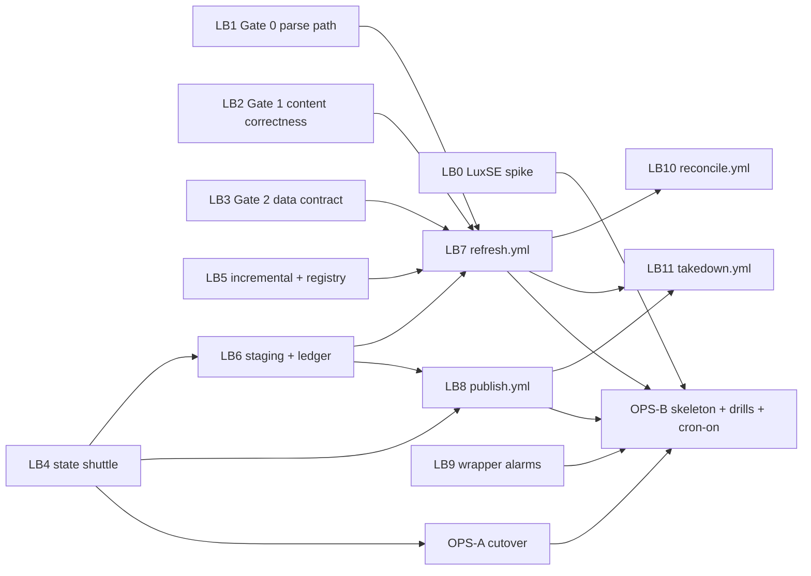

# Lane B Stage 2: Self-Running Corpus Branch Plan

> **For agentic workers:** REQUIRED SUB-SKILL: executors use
> superpowers:executing-plans on their own branch section only, via the
> paste-ready prompts in
> `docs/superpowers/plans/2026-07-19-lane-b-stage2-executor-prompts.md`.
> Steps use checkbox syntax for tracking. Executors decide nothing; a
> decision this plan does not make is a stop-and-report.

**Date:** 2026-07-19. **Architect:** Fable 5, Claude Code, per Project Shell
Runbook v0.2 Stage 2.
**Spec (authoritative):**
`docs/superpowers/specs/2026-07-18-self-running-corpus-design.md` v3.1,
Teal-signed 2026-07-18, merged in PR #127. Where a Linear issue body and the
spec disagree, the spec wins and the disposition is recorded on the issue.
**Seam deltas consumed:** the five deltas in section 4 of
`docs/superpowers/specs/2026-07-19-source-onboarding-dublin-design.md`
(merged, PR #129). Delta coverage map in section 9 of this plan.
**Linear:** TEA-1032 (LB1), TEA-1033 (LB6), TEA-1042 (LB7, umbrella),
TEA-1054 (auto-merge flip, later; this plan pins its proposed clean-cycle
number). Per-branch issues minted by this session: LB0 TEA-1058, LB2 TEA-1059,
LB3 TEA-1060, LB4 TEA-1061, LB5 TEA-1062, LB8 TEA-1064, LB9 TEA-1063,
LB10 TEA-1065, LB11 TEA-1067, OPS-A TEA-1066, OPS-B TEA-1068.

**Goal:** land the spec's whole definition of done (spec section 20): three
correctness gates merged first, S3-canonical state with a fenced single
writer, a daily PR-gated refresh workflow, journaled deploy-first publish
with CAS activation, weekly reconcile, epoch-fenced takedown, per-signal
alarms reaching lte@tealinsights.com, keepalive by artifact, and the walking
skeleton plus drills run against production.

**Architecture (one paragraph):** everything heavy is immutable
(content-addressed originals, immutable state revisions, generation-addressed
public snapshots); every mutable surface is a small fenced pointer
(STATE.json, the live MANIFEST, the refresh lock); every multi-step public
mutation is journaled so a torn run resumes. refresh.yml stages private
candidates and opens one PR; a human merge triggers publish.yml, which
deploys the site against the new generation BEFORE a single
compare-and-swap MANIFEST flip. Suppression is epoch-fenced so takedown can
never be undone by a stale candidate.

**Tech stack:** Python 3.12 + uv, Click CLI verbs in `src/corpus/`, boto3
(new dependency) behind a fake-able store seam, zstandard (new dependency)
for state revisions, GitHub Actions (SHA-pinned), gh CLI for issues/PR/CI
dispatch, netlify-cli (pinned npm) for deploys, DuckDB 1.4.4, Polars.
TypeScript only in LB3 (explorer data layer) and LB9 (wrapper smoke).

## Global constraints (verbatim from spec and repo standards)

- Gates LB1, LB2, LB3 and the staging branch LB6 merge before LB7
  (refresh.yml) exists. No scheduler work lands earlier. (Spec sections
  6-8, 20; TEA-1032/TEA-1033 sequencing.)
- Python: Polars not Pandas, DuckDB not SQLite, Click, ruff + pyright basic
  + pytest per `.github/workflows/ci.yml`. Match what CI runs.
- Atomic writes only: `safe_write()`, `.part` then rename. Never overwrite
  a content-addressed or generation-addressed object.
- Verbatim extraction rules are untouched (no grep/extract in the daily
  loop; Gate 1 only marks `grep_matches` stale).
- No Selenium anywhere in the GHA lane. No Prefect/Dagster/Luigi.
- All third-party actions SHA-pinned in every workflow this plan touches or
  creates. Dependabot (`github-actions` ecosystem) lands in LB7's PR.
- Secrets: AWS via OIDC only, four scoped roles; `NETLIFY_AUTH_TOKEN` is
  the only new repo secret; role ARNs and site ids are repo variables.
- Privacy: no names of individual users or firms in anything committed to
  either repo (the standing rule; private memos are cited by file name
  only).
- No em-dashes in any committed artifact, code comment, or PR text.
- `docs/refresh-runbook.md` is touched by several parallel branches; a
  merge conflict there is mechanical: keep both sections under their own
  stable `##` headings (same rule class as the build-metrics
  keep-both-lines rule).
- Any action requiring the AWS console, Netlify dashboard, or GitHub
  settings UI is a Teal handoff item (section 10), never an executor
  improvisation. Executors STOP and report when they hit one.
- Cron stays OFF until OPS-B flips it after the walking skeleton and
  drills pass (spec section 18 ordering: spike before cron-on).

## 1. What exists today (chair-verified at ea08c17, 2026-07-19)

| Fact | Where |
|---|---|
| Parse routes `.pdf` to Docling, `.htm/.html` to BeautifulSoup HTMLParser, `.txt` to PlainTextParser; only Docling produces the markdown sidecar | `src/corpus/cli.py:751-756`, sidecar at `cli.py:867-875` |
| Parse skip is disk-keyed (`output_path.exists()`) | `cli.py:801` |
| Ingest skips any existing `storage_key`; no update path exists | `src/corpus/db/ingest.py:169-174` |
| `build-pages` always drops and recreates FTS | `src/corpus/cli.py:1262-1294`, `src/corpus/db/pages.py:100` |
| Snapshot raises on slug collision (aborts the whole build) | `src/corpus/snapshot.py:283-286` |
| Snapshot `filing_url` is `COALESCE(source_page_url, download_url)` | `snapshot.py:250` |
| MANIFEST has no `generation`, `data_base`, or `suppression_epoch` | `snapshot.py:83-93` |
| Explorer resolves all data URLs from `PUBLIC_DATA_BASE_URL`; callsites `browse.ts:491,504` and `doc-text.ts:117,806`; client hard-checks `schema_version === 1` | `explorer-web/src/lib/snapshot-client.ts`, `urls.ts` |
| Wrapper `build.sh` already honors `BUILD_DATA_FETCH_BASE` for MANIFEST + parquet acquisition | `~/Code/prospectus-web-ti/scripts/build.sh` |
| Wrapper live-smoke: 3 checks, `permissions: contents: read`, tag-pinned actions | `~/Code/prospectus-web-ti/.github/workflows/live-smoke.yml` |
| corpus ci.yml: tag-pinned actions, no `workflow_dispatch` trigger | `.github/workflows/ci.yml` |
| NSM API supports `dateCriteria` on `submitted_date` with from/to ISO values | `docs/nsm_api_reference.md:102-110,168-171` |
| EDGAR discovery iterates `SOVEREIGN_CIKS` tiers, full sweep incl. older-page pagination every run | `src/corpus/sources/edgar.py:157-220` |
| Discovery outputs land at `data/<source>_discovery.jsonl` | `src/corpus/reporting.py:25-29` |
| No `docs/coverage/`, no `docs/refresh/`, no `data/config/source_state/` yet | repo tree |
| pyproject has `docling>=2.86.0`; no boto3, no zstandard | `pyproject.toml` |
| Repo: `Teal-Insights/sovereign-prospectus-corpus`; wrapper repo private at `~/Code/prospectus-web-ti` | `git remote -v` |

## 2. Shared contracts (the backbone; every branch cites this section, nobody redefines it)

### 2.1 Identifiers

- `run_id`: `refresh-<UTC YYYYMMDDTHHMMSSZ>-<GITHUB_RUN_ID>` in Actions;
  `refresh-<UTC>-local<uuid8>` off-Actions. Reconcile uses prefix
  `reconcile-`, takedown `takedown-`, cutover `cutover-`.
- Generation id `<gen>` = the `run_id` of the refresh run that built the
  candidate. One id namespace; lexically sortable.

### 2.2 Buckets and prefixes

Private pipeline bucket `ti-sovtech-pipeline` (new; Block Public Access on;
versioning on; lifecycle: noncurrent versions expire at 14 days):

```
state/STATE.json                          fenced pointer (2.3)
state/revisions/<run_id>/corpus.duckdb.zst
state/revisions/<run_id>/manifests.tar.zst
state/revisions/<run_id>/source_state.tar.zst   (data/config/source_state/*)
state/parsed/<storage_key>.jsonl|.md      parsed tree mirror, synced incrementally
state/suppressions.jsonl                  takedown ledger (2.8)
originals/<storage_key>/<sha256>.<ext>    content-addressed, never overwritten
incoming/<source>/<run-ts>/               Mini feeder staging (contract only in v1)
candidates/<gen>/snapshot/                staged candidates (full snapshot layout)
locks/refresh.lock                        single-writer lease (2.4)
journal/publish/<gen>.json                publish phase journal (2.7)
```

Public data bucket `ti-sovtech-data` (exists):

```
prospectus/snapshot/MANIFEST.json               THE live pointer, no-store
prospectus/generations/<gen>/snapshot/          immutable: MANIFEST.json,
                                                documents.parquet, LEDGER.json,
                                                register.json, text/<slug>.json
prospectus/health/refresh.json                  operational beacon, no-store
prospectus/snapshot/(text/*, documents.parquet) LEGACY stable objects: frozen at
                                                first new-model activation, never
                                                written again, pruned never (v1);
                                                reconcile's stale-object report
                                                covers them
```

All gzip-at-rest conventions follow the existing upload script: text gzip
level 6, parquet and MANIFEST level 9, Python `gzip` with `mtime=0`
(equivalent of `gzip -n`), `Content-Encoding: gzip` metadata, immutable
cache-control on generation objects, `Cache-Control: no-store` set by
metadata on the live MANIFEST, health beacon, and any register copy at a
stable URL.

### 2.3 STATE.json (schema_rev 1)

```json
{
  "schema_rev": 1,
  "revision_id": "refresh-20260722T091500Z-16234567890",
  "artifacts": {
    "corpus.duckdb.zst":   {"sha256": "<hex>", "bytes": 0},
    "manifests.tar.zst":   {"sha256": "<hex>", "bytes": 0},
    "source_state.tar.zst": {"sha256": "<hex>", "bytes": 0}
  },
  "suppression_epoch": 0,
  "updated_at": "2026-07-22T09:31:00+00:00",
  "updated_by_run": "refresh-20260722T091500Z-16234567890"
}
```

sha256 values name the COMPRESSED bytes (spec round-1 disposition). Writes
are conditional: PUT with If-Match on the ETag read at restore time; a
mismatch aborts the run with the `refresh failure` alarm. First-ever write
(cutover) uses If-None-Match `*`.

### 2.4 Lock protocol (CAS lease; no unconditional delete anywhere in the lock path)

S3 general-purpose buckets support conditional PUT (If-None-Match `*`,
If-Match ETag) but NOT conditional DELETE, so the spec's "owner-checked
conditional delete" intent is implemented as a compare-and-swap lease over
one object that is never deleted by the lock protocol (recorded deviation:
same guarantee, different primitive; runbook notes it).

`locks/refresh.lock` body: `{"state": "held" | "released",
"holder_run_id": "...", "acquired_at": "<iso>",
"workflow": "refresh|reconcile|takedown|local"}`.

- Acquire: if the object is absent, PUT If-None-Match `*` with
  `state: held`. If present, GET (body + etag); if `state: released`,
  CAS-PUT the new `held` lease with If-Match on that etag (a lost race
  surfaces as PreconditionFailed; re-read and retry once, then abort).
- Release: CAS-PUT `{state: released, holder_run_id: self, ...}` with
  If-Match on the lease's current etag after verifying the body still
  names self, in an `if: always()` step. A PreconditionFailed on release
  means the lease changed hands (a breaker acted); log loudly, do not
  retry, never overwrite blind.
- Stale break: on acquire conflict with `state: held`, if `acquired_at`
  is older than 7 hours AND the GitHub API says the holder run is not
  `in_progress` (holder `local` is never auto-broken), CAS-PUT the
  breaker's own `held` lease with If-Match on the etag READ WITH the
  stale body; any intervening release/acquire changes the etag and the
  CAS fails, so a live third party can never be clobbered. Retry the
  whole acquire once, then abort with an alarm, touching nothing.
- Zombie fence: immediately before the STATE.json conditional PUT, GET
  the lock; if `state` is not `held` or `holder_run_id` is not this run,
  abort without committing.
- Local takeover: `corpus state acquire-lock --holder local` uses the
  identical CAS protocol; documented in the runbook, used by cutover and
  any manual run.

### 2.5 Per-source watermarks

`data/config/source_state/<source>.json` (rides `source_state.tar.zst` in
every revision; matches the source-onboarding spec's local pointer file so
the two builds converge):

```json
{"source": "edgar", "watermark": "2026-07-18", "updated_at": "<iso>", "run_id": "<run_id>"}
```

Commit is an atomic same-directory rename. The candidate watermark computed
during discovery becomes durable ONLY at the refresh run's state commit
(step order in 5.LB7), and only if every record in the window reached a
terminal non-failure state (downloaded or any `skipped_*`).

**Failure persistence (owner: LB5; wired into health/register by LB7).**
The same pointer file carries the retry ledger for records that have no
`documents` row yet:

```json
{"source": "edgar", "watermark": "2026-07-18", "updated_at": "<iso>",
 "run_id": "<run_id>",
 "failed_records": {"<native_id>": {"attempts": 2, "last_status": "failed_http",
                     "first_failed": "<iso>"}},
 "download_quarantine": {"<native_id>": {"reason": "failed_http x3",
                     "quarantined_at": "<iso>"}}}
```

A `failed_*` outcome increments `attempts`; a success removes the entry.
At `attempts >= 3` the record moves to `download_quarantine`, STOPS
blocking watermark advancement, and is surfaced as a register row entry
and the health `download_quarantine_count` (so one permanently dead URL
cannot freeze the watermark forever, and the quarantine is visible, not
silent). Reconcile's full-window pass retries download-quarantined
records once weekly. Incremental windows re-query a 3-day overlap
(`since = watermark - 3 days`); the ingest and download skip sets absorb
the overlap.

### 2.6 Health beacon, RUN.json, holdings register

`prospectus/health/refresh.json` (no-store), written every refresh run,
including no-change and failed runs (failure writes `outcome: "failed"`
from the failure handler when credentials permit):

```json
{
  "schema_rev": 1,
  "run_id": "...", "completed_at": "<iso>", "outcome": "green",
  "pending_candidate": {"gen": "...", "created_at": "<iso>", "pending_since": "<iso>"},
  "parse_backlog": 0, "quarantine_count": 0, "download_quarantine_count": 0,
  "db_bytes": 0,
  "sources": {
    "edgar": {"last_discovery_success": "<iso>", "last_new_document_date": "2026-07-18",
               "new_documents": 0, "consecutive_zero_days": 0,
               "freshness_red_days": 3, "outcome": "ok"}
  }
}
```

`consecutive_zero_days` is maintained by the beacon writer (increment on a
zero-new day, reset otherwise); it is the persistent history the 21-day
zero-finds heuristic needs, so no run has to read old beacons.
`pending_since` is preserved from the PRIOR beacon whenever a candidate
was already pending, even though supersede-not-stack changes the gen id
daily; the lag alarm keys on `pending_since`, so an unmerged week nudges
and reds as the spec intends instead of resetting every morning.
`freshness_red_days` is stamped per source from config
(`[<source>.alarms]` override or the cadence-class default), so the
wrapper evaluator needs no access to corpus config. `db_bytes` is the
compacted DB size after this run (feeds the 9 GB size alarm, spec risk
4). The `sources` map contains ONLY the daily lane (cadence_class
`active-feed`, venue `gha`, `scheduled = true`); pdip's weekly discovery
is observed by reconcile's own failure alarm and the zero-finds
cross-check, never by a daily staleness threshold, so an archive source
can never page anyone for being an archive.

`pending_candidate` is null when no unmerged candidate exists.

`docs/refresh/RUN.json`, committed to branch `refresh/daily` EVERY run (the
keepalive, locked mechanism; also the publish trigger file):

```json
{
  "schema_rev": 1, "run_id": "...", "completed_at": "<iso>",
  "candidate": null, "suppression_epoch": 0,
  "counts": {"discovered": 0, "downloaded": 0, "parsed": 0, "ingested": 0,
              "updated": 0, "quarantined": 0},
  "by_source": {"edgar": {"discovered": 0, "new": 0}},
  "sampled": [{"storage_key": "...", "title": "...", "source_url": "..."}],
  "metrics": {"wall_seconds": 0, "db_bytes": 0}
}
```

The `metrics` block is the spec section 24 per-run recording surface, so
budget drift is visible in the repo history, not discovered.

`candidate: null` means merge publishes nothing, by contract.

Holdings register `docs/coverage/register.json` + `register.md`
(human-readable render of the same rows), committed only when holdings
change, copied into every generation. Per-source row fields: `source`,
`display_name`, `cadence_class`, `scheduled`, `adapter_status`,
`documents` (count), `known_gaps` (config-declared strings, e.g. the LSE
"adapter pending, TEA-1008" row and, until LB10's listing revalidation
extension lands, the seam-delta-3 limitation line "listing URLs are not
re-checked"), `quarantine` (sorted storage_keys with reasons),
`download_quarantine` (sorted native_ids with reasons), `suppressions`
(count only). **Onboarding-contract fields, rendered conditionally** (the
source-onboarding spec 5.6 declares them; Lane B's builder renders each
when its store exists, and emits a known-gap limitation line while it
does not): `listings` (count of attested listings on other sources'
documents, when `document_listings` exists), `near_dup_pending` and
review-lane items with stable detected dates (when the advisory store
exists), `tos` pointer (when `docs/sources.md` exists). NO run ids, NO
timestamps of latest run, nothing that changes on a no-change day
(review-lane items change the register only when items appear or
resolve, which are real changes). Serialization:
`json.dumps(..., indent=2, sort_keys=True) + "\n"` so no-change days are
byte-identical.

### 2.7 Generation ledger and publish journal

`LEDGER.json`, one per generation, immutable:

```json
{
  "schema_rev": 1, "gen": "...", "suppression_epoch": 0,
  "parquet_sha256": "<hex>", "register_sha256": "<hex>",
  "text": {"<slug>": "<sha256 of the UNCOMPRESSED text json bytes>"}
}
```

Empty delta rule: candidate is created only if `text` map, `parquet_sha256`,
or `register_sha256` differ from the ACTIVE generation's ledger (fetched
from its immutable URL; the live MANIFEST's `generation` field names it).
MANIFEST's `generated_at` never participates in the comparison.

`journal/publish/<gen>.json`: phases `open, copy, deploy, activate, smoke,
close`, each recorded with `{"intent_at": iso}` BEFORE executing and
`{"done_at": iso, ...evidence}` after. `open` captures
`{prev_manifest_etag, prev_gen, prev_deploy_id}`; the `activate` intent
additionally records `{target_gen, expected_prev_etag}`. A publish re-run
resumes at the first phase without `done_at` and never re-decides a
completed phase. **Mid-activation tear rule (the one phase where intent
and effect can be torn):** resuming at `activate`, first GET the live
MANIFEST; if its `generation` equals the journaled `target_gen`, the CAS
already landed (only this journal's run can write that generation, under
the shared `activation` concurrency group and the epoch fence), so record
`done_at` with `resumed_verified: true` and PROCEED TO SMOKE; otherwise
attempt the CAS with `expected_prev_etag` as normal, and a CAS failure
with a third generation live aborts with an alarm. This is not the
rejected round-2 equality shortcut: completion of the RUN is never
inferred, the smoke always still runs, and only the single already-won
CAS is recognized instead of retried into a wedge.

### 2.8 Suppression ledger

`state/suppressions.jsonl`, append-only:

```json
{"epoch": 1, "storage_key": "edgar__X", "reason": "...", "requested_by": "teal", "at": "<iso>", "action": "suppress"}
```

Current epoch = max epoch in the file, 0 when absent. One takedown action
appends one record per equivalence-class member, all sharing one new epoch
(previous max + 1). Candidates and MANIFESTs record the epoch they were
built against; publish refuses stale epochs (LB8 phases 1 and 5).

### 2.9 Alarm signals (exact issue titles; find-or-create by exact title)

Corpus repo issues (each corpus workflow writes its own repo's issues):
`alarm: refresh failure`, `alarm: publish failure`, `alarm: reconcile
failure`, `alarm: takedown failure`, `alarm: parse backlog`, `alarm:
quarantine growth`, `alarm: zero finds <source>`, `alarm: state
integrity`, `alarm: state size` (db_bytes > 9 GB, refresh self-check;
spec risk 4's committed mitigation), `alarm: review pending <source>`
(evaluated by reconcile ONLY when the source-onboarding review-lane store
exists; threshold from `[<source>.alarms].review_pending_days`, so
Dublin's arrival needs zero Lane B edits).

Wrapper repo issues (live-smoke writes these): `alarm: pipeline liveness`,
`alarm: publication lag`, `alarm: freshness <source>`, `alarm: incoming age
<source>` (future feeder).

Lifecycle: a firing signal finds-or-creates its issue and comments evidence
(workflow name, run URL, failing step or threshold numbers). The NEXT green
evaluation of THAT signal closes it. Distinct signals never share an issue.
Thresholds (spec section 14): liveness beacon age > 2 days red; publication
lag keyed on `pending_candidate.pending_since` (survives daily candidate
supersedes), > 4 days nudge (comment, stay green), > 8 days red;
per-source `last_discovery_success` older than that row's own
`freshness_red_days` = red (the beacon carries only daily-lane sources
and stamps each row's threshold from config, so the wrapper evaluator is
cadence-aware without reading corpus config); zero-finds = 21 consecutive
zero-new days AND weekly full-window reconcile also zero; `parse_backlog`
> 500 red; quarantine any week-over-week growth red; incoming age > 7
days red. `scheduled = false`, `adapter_status = "pending"`, and
non-daily cadence classes never appear in the beacon `sources` map, so
they are exempt from freshness and zero-finds by construction.

### 2.10 Config vocabulary (identical key names to the source-onboarding spec so either build lands first and configs converge)

`config.toml` gains, in LB5:

```toml
[corpus]
active_sources = ["nsm", "edgar", "pdip", "luxse", "lse"]

[nsm]
display_name = "FCA NSM"
cadence_class = "active-feed"    # active-feed | archive | feeder-staged
execution_venue = "gha"          # gha | feeder
feed_routing = "new-feed-eligible"
scheduled = true
# ...existing nsm keys unchanged...
```

Values per source: nsm active-feed/gha/true; edgar active-feed/gha/true;
pdip archive/gha/true; luxse active-feed/gha/false (flipped by OPS-B per
the LB0 spike outcome); lse gets a minimal new block with
`display_name = "LSE RNS"`, `adapter_status = "pending"`, known-gap note
"adapter pending, TEA-1008". `scheduled` here is enrollment for the
SCHEDULED lanes only; cron-off means nothing runs regardless.

Helper (LB5): `src/corpus/sources/source_config.py` with
`source_descriptors(config) -> dict[str, SourceDescriptor]` and
`scheduled_sources(config, *, cadence_class, execution_venue="gha") ->
list[str]`, plus CLI `corpus source list [--cadence X] [--venue Y]
[--scheduled-only] [--names-only]`. refresh.yml derives its default source
list from this command; the `sources` dispatch input is an override (seam
delta 1 satisfied). The source-onboarding build's full registry later
consumes the same config keys; this helper never resolves modules.

### 2.11 New CLI verbs (names fixed here)

LB2: `corpus build-pages --skip-fts`; `corpus quarantine sync|clear`.
LB3: `corpus snapshot build [--data-base URL] [--generation GEN]
[--suppressions PATH] [--limit N]`.
LB4: `corpus state acquire-lock|release-lock|restore|commit|status|
compact|cutover|verify-restore`.
LB5: `corpus source list` (the SAME verb name the source-onboarding spec
5.11 defines; Lane B ships the config-derived subset with `--cadence`,
`--venue`, `--scheduled-only`, `--names-only` flags, and the onboarding
build later extends the same command with registry/ToS columns, extension
not fork); `corpus discover edgar|nsm --mode incremental|full --since
DATE`; `corpus download edgar|nsm` skip decisions re-keyed on restored
manifests (2.5).
LB6: `corpus ledger compute|diff`; `corpus stage candidate`.
LB7: `corpus ops health-write|register-build|run-json-write|pr-body|
pr-upsert|archive-originals|alarm fire|alarm resolve`.
LB8: `corpus publish run|rollback|smoke`.
LB10: `corpus reconcile run [--deep] [--dequarantine KEY]`.
LB11: `corpus takedown run --storage-key KEY --reason TEXT`.

### 2.12 OIDC roles and GitHub settings (created by Teal from committed JSON; section 10)

Role names: `ti-sovtech-gha-refresh`, `ti-sovtech-gha-publish`,
`ti-sovtech-gha-reconcile`, `ti-sovtech-gha-takedown`. Policy and trust
documents are committed by LB6 at `infra/pipeline/` as
`role-<name>.policy.json` + `role-<name>.trust.json`. Scopes per spec
section 13 PLUS the positive permissions each workflow's own operations
require (LB6's `test_role_policies.py` asserts required-operation
coverage per role, not only scoping): refresh additionally needs
data-bucket `s3:GetObject` + `s3:ListBucket` on
`prospectus/generations/*` (server-side copy source and active-ledger
reads); reconcile needs the same read scopes for its ledger-vs-objects
sweeps; takedown needs, beyond its deletes, invalidation, and publish
scopes, data-bucket `s3:ListBucket` (prefix-conditioned to
`prospectus/generations/*`, to enumerate retained generations before
deleting class-member text) and pipeline-bucket access for its own
phases: `locks/*` RW (the state lock), `state/*` read +
`state/suppressions.jsonl` write, `candidates/*` RW (the sanitized
candidate), and `journal/*` RW.
Takedown's trust subject is
`repo:Teal-Insights/sovereign-prospectus-corpus:environment:takedown`, the
other three use `repo:...:ref:refs/heads/main`. Repo variables:
`AWS_ROLE_REFRESH`, `AWS_ROLE_PUBLISH`, `AWS_ROLE_RECONCILE`,
`AWS_ROLE_TAKEDOWN`, `PIPELINE_BUCKET=ti-sovtech-pipeline`,
`DATA_BUCKET=ti-sovtech-data`,
`DATA_BASE_URL=https://data.tealinsights.com`,
`SITE_BASE_URL=https://prospectus.tealinsights.com`,
`NETLIFY_SITE_ID=<site id>`, `CLOUDFRONT_DISTRIBUTION_ID=<id>`. Secret:
`NETLIFY_AUTH_TOKEN`. GitHub Environment `takedown`: required reviewer
Teal, deployment branch rule main.

## 3. Branch cut, dependencies, dispatch



| Wave | Branches | Venue | Notes |
|---|---|---|---|
| 0 (now, parallel) | LB1, LB2, LB3, LB4, LB5 | Claude Code, Opus 4.8 max | Separate worktrees, separate sessions. All independent of each other. |
| 0 (now, parallel) | LB0 | Codex, gpt-5.6-sol xhigh | Spike; TDD waived; gates only cron-on, so it must merely finish before OPS-B. |
| 1 (after LB4; rebase over LB3 if later) | LB6 | Claude Code, Opus 4.8 max | TEA-1033. Merges before LB7. |
| 1 (anytime after plan merge) | LB9 | Codex, gpt-5.6-sol xhigh | Wrapper repo only; builds against the pinned 2.6 schemas. |
| 2 (after LB1+LB2+LB3+LB4+LB5+LB6 ALL merged) | LB7 | Claude Code, Opus 4.8 max | The L branch. TEA-1042. |
| 2 (after LB4+LB6; merges after LB7) | LB8 | Claude Code, Opus 4.8 max | Builds in parallel with LB7 against contracts 2.6-2.8. |
| 3 (after LB7+LB8) | LB10, LB11 | Claude Code, Opus 4.8 max | Parallel with each other. |
| OPS-A (after LB4 + Teal handoff items 1-2) | cutover session | Claude Code, Opus 4.8 max | Operational, no new code. |
| OPS-B (after LB0, LB7, LB8, LB9, LB10, LB11 ALL merged + OPS-A + Teal items 3-7) | skeleton + drills + cron-on session | Claude Code, Opus 4.8 max | Operational; Teal in the loop at named gates. |

Every branch merges through the Stage 4 review gate (fresh session, council
code review, Codex xhigh required), never by its executor. The Runbook's
walking-skeleton-first rule is satisfied in spec terms: the spec's own gate
order (sections 6-8) makes LB1-LB6 the risk front-load, and the skeleton
(spec section 19) is by definition the first moment end-to-end execution is
possible, which is OPS-B's first step.

## 4. Wave 0 branches

### LB0: LuxSE hosted-runner spike (Codex xhigh; TDD waived; spike per Runbook)

**Linear:** TEA-1058. **Branch:** `lte/lb0-luxse-runner-spike`.

**Files:**
- Create: `.github/workflows/luxse-spike.yml` (workflow_dispatch only)
- Create: `scripts/luxse_spike_report.py` (assembles the evidence JSON)

**Tasks:**
- [ ] Workflow on `ubuntu-latest`: checkout (SHA-pinned), uv sync, then
  (a) `uv run corpus discover luxse --run-id spike-<ts>` with production
  headers and delays from config.toml, capped by a new `--max-queries 3`
  option if trivially addable, else run full discovery (it is
  metadata-only); (b) download exactly TWO documents from the discovery
  output via `uv run corpus download luxse` with a `--limit 2` option
  (add the option if absent; both adapters' run functions accept a record
  list slice, so this is a small CLI change, and it must not alter default
  behavior); (c) parse one downloaded PDF with Docling COLD (no cache),
  then again WARM, recording wall times; (d) run the Gate 0 HTML
  conversion offline assertion if LB1 has merged (skip with a note if
  not); (e) upload the evidence JSON as a workflow artifact.
- [ ] Dispatch ordering: workflow_dispatch is only available once the
  workflow file exists on the default branch, so this branch merges the
  (inert, dispatch-only) workflow FIRST via the review gate, then the
  executor dispatches `gh workflow run luxse-spike.yml` and records.
  Task (d) of the workflow (the Gate 0 HTML offline assertion) runs only
  if LB1 has merged by dispatch time; otherwise the evidence JSON notes
  it as skipped.
- [ ] Record on the LB0 Linear issue: pass/fail per probe (discovery HTTP
  outcomes, download outcomes with %PDF checks, cold/warm Docling seconds),
  and the one-line LuxSE ToS conclusion drafted for `docs/sources.md`
  (flagged for Teal confirmation; the source-onboarding build owns the
  file).

**DoD:**
- Workflow merged and dispatched; run URL and evidence artifact linked on
  the issue.
- Both downloads validated `%PDF` or the failure mode documented verbatim.
- Cold and warm Docling parse times recorded.
- Disposition sentence recorded: "LuxSE enters the daily list" or "LuxSE
  stays manual with feeder pending row" (OPS-B consumes this).
**Out of scope:** any adapter change beyond the two small CLI options; any
`scheduled` flip (OPS-B's); ToS file edits.
**Stop-and-report:** LuxSE blocks the runner IP class entirely (record
evidence, disposition = feeder pending); any need for a headless browser.

### LB1: Gate 0, the parse-path fix (TEA-1032; Claude Code Opus 4.8 max)

**Branch:** `lte/tea-1032-lb1-parse-path-gate0`.

**Files:**
- Create: `src/corpus/parsers/docling_html.py` (markdown-sidecar conversion
  for HTML via Docling's no-ML path)
- Modify: `src/corpus/cli.py` `parse_run` (751-900): keep the HTMLParser
  lane for page-segmented JSONL; ADD the Docling HTML markdown sidecar;
  write dual-lane provenance into the JSONL header
- Modify: `src/corpus/db/ingest.py` `_JSONL_HEADER_FIELDS` + schema:
  additive columns `markdown_tool`, `markdown_version` on `documents`
- Modify: `src/corpus/db/schema.py`: `_ensure_column` helper + the two
  additive columns
- Modify: `.github/workflows/ci.yml`: offline HTML-conversion assertion env
- Test: `tests/test_docling_html.py`, `tests/test_cli_parse_html_sidecar.py`,
  `tests/test_snapshot_html_docs.py`
- Docs: `docs/refresh-runbook.md` section "Parse lanes" (create file with
  this section; later branches append)

**Interfaces (produces):**
- `docling_html.convert_html_to_markdown(path: Path) -> tuple[str, str, str]`
  returning `(markdown, tool_name, tool_version)`; raises
  `DoclingHtmlError` on failure. Uses Docling's HTML backend through the
  SimplePipeline (no ML models, no downloads); the executor verifies the
  exact Docling 2.86 API names in the installed package and pins them in
  code comments.
- Parsed JSONL header gains: `markdown_tool`, `markdown_version`,
  `source_file_hash` is NOT this branch (LB2 owns it).
- Behavior matrix, fixed: `.pdf` unchanged (Docling full, sidecar as
  today); `.htm/.html` = HTMLParser pages JSONL + Docling HTML sidecar,
  header records `parse_tool="beautifulsoup"` (as today) plus
  `markdown_tool="docling-html"`, `markdown_version=<docling version>`;
  Docling HTML failure = pages-only, header records
  `markdown_tool=null` and telemetry logs `status="markdown_failed"`, doc
  is NOT quarantined; `.txt` byte-identical behavior to today, recorded as
  a decision in the runbook section.

**Tasks (test-first; each step: write failing test, watch it fail,
implement, watch it pass, commit):**
- [ ] Fixture: `tests/fixtures/edgar_sample.htm` with headings, a table,
  and page-break markers matching what HTMLParser splits on (read
  `src/corpus/parsers/html_parser.py` first and mirror its expectations).
- [ ] `test_docling_html.py::test_convert_produces_heading_markdown`:
  conversion output contains `##` heading syntax and the table content.
- [ ] `test_docling_html.py::test_convert_offline`: conversion succeeds
  with `HF_HUB_OFFLINE=1` and `TRANSFORMERS_OFFLINE=1` set (monkeypatched
  env), proving the no-model path.
- [ ] `test_cli_parse_html_sidecar.py::test_htm_writes_pages_and_sidecar`:
  invoke `parse run` via CliRunner over a manifest pointing at the fixture;
  assert `data/parsed/<key>.jsonl` (page records preserved) AND non-empty
  `<key>.md` with heading syntax; header carries both tool/version pairs.
- [ ] `test_cli_parse_html_sidecar.py::test_docling_failure_degrades`:
  monkeypatch `convert_html_to_markdown` to raise; assert JSONL still
  written, no `.md`, exit code 0, telemetry line `markdown_failed`.
- [ ] `test_cli_parse_html_sidecar.py::test_txt_unchanged`: parse a `.txt`
  fixture; byte-compare JSONL against today's output shape; no sidecar.
- [ ] `test_snapshot_html_docs.py::test_snapshot_serves_markdown`: build a
  tiny DB (ingest fixture manifest + build-pages + build-markdown over the
  parsed fixture), run `build_snapshot`, assert the doc's text JSON has
  `text_source == "markdown"` and non-empty `toc`.
- [ ] ci.yml: add `HF_HUB_OFFLINE: "1"` env to the pytest step (proves the
  suite, including the conversion test, needs no model download on a bare
  runner).
- [ ] Output-dir reconciliation: add a `README.md` in `data/parsed_docling/`
  is NOT possible (data/ is unversioned); instead the runbook section
  states: `data/parsed/` is the live tree the standard lane owns;
  `data/parsed_docling/` is a read-only legacy archive; nothing writes it
  again. Add a guard: `parse_run` logs a warning if `parsed_docling` is
  passed as `--parsed-dir` anywhere (grep first; if no such path exists,
  the runbook sentence suffices).

**DoD (named tests):**
- `uv run pytest tests/test_docling_html.py tests/test_cli_parse_html_sidecar.py tests/test_snapshot_html_docs.py -v` green.
- Full `uv run pytest`, `uv run ruff check src/ tests/`, `uv run ruff
  format --check src/ tests/`, `uv run pyright src/ tests/` green (no NEW
  pyright errors beyond the tracked pre-existing verify.py set).
- One REAL EDGAR `.htm` from `data/original/` parsed end to end locally
  (choose any recent 424B5), sidecar inspected, `text_source='markdown'`
  confirmed via a local `--limit` snapshot build; evidence pasted in the PR.
- Spec section 6 acceptance bullets each mapped to a named test in the PR
  body.
**Out of scope:** the 51-document backfill reparse (TEA-1036, Lane A);
`source_file_hash` and skip semantics (LB2); any workflow file.
**Stop-and-report:** Docling 2.86's HTML conversion cannot run without
model downloads (report the observed import/download attempt verbatim);
HTMLParser page segmentation would need to change to keep citations.

### LB2: Gate 1, incremental-content correctness (TEA-1059; Claude Code Opus 4.8 max)

**Branch:** `lte/lb2-incremental-content-gate1`.

**Files:**
- Modify: `src/corpus/db/ingest.py` (update-in-place path)
- Modify: `src/corpus/db/schema.py` (additive: `grep_matches.stale BOOLEAN
  DEFAULT false`, `documents.quarantine_reason VARCHAR`,
  `documents.quarantine_attempts INTEGER DEFAULT 0`)
- Modify: `src/corpus/db/pages.py` (`build_pages(..., skip_fts)` split) and
  `src/corpus/cli.py` `build_pages_cmd` (`--skip-fts` flag)
- Modify: `src/corpus/cli.py` `parse_run` (hash-keyed skip + budget +
  `source_file_hash` in header)
- Create: `src/corpus/db/quarantine.py` + CLI `corpus quarantine sync|clear`
- Test: `tests/test_ingest_update.py`, `tests/test_ingest_quarantine.py`,
  `tests/test_parse_skip.py`, extend `tests/test_pages.py`
- Docs: runbook section "Update semantics and quarantine"

**Interfaces (produces):**
- **Latest-record-wins manifest reads (both consumers).**
  `ingest_manifests` and `parse_run`'s manifest scan first collapse each
  manifest file to a dict keyed by `storage_key` keeping the LAST
  occurrence, THEN process. This makes appended correction records (the
  update path's write shape) idempotent instead of flip-flopping a
  document backward then forward on every subsequent run. Named tests:
  `test_ingest_update.py::test_latest_manifest_record_wins` and
  `test_parse_skip.py::test_parse_scan_latest_record_wins`.
- `_insert_document` grows an update path: when the incoming record's
  `file_hash` differs from the stored row's, execute ONE explicit
  transaction: an `UPDATE documents SET ... WHERE document_id = ?` whose
  SET list is built from the fixed candidate list (`file_hash`,
  `file_path`, `file_size_bytes`, `page_count`, `parse_tool`,
  `parse_version`, `markdown_tool`, `markdown_version`, `download_url`,
  `source_metadata`) filtered by the columns actually present in
  `information_schema.columns` (one startup query, cached), because the
  markdown pair is LB1's additive migration and wave 0 is parallel: the
  update path must be correct both before and after LB1 merges. Named
  test: `test_ingest_update.py::test_update_with_and_without_markdown_columns`
  (schema fixture variants). `updated_at = current_timestamp` always; id
  and storage_key never change. Then, in the same transaction:
  `DELETE FROM document_pages / document_markdown / document_countries
  WHERE document_id = ?`; re-insert countries from the record;
  `UPDATE grep_matches SET stale = true WHERE document_id = ?`.
  Same-hash records keep today's skip. Return value becomes a small enum
  `inserted | updated | skipped` and `ingest_manifests` stats gain
  `documents_updated`.
- Post-sequence invariant (the transactional-replacement guarantee at the
  publishing boundary): after the canonical sequence (ingest,
  build-pages --skip-fts, build-markdown), no in_scope document that was
  updated this run lacks pages; `corpus quarantine sync --assert-derived`
  performs that check and exits nonzero listing offenders. The snapshot
  build is the only publish boundary, so intermediate emptiness between
  commands never ships.
- Parse skip: parsed JSONL header gains `source_file_hash` (sha256 of the
  source file, from the manifest record). Skip rule in `parse_run`: skip
  when output exists AND its header `source_file_hash` equals the manifest
  `file_hash`; a MISSING `source_file_hash` in an existing output is
  grandfathered as matching (the legacy tree must not reparse the world;
  recorded decision). The grandfather rule is SAFE only because every
  update path invalidates first: `corpus parse invalidate --storage-key K`
  (new verb, this branch) deletes `data/parsed/<K>.jsonl` and `<K>.md`,
  and the reconcile revalidation and any future incoming update call it
  BEFORE reparsing, so corrected bytes can never be masked by a legacy
  no-hash output. Named test:
  `test_parse_skip.py::test_invalidate_forces_reparse`. `--budget N`
  limits how many NEW or CHANGED documents are parsed this run (skips are
  free); overflow count is printed as `parse_backlog=<n>` on stdout for
  the workflow to consume.
- Slug quarantine: `ingest` computes `slugify(storage_key)` per new record
  against a memoized map of existing keys (one startup query); a collision
  inserts the row with `scope_status='quarantine'`,
  `quarantine_reason='slug_collision'` instead of raising; the snapshot's
  existing raise remains as a backstop that now cannot fire from ingest.
- `corpus quarantine sync --telemetry data/telemetry/parse.jsonl --run-id X`
  marks docs whose LATEST parse attempt in that run failed:
  `scope_status='quarantine'`, `quarantine_reason='parse_failed:<status>'`,
  `quarantine_attempts += 1`; a later successful parse clears via
  `corpus quarantine clear --storage-key K` or automatically when `sync`
  sees a success for a quarantined key. Attempts cap logic (3, permanent
  unless `--dequarantine`) is LB10's to ENFORCE; the counter lives here.
- `build_pages(conn, parsed_dir, *, skip_fts: bool = False)`; the CLI flag
  `--skip-fts` skips only `create_fts_index`.

**Tasks:**
- [ ] `test_ingest_update.py::test_hash_change_updates_in_place`: ingest a
  fixture manifest; re-ingest with modified `file_hash` + `file_path`;
  assert same `document_id`, updated hash, `documents_updated == 1`.
- [ ] `::test_derived_rows_replaced_and_grep_stale`: seed
  document_pages/markdown/countries + a grep_matches row; run the update;
  assert derived rows gone, countries re-inserted from the new record,
  grep row `stale == true`.
- [ ] `::test_same_hash_skips`: unchanged record yields `skipped`, zero row
  churn (compare updated_at).
- [ ] `::test_update_is_transactional`: monkeypatch to raise between the
  UPDATE and the deletes; assert full rollback (old hash still present,
  derived rows intact).
- [ ] `test_ingest_quarantine.py::test_slug_collision_quarantines_second`:
  two storage_keys that slugify identically; first in_scope, second lands
  quarantined with reason; ingest exits normally.
- [ ] `test_parse_skip.py::test_skip_keyed_on_hash_not_disk`: existing
  output with matching header hash skips; with differing hash reparses;
  with missing header field skips (grandfather).
- [ ] `test_parse_skip.py::test_budget_counts_only_new_or_changed` and
  `::test_backlog_reported`.
- [ ] `test_pages.py::test_skip_fts_flag` (FTS absent after skip run;
  present after full run).
- [ ] `test_ingest_quarantine.py::test_quarantine_sync_and_clear` (marks
  from telemetry, increments attempts, clears on success).
- [ ] `test_ingest_quarantine.py::test_assert_derived_flags_missing_pages`
  (`--assert-derived` exits nonzero listing an in_scope updated doc with
  no pages; green when repopulated).
- [ ] The two latest-record-wins tests and
  `test_update_with_and_without_markdown_columns` and
  `test_invalidate_forces_reparse` from the interface bullets above.
- [ ] Real-data check, READ-ONLY plus a scratch copy: copy
  `data/db/corpus.duckdb` to the worktree scratch dir, run the update path
  against one real manifest line with a synthetically bumped hash, verify
  invariants, delete the copy. Never touch the canonical DB.

**DoD:** the nine named tests green; full pytest/ruff/pyright green; spec
section 7 acceptance bullets mapped to tests in the PR body; the real-data
scratch check pasted.
**Out of scope:** FTS rebuild scheduling (LB10); the revalidation sampler
(LB10); `incoming/` consumption (LB7); any workflow file; retry
enforcement.
**Stop-and-report:** DuckDB transactional semantics behave unexpectedly for
the multi-statement transaction (report the minimal repro); slugify
collision memoization needs more than one query per run for correctness.

### LB3: Gate 2, generation-addressed data contract (TEA-1060; Claude Code Opus 4.8 max)

**Branch:** `lte/lb3-generation-data-contract`.

**Files:**
- Modify: `src/corpus/snapshot.py` (`SnapshotManifest` + `build_snapshot`
  params `data_base: str | None = None`, `generation: str | None = None`,
  `suppressed_keys: frozenset[str] = frozenset()`, `suppression_epoch:
  int = 0`)
- Create: CLI `corpus snapshot build` in `src/corpus/cli.py` (wraps
  `build_snapshot`; `--suppressions` reads the 2.8 ledger format and
  derives keys + epoch); `scripts/build_snapshot.py` keeps working
  unchanged (calls with defaults)
- Modify: `explorer-web/src/lib/snapshot-client.ts` (`Manifest` gains
  `generation?: string | null; data_base?: string | null;
  suppression_epoch?: number`), `explorer-web/src/scripts/browse.ts`
  (491-504), `explorer-web/src/scripts/doc-text.ts` (117, 806)
- Modify (wrapper repo `~/Code/prospectus-web-ti`, branch
  `lte/lb3-build-data-base` there): `scripts/build.sh` snapshot
  acquisition block (lines 43-56 today): after fetching MANIFEST from
  `FETCH_BASE`, extract `data_base` with node; when non-null, fetch
  `documents.parquet` from `data_base` instead of `FETCH_BASE` (the
  MANIFEST itself always comes from `FETCH_BASE`). The spec (s8) names
  build.sh explicitly: without this, an ordinary wrapper push after the
  first new-model activation would build static pages from the FROZEN
  legacy stable parquet while the runtime client reads the new
  generation. `BUILD_DATA_FETCH_BASE` override behavior unchanged.
- Test: `tests/test_snapshot_manifest.py` (new),
  `explorer-web/tests/unit/snapshot-client.test.ts` (extend),
  `explorer-web/scripts/smoke.mjs` scenario (extend), ci.yml explorer job
  fixture (extend `explorer-web/tests/fixtures/snapshot/MANIFEST.json`
  variant); wrapper: `bash scripts/build.sh` against a local fixture
  server whose MANIFEST carries `data_base` pointing at a second local
  prefix, asserting the parquet request hits the data_base origin (a
  small `scripts/test-build-fetch.sh` harness with a python http.server
  is sufficient; paste output in the PR)
- Docs: runbook section "Generation addressing"

**Interfaces (produces):**
- MANIFEST additive keys, always written: `"generation"` (string or null),
  `"data_base"` (absolute URL of the generation snapshot prefix, or null),
  `"suppression_epoch"` (int, default 0). SCHEMA_VERSION stays 1; additive
  manifest keys are legal under the ratified additive-within-version
  contract (roadmap section 5; source-onboarding spec 5.14.3 reconciles the
  stricter code comment separately; this branch does NOT edit that comment,
  avoiding double-ownership).
- Suppression: `build_snapshot` drops rows whose `storage_key` is in
  `suppressed_keys` before slug bookkeeping (they also vanish from the
  stale-slug sweep's keep set, so full builds delete their text files).
- Client resolution rule: `const dataBase = manifest.data_base ??
  PUBLIC_DATA_BASE_URL;` then `fetchParquetBytes(dataBase, ...)` and
  `fetchDocText(dataBase, ...)`. `loadManifest` always fetches from
  `PUBLIC_DATA_BASE_URL` (the stable pointer). Legacy manifests without
  `data_base` behave byte-identically to today.

**Tasks:**
- [ ] `test_snapshot_manifest.py::test_manifest_carries_generation_fields`
  (values passed through; nulls when omitted) and
  `::test_suppressed_keys_excluded` (row absent from parquet, text file
  absent, counts reflect exclusion) and
  `::test_suppression_epoch_recorded`.
- [ ] `corpus snapshot build` CliRunner test: `--suppressions` fixture
  ledger yields epoch + exclusions.
- [ ] `snapshot-client.test.ts`: manifest with `data_base` routes parquet
  and text fetches to it (assert via injected fetchFn URLs); manifest
  without behaves as today; unknown extra keys ignored.
- [ ] Wire the two callsites; `npx vitest run`, `npx astro check` clean.
- [ ] smoke.mjs scenario: fixture manifest WITH `data_base` pointing at the
  second origin; browse renders rows and one doc page loads its text from
  the data_base origin (assert via request log in the smoke harness).
- [ ] ci.yml explorer job: run the browser smoke twice, once with each
  fixture manifest variant (with and without `data_base`), or one combined
  scenario if the harness supports per-scenario manifests; either way both
  paths are exercised in CI.

**DoD:** the named Python and vitest tests green; astro check clean; both
smoke paths green locally with output pasted; the wrapper build.sh
fixture harness output pasted (parquet fetched from data_base when
present, from FETCH_BASE when absent); full pytest green; spec section 8
acceptance mapped in the PR body (both halves: client AND build.sh).
**Out of scope:** SCHEMA_VERSION comment rewrite (source-onboarding
refactor 3); any UI change; suppressions ledger WRITING (LB11); wrapper
changes beyond the build.sh acquisition block.
**Stop-and-report:** the client change cannot keep the no-data_base path
byte-identical; any need to touch `urls.ts` signatures beyond passing a
different base; the build.sh change cannot keep CI's SNAPSHOT_DIR preset
path untouched.

### LB4: State shuttle, fenced lock, cutover tooling (TEA-1061; Claude Code Opus 4.8 max)

**Branch:** `lte/lb4-state-shuttle`.

**Files:**
- Create: `src/corpus/state/__init__.py`, `store.py` (S3 seam), `lock.py`,
  `revisions.py`, `sync.py`, `cutover.py`
- Create: `tests/fake_s3.py` (in-memory store with real conditional-write
  semantics), `tests/test_state_lock.py`, `tests/test_state_revisions.py`,
  `tests/test_state_sync.py`, `tests/test_state_cutover.py`
- Create: `.github/workflows/state-verify.yml` (dispatch-only acceptance
  restore; also the first OIDC trust-policy proof)
- Modify: `pyproject.toml` (+ `boto3`, `zstandard`), `src/corpus/cli.py`
  (`corpus state` group per 2.11)
- Docs: runbook sections "State model", "State-revision recovery" (how to
  point STATE.json at a prior revision and re-run, the spec s20 runbook
  line), "Local takeover", "Cutover"

**Interfaces (produces):**

```python
class ObjectStore(Protocol):          # store.py; the ONLY seam to S3
    def get(self, key: str) -> tuple[bytes, str]: ...          # body, etag
    def head(self, key: str) -> ObjectMeta: ...  # etag, size, metadata dict
                                                 # (raises KeyError if absent);
                                                 # parsed sync's sha compare
                                                 # runs through THIS, so the
                                                 # seam suffices without boto3
                                                 # leaks or full downloads
    def put(self, key: str, body: bytes, *, if_none_match: bool = False,
            if_match_etag: str | None = None,
            metadata: dict[str, str] | None = None,
            cache_control: str | None = None,
            content_encoding: str | None = None) -> str: ...   # new etag
    def delete(self, key: str) -> None: ...
    def copy_from(self, src_bucket: str, src_key: str, dst_key: str) -> None: ...
    def list_keys(self, prefix: str) -> list[str]: ...
    def exists(self, key: str) -> bool: ...

class PreconditionFailed(Exception): ...
```

`S3Store(bucket)` implements it with boto3 (`IfNoneMatch="*"`,
`IfMatch=<etag>` on put_object; both are supported by S3 conditional
writes; the executor confirms the exact boto3 parameter names against the
installed botocore and pins them). `FakeS3` in tests implements identical
semantics including etag rotation and PreconditionFailed. EVERY consumer
branch (LB6, LB7, LB8, LB10, LB11) injects an `ObjectStore`; no other
module imports boto3.

- `lock.acquire(store, run_id, workflow) -> Lease`,
  `lock.verify(store, lease)`, `lock.release(store, lease)`,
  `lock.break_stale(store, *, older_than_hours=7, run_is_alive)` per the
  CAS-lease protocol in 2.4 (release and break are conditional PUTs with
  If-Match, never deletes; the lock module never calls
  `ObjectStore.delete`).
- `revisions.commit(store, *, run_id, db_path, manifests_dir,
  source_state_dir, prior_etag) -> str` compresses (zstd level 10 for the
  DB, tar+zstd for the two trees), uploads under
  `state/revisions/<run_id>/`, then CAS-writes STATE.json (2.3) with
  If-Match `prior_etag`, calling `lock.verify` immediately before the PUT
  (zombie fence).
- `revisions.restore(store, *, dest_db, dest_manifests, dest_source_state,
  expect: StateJson | None = None) -> StateJson` downloads, verifies each
  sha256 against STATE.json, refuses on mismatch. The `corpus state
  restore` verb calls this AND `sync.parsed_down` so one command yields a
  complete working state.
- `sync.parsed_up(store, parsed_dir, *, touched: list[Path] | None = None)`
  and `sync.parsed_down(...)`: change detection is CONTENT-true, never
  size: every uploaded object carries `x-amz-meta-sha256`, and the
  incremental compare is local sha256 vs that metadata (HEAD request),
  because equal-size byte changes are real under reparse (Codex round-1
  catch). The daily path passes `touched` (the files parse wrote this
  run) so only those are HEAD-checked; the weekly reconcile runs the full
  metadata sweep. Upload-before-commit ordering is enforced by the
  `corpus state commit` verb calling `parsed_up` FIRST (the torn-sync
  rule; the benign-by-argument note goes in the runbook).
- `cutover.compact(db_path, out_path)`: fresh-file rebuild (ATTACH new,
  CREATE TABLE ... AS SELECT per table, recreate sequences with correct
  currval, no FTS index), returns before/after bytes.
- `corpus state cutover` orchestrates: compact, revision 0 upload,
  parsed_up, originals upload (content-addressed from `data/original/` +
  manifest hashes; idempotent, resumable), STATE.json If-None-Match
  create, baseline counts JSON written to `docs/refresh/cutover-baseline.json`
  (documents by source, pages, markdown rows, manifest line counts).
- `state-verify.yml`: dispatch-only; OIDC to `AWS_ROLE_REFRESH`; restores
  from S3 alone on the hosted runner; recomputes the baseline counts;
  fails on any mismatch; prints a table.

**Tasks (selected; the executor works test-first through each module):**
- [ ] `test_state_lock.py::test_acquire_free`, `::test_acquire_contested`,
  `::test_zombie_fence_blocks_commit` (lease stolen between restore and
  commit; commit raises, STATE unchanged), `::test_release_owner_checked`,
  `::test_break_stale_checks_liveness` (run_is_alive callback true =
  refuse to break).
- [ ] `test_state_revisions.py::test_round_trip` (commit then restore
  reproduces byte-identical DB and trees), `::test_sha_mismatch_refuses`,
  `::test_cas_conflict_raises` (second writer with stale etag),
  `::test_cancel_mid_push_leaves_pointer` (upload artifacts, fail before
  CAS; old STATE intact and restorable).
- [ ] `test_state_sync.py::test_parsed_up_before_commit_order` (verb-level
  ordering assertion), `::test_parsed_up_detects_same_size_change`
  (equal-length byte change re-uploads), and incremental-sync unit cases
  incl. the `touched` fast path.
- [ ] Lock CAS cases: `test_state_lock.py::test_release_is_cas_put_not_delete`
  and `::test_break_cas_fails_when_lease_changed_hands` (breaker reads
  stale lease; a release+re-acquire lands in between; the breaker's
  If-Match CAS fails and no live lease is clobbered).
- [ ] `test_state_cutover.py::test_compact_preserves_counts` on a fixture
  DB, `::test_originals_upload_idempotent` (re-run uploads zero new
  objects to identical keys).
- [ ] Optional marked test `@pytest.mark.network` against real S3, skipped
  without credentials (CI runs `-m "not network"` already).

**DoD:** the named tests green; full pytest/ruff/pyright green;
`state-verify.yml` actionlint-clean (workflow is inert until OPS-A);
runbook sections written; spec section 5 requirements each mapped to a test
or an OPS-A step in the PR body.
**Out of scope:** EXECUTING cutover (OPS-A, after Teal handoff); Actions
cache wiring (LB7); any refresh workflow steps; pruning (LB10).
**Stop-and-report:** boto3/S3 conditional-write parameters do not behave as
2.3-2.4 assume on a live probe (record the exact API error); compaction
cannot recreate sequences faithfully.

### LB5: EDGAR/NSM incremental discovery + registry-derived source lists (TEA-1062; Claude Code Opus 4.8 max; seam deltas 1, 2, 4)

**Branch:** `lte/lb5-incremental-discovery-source-config`.

**Files:**
- Modify: `src/corpus/sources/edgar.py` (`discover_edgar(..., since:
  str | None = None)`), `src/corpus/sources/nsm.py` (`discover_nsm(...,
  since: str | None = None)` threading `dateCriteria`), `src/corpus/cli.py`
  discover commands (`--mode incremental|full`, `--since`)
- Create: `src/corpus/sources/source_config.py` (2.10),
  `src/corpus/sources/watermarks.py` (2.5, incl. the failed_records and
  download_quarantine ledger), `src/corpus/sources/incremental.py`
  (capability map `SUPPORTS_SINCE = {"edgar": True, "nsm": True,
  "pdip": False, "luxse": False, "lse": False}` plus signal strings
  matching the source-onboarding spec: `"EDGAR submissions recency"`,
  `"NSM dated query"`)
- Modify: `src/corpus/sources/edgar.py` `download_edgar_document` and
  `src/corpus/sources/nsm.py` `run_nsm_download`/`download_nsm_document`:
  the existence check becomes MANIFEST-KEYED (skip when the storage_key
  already appears in the restored manifest with a recorded `file_hash`),
  with `target.exists()` retained only as a secondary disk check, because
  a stateless runner has no local originals and disk-keyed skips would
  re-download the whole discovery window (and the weekly full-window
  sweep would re-download the corpus). This is the bounded statelessness
  fix; FULL Tier A runner migration remains the source-onboarding build's
  migration branch (its section 6), coordinated in section 12
  dispositions.
- Modify: `config.toml` (descriptor keys per 2.10)
- Test: `tests/test_incremental_discovery.py`, `tests/test_source_config.py`,
  `tests/test_watermarks.py`
- Docs: runbook section "Incremental discovery and watermarks"

**Interfaces (produces):**
- EDGAR incremental: with `since` set, `build_filing_list` filters
  `filingDate >= since`, and older-page pagination is SKIPPED entirely
  (the recent window of submissions.json covers far more than any 3-day
  overlap; the weekly full-window reconcile is the safety net, spec
  section 11). Full mode is byte-identical to today.
- NSM incremental: `query_nsm_api` gains `date_criteria` parameter; the
  payload's `dateCriteria` becomes
  `[{"name": "submitted_date", "value": {"from": "<since>T00:00:00Z",
  "to": null}}]` exactly per `docs/nsm_api_reference.md:168-171`; applied
  to every sovereign query in incremental mode. Full mode unchanged.
- `--mode incremental` on a `SUPPORTS_SINCE=False` source (pdip, luxse)
  runs FULL with a logged notice, never an error (uniform platform
  calls; source-onboarding 5.5 contract honored).
- `watermarks.read(source) -> str | None`, `watermarks.stage(source,
  candidate: str, run_id)` writes `data/config/source_state/<source>.staged.json`,
  `watermarks.promote(source)` atomic-renames staged over live (called only
  at state-commit time by LB7), `watermarks.effective_since(source,
  overlap_days=3) -> str | None`, and
  `watermarks.record_outcomes(source, outcomes: dict[str, str])` which
  maintains the 2.5 failed_records/download_quarantine ledger. The
  `corpus download edgar|nsm` commands call `record_outcomes` at the end
  of every run (this branch owns that CLI wiring), so LB7's workflow
  needs no extra step for it. Named test:
  `test_watermarks.py::test_download_outcomes_recorded` (CLI run over a
  fake client updates the ledger; success clears).
- Watermark values: EDGAR = max `publication_date` (filingDate) among
  records that reached terminal non-failure states; NSM = max
  `submitted_date` similarly. Computing "terminal non-failure" lives in
  LB7 (it owns the download outcomes); LB5 provides
  `watermarks.candidate_from_records(records, outcomes) -> str | None`
  implementing the rule from 2.5 with unit tests.

**Tasks:**
- [ ] `test_incremental_discovery.py::test_edgar_since_filters_and_skips_older_pages`
  (fake client: recent window + older files present; since set = no older
  fetch, filtered list), `::test_edgar_full_unchanged` (golden comparison
  against today's behavior on the same fake).
- [ ] `::test_nsm_date_criteria_payload` (fake client captures POST body;
  exact dateCriteria shape asserted), `::test_nsm_full_unchanged`.
- [ ] `::test_incremental_on_unsupported_source_runs_full_with_notice`.
- [ ] `test_watermarks.py::test_stage_then_promote_atomic`,
  `::test_candidate_blocked_by_failures` (a failed record below three
  attempts = no advancement), `::test_three_strikes_quarantine_unblocks`
  (third failure moves the record to download_quarantine and the
  watermark advances past it), `::test_success_clears_failed_record`,
  `::test_overlap_window`.
- [ ] `test_incremental_discovery.py::test_download_skip_keyed_on_manifest_not_disk`
  (fresh empty original dir + restored manifest = skip; absent from
  manifest = download).
- [ ] `test_source_config.py::test_descriptors_parse`,
  `::test_scheduled_sources_matrix` (cadence x venue x scheduled
  combinations incl. lse pending exclusion and luxse unscheduled),
  CliRunner test for `corpus source list --names-only`.
- [ ] One RECORDED live probe each for EDGAR and NSM incremental (run the
  new discover with `--since <7 days ago>` locally, paste counts + one
  sample record in the PR; NSM probe validates the dateCriteria shape
  against the real API). Marked `network`; excluded from CI.

**DoD:** named tests green; full suite + lint + pyright green; both live
probes pasted; config descriptor keys byte-match section 2.10.
**Out of scope:** the source-onboarding registry/module resolution, shims,
DiscoveryResult envelope (all Dublin-build-owned); watermark PROMOTION
wiring in the workflow (LB7); any luxse/pdip incremental code.
**Stop-and-report:** the NSM API rejects `dateCriteria` on the production
endpoint (paste request + response verbatim; the fallback decision is the
architect's, not yours); EDGAR recent-window semantics do not cover a
3-day overlap.

## 5. Wave 1-3 branches

### LB6: Candidate staging, generation ledger, incremental upload, role policies (TEA-1033; Claude Code Opus 4.8 max; after LB4)

**Branch:** `lte/tea-1033-lb6-staging-ledger`.

**Files:**
- Create: `src/corpus/publish/__init__.py`, `ledger.py`, `staging.py`
- Create: `infra/pipeline/role-ti-sovtech-gha-refresh.policy.json` +
  `.trust.json`, same pair for publish, reconcile, takedown (scopes per
  spec section 13 and 2.12; takedown trust uses the Environment subject)
- Create: `infra/pipeline/README.md` (what Teal runs to create bucket,
  OIDC provider, roles; the exact aws CLI commands; verification commands)
- Modify: `src/corpus/cli.py` (`corpus ledger compute|diff`,
  `corpus stage candidate`)
- Test: `tests/test_ledger.py`, `tests/test_staging.py`,
  `tests/test_role_policies.py`
- Docs: runbook section "Candidates and generations"

**Interfaces (produces):**
- `ledger.compute(snapshot_dir: Path, *, gen: str, suppression_epoch: int)
  -> Ledger` per 2.7 (text sha over UNCOMPRESSED bytes as written by the
  builder; parquet and register file shas).
- `ledger.fetch_active(data_base_url: str, http) -> Ledger | None`: reads
  the live MANIFEST from `<data_base_url>/prospectus/snapshot/MANIFEST.json`;
  if it carries `generation`, fetches that generation's LEDGER.json; a
  legacy manifest without `generation` returns None (first run = full
  upload; the recorded, expected ~2.5 GB one-time cost).
- `ledger.diff(new, active) -> LedgerDelta` with `changed_slugs`,
  `removed_slugs`, `parquet_changed`, `register_changed`, `is_empty`.
- `staging.stage_candidate(store, delta, snapshot_dir, *, gen,
  active_gen, data_bucket) -> StagingReport`: uploads changed text
  (gzipped per 2.2) + parquet + register + LEDGER + MANIFEST to
  `candidates/<gen>/snapshot/` on the PIPELINE bucket; unchanged text
  objects are SERVER-SIDE COPIED from
  `<data_bucket>/prospectus/generations/<active_gen>/snapshot/text/...`;
  completeness assertion: staged object count equals
  `text_file_count + 4` and every ledger slug exists; raises on any gap.
  Retry-safe: re-PUT of identical bytes to identical keys.
- Parquet byte-determinism spike (task 1): build the fixture snapshot
  twice, compare parquet shas. If polars output is byte-stable, ledger
  uses the file sha. If NOT, `ledger.compute` derives
  `parquet_sha256` from a canonical logical hash: DuckDB query
  `SELECT sha256(string_agg(row_repr, '' ORDER BY slug))` over a stable
  row serialization, and the LEDGER field is renamed
  `parquet_logical_sha256`. Record the measured outcome in the PR AND on
  the TEA-1033 issue; the choice is mechanical from the measurement.
- Role policies: refresh = pipeline bucket RW on `state/*, originals/*,
  candidates/*, locks/*, journal/*` + delete ONLY `incoming/*` +
  data-bucket PutObject ONLY `prospectus/health/refresh.json`; publish =
  data-bucket PutObject `prospectus/generations/*` + PutObject
  `prospectus/snapshot/MANIFEST.json` + GetObject both buckets + pipeline
  `journal/*` RW, NO deletes; reconcile = refresh scopes plus
  DeleteObject on `prospectus/generations/*`, `candidates/*`,
  `state/revisions/*`; takedown = DeleteObject scoped
  `prospectus/generations/*/snapshot/text/*` + `cloudfront:CreateInvalidation`
  on the distribution ARN + the publish scopes. `test_role_policies.py`
  loads each JSON and asserts the scoping (no `*` resources except the
  documented CloudFront invalidation ARN placeholder replaced by Teal).

**Tasks:** test-first through `test_ledger.py::test_compute_deterministic`,
`::test_diff_empty_when_identical`, `::test_diff_detects_text_change`,
`::test_legacy_manifest_full_upload`;
`test_staging.py::test_changed_uploaded_unchanged_copied` (FakeS3 records
copy vs put calls), `::test_completeness_assertion_fires`,
`::test_restage_idempotent`; the determinism spike with recorded numbers;
policy JSON tests.

**DoD:** named tests green; full suite green; determinism measurement and
before/after upload-size numbers for a fixture delta posted on TEA-1033
(the issue's own DoD line); policies committed with README; supersession
note posted on TEA-1033 (its original "deploy policy" framing is realized
as the four-role model per spec section 13).
**Out of scope:** calling any of this from a workflow (LB7/LB8); public
generation COPY to `prospectus/generations/` (publish, LB8); pruning
(LB10); creating any AWS resource.
**Stop-and-report:** server-side copy across buckets fails under the
planned role scopes on a live probe (paste the error; policy fix is
architect's); parquet proves nondeterministic AND the logical-hash query
exceeds 60 seconds on the real corpus.

### LB7: refresh.yml, the walking-skeleton workflow (TEA-1042; Claude Code Opus 4.8 max; after LB1-LB6 ALL merged)

**Branch:** `lte/tea-1042-lb7-refresh-workflow`.

**Files:**
- Create: `.github/workflows/refresh.yml`
- Create: `src/corpus/ops/__init__.py`, `health.py`, `register.py`,
  `run_json.py`, `pr_body.py`, `alarms.py`, and CLI verbs per 2.11
- (PR upsert is the Python verb `corpus ops pr-upsert` in
  `src/corpus/ops/pr_upsert.py`, using `gh` via subprocess; no shell
  script)
- Modify: `.github/workflows/ci.yml` (add `workflow_dispatch:` trigger; SHA-pin
  the four existing action tags; no other change)
- Create: `.github/dependabot.yml` (`github-actions` ecosystem, weekly)
- Test: `tests/test_ops_health.py`, `tests/test_ops_register.py`,
  `tests/test_ops_run_json.py`, `tests/test_ops_pr_body.py`,
  `tests/test_ops_alarms.py`, `tests/test_refresh_workflow_static.py`
- Docs: runbook sections "Daily run anatomy", "Alarms"

**Workflow skeleton (transcribe; SHA pins resolved at build time with
`gh api` lookups, recorded in comments beside each pin):**

```yaml
name: refresh
on:
  workflow_dispatch:
    inputs:
      sources: {description: "override source list", required: false, default: ""}
      since: {description: "override since date", required: false, default: ""}
      dry_run: {description: "no state commit, no candidate", type: boolean, default: false}
      suppress_only: {description: "rebuild snapshot from state minus suppressions", type: boolean, default: false}
      fail_at: {description: "drill: fail after the named step", required: false, default: ""}
  # schedule:              # enabled by OPS-B cron-on PR, not before
  #   - cron: '23 9 * * *'
concurrency: {group: refresh, cancel-in-progress: false}
permissions: {contents: write, pull-requests: write, actions: write, issues: write, id-token: write}
```

Single job, `timeout-minutes: 330`, steps in this exact order (each `uv
run corpus ...` verb already exists from prior branches): checkout;
uv setup + `uv sync --frozen`; OIDC via pinned
`aws-actions/configure-aws-credentials` with `vars.AWS_ROLE_REFRESH`;
`corpus state acquire-lock`; restore (Actions cache
`corpus-db-<sha-from-STATE.json>` first via `actions/cache/restore`, then
`corpus state restore` which no-ops per artifact when local sha already
matches); Docling PDF weights cache restore keyed on the locked Docling
version (spec s9 step 7); source list = input override or `corpus source
list --cadence active-feed --venue gha --scheduled-only --names-only`;
per-source `corpus discover <s> --mode incremental --since <effective>`
(respecting `fail_at=discover` drill hook: `exit 1` after the step when
set); `incoming/` step (list `incoming/`; if unexpectedly non-empty, log
a warning and continue WITHOUT consuming; the validation and consumption
code path ships with the feeder, spec section 17; LB10's revalidation
does not use this path);
per-source `corpus download <s>`; `corpus quarantine sync` variant for
download failures is NOT needed (download failures stay in discovery
retry, 2.5); parse: `corpus parse run --budget <config
[refresh].parse_budget, default 200>`; `corpus quarantine sync
--telemetry ... --run-id ...`; `corpus ingest`; `corpus build-pages
--skip-fts`; `corpus build-markdown`; `corpus quarantine sync
--assert-derived`; `corpus ops register-build`; `corpus snapshot build
--data-base <computed gen URL> --generation <gen> --suppressions <restored
ledger>`; `corpus ledger compute` + `diff` (against active); IF delta
non-empty AND not dry_run: `corpus stage candidate`; originals upload
happens inside the download step (the runner streams to
`originals/<storage_key>/<sha>.<ext>` via the LB4 store; small glue verb
`corpus ops archive-originals --manifest <file>` uploads any manifest
rows whose object is absent, idempotent); IF not dry_run: `corpus state
commit` (parsed_up first, watermark promote incl. the failed_records
ledger, revision upload, fenced CAS); `actions/cache/save` for the DB
keyed `corpus-db-<new sha>` (without this the cache-first restore never
materializes) and for the Docling weights; `corpus ops health-write`
(daily-lane sources only, per-row `freshness_red_days` from config,
`pending_since` preserved from the prior beacon, `db_bytes`,
`consecutive_zero_days`, `download_quarantine_count`); the `alarm: state
size` self-check (db_bytes > 9 GB); `corpus ops run-json-write
--candidate <gen-or-null>` (incl. the `metrics` block); branch push: reset `refresh/daily` from `origin/main`,
commit `docs/refresh/RUN.json` (+ `docs/coverage/register.*` when
changed), force-push; keepalive assertion: `gh api` confirms the new
commit is on `refresh/daily`; `corpus ops pr-upsert` (find open PR by
head `refresh/daily`, update title `refresh: <date> (<counts>)` + body
from `corpus ops pr-body`, else create; retry once on merged-race);
`gh workflow run ci.yml --ref refresh/daily`; final steps: release lock
`if: always()`; `if: failure()` step runs `corpus ops alarm fire --signal
"refresh failure" --evidence-run-url $GITHUB_SERVER_URL/...` AND a
best-effort `corpus ops health-write --outcome failed` (guarded so a
credential failure cannot mask the alarm); a green run ends with
`corpus ops alarm resolve --signal "refresh failure"` plus self-check
signals (`alarm fire/resolve` for `parse backlog` and `state size` per
threshold).

**Interfaces (produces):** the 2.6 beacon/RUN.json/register writers with
deterministic serialization (health-write maintains each source's
`consecutive_zero_days` counter by reading the prior beacon before
writing); `alarms.fire(signal, evidence)` /
`alarms.resolve(signal)` using `gh` (find-or-create by exact title, 2.9);
`pr_body.build(run_json, register_delta, samples) -> str` with the spec
section 9 step 17 content (three sampled new documents with SOURCE filing
URLs and <=300-char excerpts pulled from `data/parsed/<key>.md` or the
JSONL first page; candidates are private so NO candidate links; the exact
rollback command line `gh workflow run publish.yml -f
rollback_to=<prev_gen>`).

**Tasks:** test-first over each ops module with FakeS3 + a `FakeGh`
(subprocess shim recording argv, returning canned JSON): named tests
`test_ops_register.py::test_no_change_day_byte_identical`,
`::test_holdings_change_updates`,
`::test_onboarding_fields_render_when_stores_exist` (fixture with a
`document_listings` table, an advisory store, and a sources doc renders
the conditional 2.6 fields; absent stores render the limitation lines),
`test_ops_run_json.py::test_candidate_null_contract`,
`test_ops_alarms.py::test_find_or_create_by_exact_title`,
`::test_green_resolves_only_own_signal`,
`test_ops_pr_body.py::test_body_contains_counts_samples_rollback`,
`test_ops_health.py::test_beacon_fields_and_no_store_metadata`,
`::test_pending_since_survives_candidate_supersede`,
`::test_daily_lane_sources_only` (pdip and unscheduled sources never
appear), `::test_consecutive_zero_days_counter`,
`test_refresh_workflow_static.py` (parse the YAML: concurrency group
`refresh`, cancel-in-progress false, permissions exact, every `uses:`
SHA-pinned, cron ABSENT or commented, `fail_at` honored only for
`workflow_dispatch`, cache save steps present). Plus `actionlint` on the workflow. NO dispatch
against production state in this branch (that is OPS-B's walking
skeleton, by spec section 19 ordering); the DoD is code-level.

**DoD:** all named tests + actionlint green; full pytest/ruff/pyright
green; ci.yml gains workflow_dispatch + SHA pins only; dependabot.yml
present; spec section 9 steps 1-17 each traceable to a workflow step or
named verb in a PR-body table; TEA-1042's issue-body deltas vs the spec
(preview build language, MANIFEST-age wording) get a supersession note
posted on the issue citing spec sections 9, 10, 14.
**Out of scope:** dispatching refresh.yml against production
(OPS-B); publish.yml (LB8); reconcile/takedown; cron-on; luxse/pdip in
the daily list.
**Stop-and-report:** any verb from LB1-LB6 proves missing or misshapen for
a step (name it; do not reimplement inline); the keepalive assertion
cannot be made from within the run.

### LB8: publish.yml, journaled deploy-first activation (TEA-1064; Claude Code Opus 4.8 max; builds after LB4+LB6, merges after LB7)

**Branch:** `lte/lb8-publish-workflow`.

**Files:**
- Create: `.github/workflows/publish.yml`
- Create: `src/corpus/publish/journal.py`, `activate.py`, `netlify.py`,
  `smoke.py`; CLI `corpus publish run|rollback|smoke`
- Test: `tests/test_publish_journal.py`, `tests/test_publish_activate.py`,
  `tests/test_publish_netlify.py`, `tests/test_publish_smoke.py`,
  `tests/test_publish_workflow_static.py`
- Docs: runbook sections "Publish anatomy", "Rollback", "Torn-publish
  resume"

**Workflow:** trigger `on: push: {branches: [main], paths:
["docs/refresh/RUN.json"]}` plus `workflow_dispatch` inputs `gen`
(explicit generation to publish or resume; empty = read RUN.json),
`rollback_to` (gen id), and `kill_after` (drill: exit 1 after the named
phase). `kill_after` is ALSO honored from the repo variable
`DRILL_KILL_AFTER` when set, so the push-triggered run of a drill day
can be killed deterministically (a workflow_dispatch cannot intercept
the merge-triggered run; OPS-B sets the variable via `gh variable set`,
lets the triggered run die mid-activation, clears it, then resumes via
dispatch with `gen=<candidate>`). Concurrency `{group: activation,
cancel-in-progress: false}` (SHARED with takedown's republish, spec
round-3 fix). Permissions: `contents: read, issues: write, id-token:
write`. Reads RUN.json; `candidate: null` exits green explicitly. Else
`corpus publish run --gen <candidate>`.

**Phases in `activate.py` (each journaled per 2.7):**
1. Epoch check: candidate MANIFEST epoch == current ledger epoch from
   `state/suppressions.jsonl`; stale aborts + `alarm: publish failure`.
2. Journal open: record prev MANIFEST etag + gen + current Netlify
   production deploy id (via `netlify.py`).
3. Copy: candidate objects to `prospectus/generations/<gen>/snapshot/`
   (server-side within the data bucket where possible: changed objects
   were uploaded to the pipeline bucket, so copy pipeline -> data via
   download/re-put for changed and data-to-data server-side copy for
   unchanged, reusing the LB6 delta; publish is public-on-copy by design).
4. Deploy first: `netlify env:set BUILD_DATA_FETCH_BASE <gen URL>`;
   trigger via authenticated API (`netlify api createSiteBuild`), poll THAT
   deploy id to `ready` (timeout 20 min); an `if: always()` workflow step
   runs `corpus publish run --restore-env-only` so a failed publish cannot
   leave the override set (round-2 fix).
5. Activate: re-verify epoch against the ledger (round-3 fix), then ONE
   conditional MANIFEST PUT: copy the generation MANIFEST body to
   `prospectus/snapshot/MANIFEST.json` with If-Match on the journaled etag
   and no-store cache-control. CAS failure aborts + alarm.
6. Smoke (conditional by DELTA TYPE, from the ledger delta; three cases
   so takedown's removal-only candidates are first-class):
   (a) delta has changed/new slugs: pick up to 3; markdown-source docs
   assert live text JSON 200 + `text_source == "markdown"` + non-empty
   toc; a `.txt`-only delta asserts `text_source == "pages"`; assert each
   sampled NEW-SLUG page: site `/doc/<slug>/` HTTP 200 with the doc
   container marker `id="ew-doc-text"` (static HTML; the BROWSER-level
   rendered assertion is the wrapper live-smoke's on its 6-hour cadence,
   and OPS-B eyeballs it at the skeleton).
   (b) removal-only delta (sanitized takedown candidates): the new-slug
   assertion is vacuous; instead assert one sampled RETAINED doc still
   returns 200 (regression guard).
   (c) always: MANIFEST parity, live MANIFEST `generation == gen`.
   Plus `corpus publish run --absence-check <slugs-file>` (optional
   input): every listed slug must 404 on text JSON, be absent from the
   downloaded generation parquet, and 404 on the site page. LB8 owns the
   helper; LB11 passes the equivalence-class slugs.
7. On smoke failure: rollback the PAIR: restore prev MANIFEST via CAS;
   restore the journaled Netlify deploy ONLY IF current production deploy
   id still equals the one this run created (`netlify api
   restoreSiteDeploy` fenced by a `getSite` check; round-2 fix); alarm
   with evidence; exit nonzero.
8. Close journal; comment the outcome (counts, deploy id, smoke evidence)
   on the merged PR via `gh`.

`corpus publish rollback --gen <prev>` performs pointer+deploy pair
restore using the journal of the CURRENT gen; `kill_after` supports BOTH
kill points: `activate` (after the phase completes, before smoke) and
`activate-mid` (after the CAS PUT lands but BEFORE the journal `done_at`
write), the second existing precisely to drill the 2.7 mid-activation
tear rule.

**Tasks:** test-first with FakeS3 + `FakeNetlify` + `FakeGh`:
`test_publish_journal.py::test_resume_skips_done_phases` (kill after
activate; re-run executes smoke only), `::test_never_green_without_smoke`,
`::test_resume_after_mid_activation_crash` (CAS landed, `done_at`
missing; resume verifies `generation == target_gen`, records
resumed_verified, runs smoke; and the interloper case, a THIRD generation
live, aborts with an alarm);
`test_publish_activate.py::test_epoch_stale_aborts_before_any_write`,
`::test_pre_flip_epoch_recheck`, `::test_cas_conflict_aborts`;
`test_publish_netlify.py::test_env_always_restored`,
`::test_deploy_restore_fenced`;
`test_publish_smoke.py::test_markdown_day_assertions`,
`::test_txt_only_day_assertions`, `::test_new_slug_render_assertion`,
`::test_removal_only_day_assertions`, `::test_absence_check_all_members`;
`test_publish_workflow_static.py` (trigger paths, shared `activation`
group, SHA pins, null-candidate exit, `gen` dispatch input present,
DRILL_KILL_AFTER variable honored).

**DoD:** named tests + actionlint green; full suite green; runbook
sections written, including "Secret rotation" (NETLIFY_AUTH_TOKEN scope,
expiry, rotation steps; the OIDC immutable owner/repo-ID hardening note
from spec s13); spec section 10 phases 1-8 and AC 4, 8, 9 mapped in the
PR body. No production dispatch (OPS-B).
**Out of scope:** takedown chaining (LB11 calls these verbs); wrapper
repo changes; candidate creation.
**Stop-and-report:** netlify-cli lacks any listed API call under the
pinned version (paste which); the rendered-mode marker cannot be
identified from the built page.

### LB9: Wrapper live-smoke freshness + per-signal alarms (TEA-1063; Codex xhigh; wrapper repo ONLY)

**Branch (wrapper repo `~/Code/prospectus-web-ti`):**
`lte/lb9-live-smoke-freshness`.

**Files:**
- Modify: `.github/workflows/live-smoke.yml` (`permissions: {contents:
  read, issues: write}`; SHA-pin the three action tags; pass
  `GITHUB_TOKEN` env to the script step)
- Modify: `scripts/live-smoke.mjs` (freshness evaluation + alarm calls)
- Create: `scripts/alarm.mjs` (find-or-create-by-title, comment, close;
  REST via fetch + GITHUB_TOKEN; used only in Actions)
- Create: `scripts/fixtures/health-*.json` (green, stale-liveness,
  lagging-candidate, stale-source variants)
- Modify: `README.md` (what each signal means, thresholds, how to
  self-test)

**Behavior (exact thresholds from 2.9):** after the standing 3 checks, the
script fetches `<DATA_BASE>/prospectus/health/refresh.json` with
`cache: 'no-store'`. Evaluates: liveness (beacon `completed_at` age > 2
days = red -> `alarm: pipeline liveness`); publication lag
(`pending_candidate.pending_since` age > 4 days = nudge comment on
`alarm: publication lag` WITHOUT failing, > 8 days = red); per-source
freshness (each `sources.<s>.last_discovery_success` older than that
row's own `freshness_red_days` = red -> `alarm: freshness <s>`; the
beacon carries only daily-lane sources, so archive sources can never
false-alarm here); a missing beacon entirely = liveness red. Each
signal independently resolves (closes its issue) when green. Workflow
exit code is nonzero only when any RED signal fired. `--self-test
<fixture>` mode drives the evaluator offline and prints fired/resolved
signals for assertion; a tiny `node --test` file
`scripts/live-smoke.test.mjs` runs the four fixtures. Production drill
hook: live-smoke.yml gains a `workflow_dispatch` input `drill` (default
empty) mapped to env `SMOKE_DRILL` on the script step, so `gh workflow
run live-smoke.yml -f drill=liveness_red` makes the evaluator use the
named fixture INSTEAD of the live beacon while still exercising the
REAL issue-creation path (OPS-B fires one wrapper alarm for real,
confirms the email, then a normal run closes it).

**DoD:** `node --test scripts/live-smoke.test.mjs` green (4 fixture
cases named: green_all, liveness_red, lag_nudge_then_red, source_stale);
`node scripts/live-smoke.mjs` against production still passes its
standing 3 checks TODAY (freshness section reports "beacon absent =
liveness red" is EXPECTED until OPS-B; therefore ship the freshness
evaluation behind env `SMOKE_FRESHNESS=on`, default off, and OPS-B turns
it on by setting the workflow env after the first beacon exists; this
default-off gate is part of the DoD); workflow lints; pins are SHAs;
README updated.
**Out of scope:** corpus repo anything; incoming-age signal activation
(feeder does not exist; code path present, exercised by fixture only).
**Stop-and-report:** production live-smoke fails its standing checks
today (live incident, report and touch nothing); GITHUB_TOKEN cannot
create issues in the private wrapper repo (paste the API error).

### LB10: reconcile.yml, weekly and monthly hygiene (TEA-1065; Claude Code Opus 4.8 max; after LB7)

**Branch:** `lte/lb10-reconcile-workflow`.

**Files:**
- Create: `.github/workflows/reconcile.yml` (cron `41 3 * * 0` COMMENTED
  until OPS-B cron-on, dispatch with `deep` boolean + `dequarantine`
  string inputs), `src/corpus/ops/reconcile.py`, `prune.py`,
  `revalidate.py`, `integrity.py`; CLI `corpus reconcile run`
- Test: `tests/test_prune_pins.py`, `tests/test_reconcile_quarantine.py`,
  `tests/test_revalidate.py`, `tests/test_integrity_audit.py`,
  `tests/test_reconcile_workflow_static.py`
- Docs: runbook section "Weekly reconcile and pruning"

**Behavior:** under the fenced lock: full-window discovery per active
source (`--mode full`) recording per-source found counts (the zero-finds
cross-check: reconcile stores `full_window_new` in the beacon extension
field `reconcile`); PDIP full cycle (discover/download/parse/ingest,
state-writing; results ride the next daily candidate, spec section 11);
quarantine retry: for each `quarantine_reason like 'parse_failed%'` doc
with `quarantine_attempts < 3`, re-parse + `quarantine sync` (success
clears; 3rd failure marks permanent reason suffix `:permanent`);
`--dequarantine KEY` forces one more attempt regardless;
DOWNLOAD-quarantine weekly retry (the 2.5 promise, owned here): each
`download_quarantine` entry in every source's pointer file gets ONE
retry attempt during the full-window pass; success removes the entry and
the record flows through the normal ingest path, failure leaves it
quarantined (named test:
`test_reconcile_quarantine.py::test_download_quarantine_weekly_retry`); FTS rebuild
(`build-pages` full); integrity audit: DB counts vs manifest lines vs
`originals/` object listing vs parsed-tree membership vs
`docs/refresh/cutover-baseline.json` drift rules (baseline is a floor,
not an equality, after cutover; mismatches -> `alarm: state integrity`
with the diff table); pruning with PINS: compute pin set {active gen (live
MANIFEST), its predecessor (journal of active gen's `prev_gen`), the open
refresh PR's candidate gen (from its RUN.json on `refresh/daily`), the
candidate named by the RUN.json at origin/main HEAD (the
merged-but-possibly-unpublished window between merge and journal open),
every journal target with an unclosed journal}, then: public generations keep
last 7 daily + first-of-month, delete the rest EXCEPT pins; private
candidates unreferenced by the open PR older than 7 days deleted; state
revisions keep last 7. `--deep` (monthly, first Sunday) adds
ledger-vs-objects sweep, stale-object report (report only, no deletion),
and the revalidation sample with TWO pools and DIFFERENT consequences:
(a) primary pool, N=20 uniformly random held documents, re-fetch bytes
from the document's own `download_url`, sha-compare to recorded
`file_hash`; changed bytes -> alarm with evidence + write a NEW
content-addressed original + `corpus parse invalidate` + append an
updated manifest record (new hash, new relative path; latest-record-wins
makes the append idempotent) + run the Gate 1 update path INLINE
(reconcile already holds the lock and is state-writing, like its PDIP
cycle), so the correction rides the next daily candidate; (b) listing
pool (seam delta 3), drawn from `document_listings.download_url` with
attach-time `file_hash` when that table exists (schema check at
runtime): changed listing bytes are DIVERGENCE, not correction, and are
recorded to the advisory lane with an alarm evidence line, NEVER
mutating the canonical document (the source-onboarding spec 5.8 routes
listing divergence to review, never auto-update; the venue copy is not
the canonical text). Until the table exists the register limitation line
from 2.6 stands. The daily `incoming/` step stays the spec's v1 no-op
(list, warn if unexpectedly non-empty, never consume); revalidation does
not route through it. Quarantine-growth signal:
reconcile persists `data/config/source_state/_reconcile.json`
(`{"last_quarantine_count": n, "run_id": ...}`, riding
`source_state.tar.zst`); current count above the stored count fires
`alarm: quarantine growth`, equal-or-lower resolves it, then the file is
updated.
Zero-finds evaluation: for each active-feed scheduled source, if health
history (last 21 daily beacons are not stored; instead the beacon carries
`consecutive_zero_days` counter maintained by LB7's health-write) shows
>= 21 AND this reconcile's full window also found 0 new, fire
`alarm: zero finds <source>`.
NOTE for LB7: `health-write` maintains `consecutive_zero_days` per
source (increment on 0-new days, reset otherwise); add to 2.6 sources
map. LB7 implements; LB10 consumes.

**Tasks/tests:** `test_prune_pins.py::test_pin_set_never_deleted`
(enumerate generations incl. all four pin categories; assert survivors),
`::test_keep_policy_window`; `test_reconcile_quarantine.py::test_three_strikes_permanent`,
`::test_dequarantine_forces`; `test_revalidate.py::test_changed_bytes_alarm_and_inline_update`
(update path invoked, document_id stable, new original object written,
parsed outputs invalidated first),
`::test_listing_divergence_advisory_never_updates_canonical`
(listing-pool change records advisory + alarm; canonical row, text, and
hash untouched), `::test_quarantine_growth_fires_and_resolves`;
`test_prune_pins.py::test_merged_unpublished_candidate_pinned`;
`test_integrity_audit.py::test_seeded_mismatch_detected`; workflow static
test (cron commented, lock steps present, deep monthly guard, SHA pins).

**DoD:** named tests green; full suite green; actionlint green; spec
section 11 items each mapped in the PR body; no production dispatch.
**Out of scope:** cron-on; takedown-driven deletion (LB11's scopes);
feeder consumption.
**Stop-and-report:** pin-set computation cannot determine the open PR's
candidate without new plumbing (name the gap); DuckDB FTS rebuild fails
on the restored state.

### LB11: takedown.yml, epoch-fenced complete takedown (TEA-1067; Claude Code Opus 4.8 max; after LB7+LB8; seam delta 5)

**Branch:** `lte/lb11-takedown-workflow`.

**Files:**
- Create: `.github/workflows/takedown.yml` (workflow_dispatch
  `storage_key` + `reason`, `environment: takedown`, concurrency: job 1
  under `refresh`-independent group `takedown-ledger`, republish job under
  the SHARED `activation` group), `src/corpus/db/suppress.py`,
  `src/corpus/ops/takedown.py`; CLI `corpus takedown run`
- Test: `tests/test_suppress_class.py`, `tests/test_takedown.py`,
  `tests/test_takedown_workflow_static.py`
- Docs: runbook section "Takedown" (mechanism, drill, un-suppress
  procedure: remove ledger lines via manual state edit under local lock +
  suppress_only republish, documented but not automated)

**Behavior (spec section 12, in order):** under the state lock: (1)
resolve the equivalence class: FIRST check whether the source-onboarding
build's shared fixed-point query module has landed (its spec 5.8 ships
"the fixed-point class-resolution query both sides share"; grep
`src/corpus/db/` for it by docstring/name at branch time); if present,
IMPORT AND USE IT; if absent, implement
`suppress.equivalence_class(conn, storage_key)` with identical
semantics: fixed-point closure over `duplicate_of_document_id` edges
(both directions) AND same-`file_hash` peers across `documents` and,
when the table exists, `document_listings` (schema-checked; absent
tables degrade to the documents-only closure), plus a filed follow-up
issue to unify when the shared module lands; append one 2.8 ledger record per member at
epoch = max+1; (2) delete every member's `text/<slug>.json` from ALL
retained public generations (list `prospectus/generations/`, scoped
DeleteObject) + one CloudFront invalidation for those paths; (3) retire
any open candidate: comment and close the refresh PR via `gh` (the epoch
bump already makes it unpublishable); (4) sanitized republish INSIDE the
same approved dispatch: rebuild snapshot from current state minus
suppressions (`corpus snapshot build --suppressions ...`), `corpus ledger
compute`+`stage candidate`, then `corpus publish run --gen <sanitized>
--absence-check <class-slugs-file>` under the SHARED `activation`
concurrency group with the PR gate explicitly skipped (the Environment
approval WAS the human gate); the absence check is LB8's helper (every
class member 404s on text JSON, is absent from the downloaded generation
parquet, and 404s on the site page; LB8's removal-only smoke variant
applies); (5) register takedown section incremented (count only) + run
log.

**Tasks/tests:** `test_suppress_class.py::test_fixed_point_over_duplicate_of_and_hash`
(chain: A duplicate_of B, C shares hash with B, listing on D shares
hash -> all four), `::test_absent_tables_degrade`,
`::test_one_epoch_per_action`;
`test_takedown.py::test_ledger_append_and_epoch_bump`,
`::test_generation_deletes_scoped` (FakeS3 asserts ONLY text keys
deleted), `::test_open_candidate_retired`,
`::test_absence_smoke_asserts_all_members`; workflow static test
(environment name, shared activation group on the republish job, SHA
pins, permissions).

**DoD:** named tests green; full suite green; actionlint green; spec
section 12 + AC 13 mapped in the PR body; the takedown DRILL is OPS-B's
(needs production + Teal approval), stated in the PR.
**Out of scope:** IAM/Environment creation (Teal, section 10); the drill;
un-suppress automation.
**Stop-and-report:** the shared `activation` group cannot span the two
workflows as specified (record the Actions limitation observed);
CloudFront invalidation ARN scoping rejects the wildcard path form.

## 6. Operational sessions (paste-ready prompts exist for both; no new code)

### OPS-A: cutover execution (after LB4 merged + Teal items 1-2)

Preconditions checked first: bucket exists, refresh role exists, repo
variables set. Steps: dry-run `corpus state cutover --dry-run` (prints
plan); real run from the Mac under `caffeinate` (compaction sizes
recorded; expect 7.1 GB -> materially smaller, the FTS drop is the
predicted bulk); originals upload (resumable; hours); STATE.json created;
baseline JSON committed via a small PR; dispatch `state-verify.yml`;
counts must match exactly; record before/after sizes + wall times on the
LB4/OPS-A issue and in the runbook. STOP-AND-REPORT: any AWS permission
error (never widen a policy yourself), any count mismatch, any need to
touch the AWS console.

### OPS-B: walking skeleton, drills, spike disposition, cron-on (after LB0, LB7, LB8, LB9, LB10, LB11 ALL merged + OPS-A + Teal items 3-7)

LB10 and LB11 are hard preconditions: the takedown drill dispatches
takedown.yml and the pre-flight dispatches reconcile.yml, so neither
workflow may be missing when this session starts.

The session's only commits are the small config PRs named in the steps
PLUS the close-out documentation PR (runbook sections,
SESSION-HANDOFF.md); nothing else.

Sequence, each step gated on the previous: (1) dispatch refresh.yml
(`sources=edgar`, `since` override chosen to guarantee at least one real
new filing); verify spec section 19's checklist item by item (lock,
restore, discovery, content-addressed original, Gate 0 parse, Gate 1
ingest, register + beacon, candidate staged with a transfer log showing
few uploads + thousands of server-side copies, state revision committed,
RUN.json pushed, PR upserted, dispatched CI green). (2) HAND TO TEAL:
merge the PR (approval gate; session stops and waits). (3) Verify publish
end to end: journal, epoch check, copy, deploy-first, CAS flip, smoke
green, live page 200 with `text_source='markdown'`; then trigger one
ORDINARY wrapper deploy and verify it builds against the new generation
via the MANIFEST `data_base` (the LB3 build.sh half proven in
production). (4) Enable `SMOKE_FRESHNESS=on` in the wrapper live-smoke
workflow env (one-line wrapper PR) and dispatch it green. (5) Alarm
drill, corpus side: dispatch refresh.yml with `fail_at=discover`;
confirm `alarm: refresh failure` issue + email to lte@ [TEAL confirms
receipt]; next green run closes it. (5b) Alarm drill, wrapper side:
dispatch live-smoke with `SMOKE_DRILL=liveness_red`; confirm the wrapper
`alarm: pipeline liveness` issue + email [TEAL confirms]; a normal
dispatch closes it (the independent dead-man's own notification path is
now proven, spec s14's "verified in the skeleton"). (6) Rollback drill:
`gh workflow run publish.yml -f rollback_to=<prev gen>`; verify pointer +
deploy pair; re-activate. (7) Torn-publish drill: dispatch publish with
`kill_after=activate-mid` on the next real candidate (the CAS-landed,
journal-torn window); re-run; verify the resume recognizes the landed
flip, completes the smoke, and never reports green without it. (8) NSM
joins: dispatch with `sources=edgar,nsm`; verify. (9) LuxSE disposition
from LB0 (TEA-1058): flip `luxse.scheduled=true` in a config PR, or mint
the feeder issue with the "feeder pending" register row; write the
runbook "Spike outcomes" section either way. (10) Takedown drill: inject
the synthetic drill document through the documented LOCAL TAKEOVER
procedure (acquire the lock as `local`, append one hand-written manifest
record with title "Synthetic takedown drill artifact, not a filing",
source edgar, fake native id `TEST-TAKEDOWN-DRILL-1`, place its small PDF
in `data/original/` and its content-addressed object, commit state,
release), which also exercises the runbook's takeover recipe; dispatch
refresh.yml (`sources=edgar`) to build the candidate carrying it and
[TEAL] merges that drill PR; after publish, run takedown.yml on it with
[TEAL] approving the environment gate; verify the absence smoke and
register record. (11) Reconcile pre-flight, THEN cron-on: dispatch
reconcile.yml once (`deep=false`); verify the reconcile OIDC role
assumes (the last of the four trust assertions), FTS rebuild and
integrity audit run green, and the pruning pin set logs correctly; then
the cron-on PR uncommenting both workflow schedules; [TEAL] merges;
TEA-906 closed as superseded. (12) Close-out: post on TEA-1042 the
five-clean-runs watch checklist (the build's DoD closes ONLY when five
consecutive scheduled runs with zero manual intervention besides merges
are recorded there, at least one publishing a real new document; a
10-minute check-in session or Teal marks each day), the Netlify
build-minutes budget line, and the per-run metrics note (spec s24); link
the skeleton run on TEA-1031 (its own DoD line); write the runbook
"Accepted residual risks" section (lock CAS deviation note, mid-window
wrapper build, torn-sync determinism argument); update
SESSION-HANDOFF.md; post the closing trail on TEA-1068. STOP-AND-REPORT
at every [TEAL] gate and on ANY drift from the section 19 checklist.

## 7. Definition of done, whole build (mirrors spec section 20; the OPS-B close-out comment walks this list)

Gates merged first with acceptance green (LB1, LB2, LB3); cutover executed
with recorded baselines and hosted-runner restore reproducing counts;
bucket public-access check + four OIDC trust assertions recorded (OPS-A
proves refresh, OPS-B step 3 publish, step 10 takedown, step 11
reconcile); walking skeleton executed with a real document and all
drills incl. both alarm legs (OPS-B); LuxSE spike dispositioned before
cron-on; cron on; **the build's DoD then closes only when the
five-clean-runs record on TEA-1042 is complete** (five consecutive
scheduled runs, zero manual intervention besides merges, at least one
publishing a real new document; each day marked by Teal or a 10-minute
check-in session); takedown drill complete; `docs/refresh-runbook.md`
assembled with every spec s20 section present (state model,
state-revision recovery, local takeover, cutover, publish rollback,
torn-publish resume, takedown, secret rotation, spike outcomes,
accepted residual risks); TEA-906 closed superseded; auto-merge flip
issue TEA-1054 carries the proposed clean-cycle number (see section 8);
build metrics line per branch in `docs/build-metrics.md`.

## 8. TEA-1054 input (recorded, not executed here)

The spec left the auto-merge clean-cycle number open. This plan proposes
**10 consecutive clean scheduled cycles after cron-on** (two calendar
weeks of dailies incl. two weekly reconciles) as the "agreed run of clean
cycles"; Teal confirms or amends on TEA-1054 at flip time. The other two
DoD lines (Lane D e2e suite = TEA-1034; real-data new-slug smoke = LB8
smoke phase 6) are traceable from this plan.

## 9. Seam-delta coverage map (source-onboarding spec section 4)

| Delta | Where in this plan |
|---|---|
| 1. Registry-derived source lists; `edgar,nsm` default becomes an override | LB5 `source_config` + `corpus source list`; LB7 workflow source-list step |
| 2. State revision gains per-source pointers + state trees | 2.2/2.3 `source_state.tar.zst`; LB4 revisions; LB5 watermark files |
| 3. Revalidation extends to listing URLs; register limitation line until then | LB10 `revalidate.py` schema-checked extension; 2.6 register `known_gaps` line |
| 4. EDGAR/NSM `supports_since = true` implemented here | LB5 (incremental discovery + capability map + signal strings) |
| 5. takedown resolves the dedup equivalence class + drill | LB11 `suppress.equivalence_class` + absence smoke; OPS-B drill step 10 |

## 10. Teal handoff list (dashboard/console items; every executor treats these as stop-and-report boundaries)

1. Create bucket `ti-sovtech-pipeline` (Block Public Access, versioning,
   14-day noncurrent lifecycle) using the exact commands in
   `infra/pipeline/README.md` (LB6).
2. Create/confirm the GitHub OIDC provider in AWS and the four roles from
   the committed policy/trust JSONs; set the six repo variables and the
   ARN variables (2.12).
3. Create GitHub Environment `takedown` (required reviewer Teal, branch
   rule main).
4. Add `NETLIFY_AUTH_TOKEN` secret (scoped token; rotation note in the
   runbook) + `NETLIFY_SITE_ID`, `CLOUDFRONT_DISTRIBUTION_ID` variables.
5. Confirm watch/notification settings on both repos so per-signal issues
   email lte@tealinsights.com.
6. TEA-922 / TEA-1052 hardening evening (independent but recommended
   before cron-on).
7. Repo Actions settings: enable "Allow GitHub Actions to create and
   approve pull requests" on the corpus repo (without it the refresh PR
   upsert 403s on its first real run), and confirm no ruleset blocks the
   workflow's force-push to `refresh/daily`.

## 11. Spec coverage self-check (spec section -> branch)

s5 state -> LB4 + OPS-A; s6 Gate 0 -> LB1; s7 Gate 1 -> LB2; s8 Gate 2 ->
LB3; s9 refresh -> LB5 + LB6 + LB7; s10 publish -> LB8; s11 reconcile ->
LB10; s12 takedown -> LB11; s13 secrets -> LB6 policies + LB7 pins +
handoff 2-4; s14 alarms -> 2.9 + LB7 + LB9 + LB10; s15 keepalive -> LB7
RUN.json commit + assertion; s16 non-goals -> respected (no grep/extract,
no new adapters, no auto-merge flip, no MotherDuck, no e2e suite); s17
feeder contract -> 2.2 `incoming/` prefix + LB7's v1 no-op step (list,
warn, never consume) + the deny-tested feeder credential deferred with
the feeder itself (spec AC 15 is future-scoped); s18 spike ->
LB0; s19 skeleton -> OPS-B; s20 DoD -> section 7; s21 acceptance -> named
tests per branch (each branch PR maps its bullets); s23 risks -> owned by
the same branches as their mechanisms; s24 budgets -> OPS-B records
per-run metrics lines.

## 12. Council PLAN review dispositions

**Round 1 (2026-07-19). Seats:** Codex gpt-5.6-sol xhigh, read-only,
mechanism/seams lens: **NOT SOUND** (10 CRITICAL, 5 IMPORTANT). One
fresh-context Claude external, completeness/executability lens: **SOUND
WITH CHANGES** (1 CRITICAL, 8 IMPORTANT, 6 SUGGESTION). Authorship
anonymized; both seats read the spec, the seam deltas, this plan, and
the prompts; both verified the plan's code claims against ea08c17
independently and reported them accurate. Chair triaged by convergence
and verified every singleton before ruling. Every accepted item is
applied in the sections above.

**Convergent, accepted:**
- OPS-B gating and DoD completion (Codex C1 + Claude I4/I8): LB10 and
  LB11 became hard OPS-B preconditions; a reconcile pre-flight dispatch
  now precedes cron-on (also the fourth OIDC trust assertion); the
  five-clean-runs record on TEA-1042 is the explicit build-close
  condition with a named owner; the skeleton run gets linked on
  TEA-1031.
- Daily-lane beacon scoping (Codex I12 + Claude I3): the beacon
  `sources` map carries ONLY active-feed/gha/scheduled sources and
  stamps per-row `freshness_red_days` from config, so pdip can never
  false-alarm and the wrapper needs no corpus config.
- IAM positive coverage (Codex C4; Claude flagged the handoff gap
  class): 2.12 now grants refresh/reconcile the data-bucket read scopes
  their copies and sweeps need and takedown its pipeline lock, ledger,
  candidate, and journal scopes; `test_role_policies.py` asserts
  required-operation coverage, not only scoping.

**Codex singletons, chair-verified and accepted:**
- C2 Gate 2 wrapper half: spec s8 names build.sh; LB3 now changes the
  wrapper acquisition block (parquet from `data_base` when the MANIFEST
  carries it) with a fixture harness, and OPS-B step 3 proves an
  ordinary wrapper deploy in production.
- C3 legacy parse-hash grandfather vs corrections: `corpus parse
  invalidate` added (LB2); every update path invalidates before
  reparse; grandfather stays safe for the daily path and the reasoning
  is recorded.
- C5 lock release/break race: 2.4 redesigned as a CAS lease (release
  and stale-break are If-Match PUTs; the lock path never deletes;
  recorded deviation from the spec's literal "conditional delete", which
  S3 general-purpose buckets do not support, same guarantee by CAS).
- C6 mid-activation tear: the journal's activate intent records
  `target_gen` + `expected_prev_etag`; resume recognizes an already-won
  CAS by generation equality and STILL runs the smoke (explicitly not
  the rejected round-2 equality shortcut); `kill_after=activate-mid`
  drills exactly this window.
- C7 download-quarantine persistence: the source_state pointer file
  gains the `failed_records`/`download_quarantine` ledger (LB5), wired
  into health and register (LB7), with the three-strike
  watermark-unblock test.
- C8 listing revalidation: split into two pools; listing-pool
  divergence is advisory-only, never a canonical mutation, per the
  onboarding spec 5.8.
- C10 removal-only smoke: LB8's smoke is delta-typed with a
  removal-only variant and an `--absence-check` helper LB11 consumes.
- C13 pending-candidate age + pin gap: `pending_since` survives daily
  supersedes; the pin set adds the merged-but-unpublished RUN.json
  candidate.
- C14 parsed sync size-compare: replaced with sha256-in-metadata
  comparison plus a `touched` fast path.
- C15 manifest append semantics: latest-record-wins collapse at read
  time in both ingest and parse, with named tests.

**Claude singletons, chair-verified and accepted:** live-Linear
identifier collision (C1: the prompt ids were speculative and TEA-1057
already existed; eleven issues minted and both docs remapped to the real
identifiers); LB2's UPDATE column dependency on LB1 (I2: conditional SET
list from information_schema keeps wave 0 parallel); unowned runbook
sections (I5: secret rotation to LB8, spike outcomes and residual risks
to OPS-B, state-revision recovery to LB4); DB size metric and 9 GB alarm
(I6: `db_bytes` in beacon + `alarm: state size` + RUN.json metrics
block); Actions PR-creation setting + refresh/daily ruleset check (I7:
handoff item 7); wrapper alarm path unproven (I9: `SMOKE_DRILL` hook +
OPS-B step 5b with Teal email confirmation); LB7/LB10 incoming wording
(S10: aligned to list-warn-continue); LB7 step omissions (S11: Docling
weights cache restore/save, DB cache save, failure-path beacon write);
runbook conflict rule (S12: global constraint); LB0 wording and task (d)
(S13); takedown-drill publish gates (S14: explicit dispatch + [TEAL]
merge); `--assert-derived` named test (S15).

**Partial acceptance, with reasons (the two pushbacks):**
- Codex C9 (Tier A migration of EDGAR/NSM belongs to Lane B Stage 2):
  PARTIAL. The statelessness defect is real and is fixed here:
  manifest-keyed download skips land in LB5, so a fresh runner and the
  weekly full-window sweep never re-download held documents. FULL Tier A
  migration (runner-executed adapters, no writes/sleeps) is not built
  here because the Tier A runner is the source-onboarding build's
  deliverable and may not exist on Lane B's timeline ("either can land
  first" is that spec's own contract); its section 6 migration branch
  owns the completion, and this disposition is the recorded
  coordination. If that build lands first, LB5's skip change merges
  trivially into the migrated flow.
- Codex I11 (duplicated interfaces): PARTIAL. The CLI verb fork is
  eliminated (`corpus source list`, the onboarding spec's own name,
  which its build extends); LB11 now imports the shared equivalence
  query when it exists and files a unification follow-up when it does
  not. The config-only descriptor helper stays: it reads the SAME config
  vocabulary the registry will read, contains no module resolution, and
  is the minimum that lets refresh.yml derive lanes without depending on
  an unlanded registry; single-source-of-truth is the config file, not
  the helper.

**Round 2 (2026-07-19): Codex gpt-5.6-sol xhigh delta verification on the
revised plan. Verdict: SOUND WITH CHANGES.** Closure table: 10 of 15
CLOSED (1, 2, 3, 5, 8, 10, 13, 15 plus both pushbacks 9 and 11 judged
sound); 4 PARTIAL and 1 NOT CLOSED, all mechanical, all applied
chair-side in this final revision per the Lane B round-3 precedent:
- (14, CRITICAL) `ObjectStore` gained `head()` so the parsed-sync sha
  comparison runs through the pinned seam.
- (7 partial) `watermarks.record_outcomes` wired into the download CLI
  (LB5) and the weekly download-quarantine retry named in LB10 with its
  test, closing the ledger lifecycle end to end.
- (6 partial) publish.yml gained the `gen` dispatch input and honors the
  repo variable DRILL_KILL_AFTER, making the mid-activation drill
  deterministically dispatchable; OPS-B step 7 rewritten to the
  variable-set, merge, clear, resume procedure.
- (new IMPORTANT) live-smoke.yml gained the `drill` workflow_dispatch
  input mapped to SMOKE_DRILL, making the wrapper alarm drill
  dispatchable.
- (4 partial / new IMPORTANT) takedown's role gained data-bucket
  `s3:ListBucket` prefix-conditioned to `prospectus/generations/*`.
- (12 partial / new MODERATE) LB7 gained
  `test_onboarding_fields_render_when_stores_exist` so the conditional
  register fields are acceptance-covered.
- (new MODERATE) OPS-B's commit boundary now names the close-out
  documentation PR explicitly.

Round 2 also re-verified as sound: the dependency/precondition graph,
both halves of Gate 2, the CAS lease coherence, mid-activation resume
never inferring run completion, the shared absence-check interface, the
candidate pin categories, daily-lane beacon scoping, and both recorded
pushbacks. No round 3: the round 2 verdict is SOUND WITH CHANGES with
every residual an undisputed mechanical closure, applied above. Any
executor discovering a contradiction between this plan and the spec
stops and reports rather than resolving it locally.
