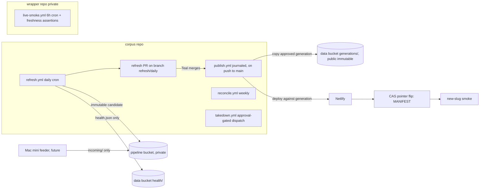

# Self-Running Corpus: Lane B Stage 1 Spec

**Date:** 2026-07-18 (v3; council rounds 1 and 2 applied)
**Status:** Council round 1 (Codex xhigh NOT SOUND, Opus max SOUND WITH CHANGES, Sonnet max SOUND WITH CHANGES) fully triaged into v2; round 2 (Codex xhigh delta verification, NOT SOUND on five new seams) fully triaged into v3; round 3 final check (Codex xhigh): 11 of 12 closures CLOSED, zero new findings, one PARTIAL (publish/takedown activation race) closed in this v3.1, verdict SOUND WITH CHANGES. Awaiting Teal sign-off. Dispositions in section 22.
**Owner:** Teal Emery. **Architect session:** Fable 5, Claude Code, per Project Shell Runbook v0.2 Stage 1
**Linear:** TEA-1031 (supersedes TEA-906 when refresh.yml lands)
**Grounding:** 2026-07-17 consolidation roadmap sections 4/6/9/10/11; 2026-07-06 council audit; code verified against `src/corpus/cli.py`, `src/corpus/db/{ingest,pages,markdown}.py`, `src/corpus/snapshot.py`, `src/corpus/parsers/`, `src/corpus/sources/*.py`, `prospectus-web-ti/scripts/{build.sh,upload-snapshot.sh,provision-data-host.sh}`, workflows in both repos; interview with Teal 2026-07-18 (five decisions in section 3); GitHub/AWS/Netlify doc claims web-verified where cited

**BLUF:** A sovereign files a prospectus; within 48 hours it is on the site, rendered, and nobody at Teal Insights touched anything except one morning PR merge. The design: a daily GitHub Actions refresh builds an immutable candidate snapshot generation on a private bucket; a human-merged PR approves it; a journaled publish workflow copies it to a public generation-addressed prefix, deploys the site against it, then activates it with a single compare-and-swap pointer write. Every mutable surface is a small pointer (state pointer, live MANIFEST, health beacon); everything heavy is immutable, content-addressed, or generation-addressed, so activation is atomic, rollback restores a pointer plus its paired Netlify deploy, torn runs resume from a journal, and no cache can be poisoned. Three correctness gates merge before the scheduler exists. Alarms reach Teal's inbox through per-signal GitHub issues with a cross-repo dead-man check. Automation that creates cleanup work is worse than manual; every requirement is testable against that bar.

## 1. The user experience this buys

| Who | Today | After Lane B |
|---|---|---|
| IMF Legal / WB Debt Unit repeat visitor | Newest LuxSE doc six weeks stale; refresh happens when Teal remembers | New filings from API sources live within 48h; a public register states per-source holdings and known gaps; a health beacon states per-source freshness |
| Teal | Runs the pipeline by hand, watches it | Merges one PR most mornings (~2 min); reads an alarm email when something breaks; nothing else recurring |
| Funders / forkers | "Trust us, we run it" | Every refresh is a public Actions run on the open repo; the register commits itself |

## 2. Locked decisions (inherited; built on, not reopened)

1. Daily cadence (decided 2026-07-17).
2. GHA spine; Mac mini feeder lane for bot-walled sources only.
3. PR-gated publishing. Auto-merge is earned later; its flip is a separate issue whose DoD includes the Lane D e2e suite, the real-data new-slug smoke, and a clean-cycle run.
4. Toil-free bar: zero recurring manual steps, alarms not vigilance, fail-closed.
5. Keepalive implemented as the workflow committing its own regenerated coverage register.

## 3. Decisions made in the Stage 1 interview (2026-07-18)

1. **State home: S3-canonical.** Pipeline state moves to a private S3 bucket; the Mac retires from the write path (section 5).
2. **v1 source scope: EDGAR + NSM daily; LuxSE joins by spike outcome; PDIP weekly reconcile only; LSE excluded until TEA-1008, register row marked "adapter pending."**
3. **Alert channel: email to lte@tealinsights.com** via GitHub issue notifications (section 14).
4. **Merge cadence: daily-ish**; the public SLO can honestly say 48 hours for API sources.
5. **Non-goals: all eight confirmed** (section 16), with one council-driven carve-out recorded there (the generation-addressed data contract touches the explorer data layer and wrapper build script; UI untouched).

## 4. Architecture overview



Core invariants, each load-bearing:

1. **Everything heavy is immutable.** Snapshot text, parquet, register, and ledger live at `prospectus/generations/<gen>/...`, write-once. Originals and parsed artifacts are content-addressed. The live site is defined by one small mutable pointer, `prospectus/snapshot/MANIFEST.json` (no-store), naming the active generation. Stable-URL overwrites no longer exist, so the CDN poisoning class is closed by construction and rollback needs no invalidation.
2. **Candidates are private until merged.** refresh.yml stages candidates on the private pipeline bucket; nothing publicly fetchable changes before the human merge.
3. **Every mutable pointer write is fenced, and every multi-step public mutation is journaled.** State pointer, run lock, and live MANIFEST use conditional writes; publish.yml records phase-by-phase progress in a journal so a torn run RESUMES instead of being mistaken for complete.
4. **refresh.yml never touches the public snapshot or generations prefixes.** Its only public write is `prospectus/health/refresh.json` (operational beacon, no-store). publish.yml owns public data mutation; takedown.yml owns deletion and sanitized republication.
5. **Suppression is epoch-fenced.** Every candidate and every activation carries the suppression-ledger epoch it was built against; publish refuses a candidate whose epoch is stale, so a takedown can never be undone by a previously staged candidate.

## 5. State: S3-canonical, immutable revisions, fenced single writer

Refresh inputs today exist only on Teal's Mac: `corpus.duckdb` 7.1 GB, `data/original` 7.9 GB, `data/parsed` 605 MB, `data/manifests` 9.5 MB. A hosted runner starts empty.

**New private bucket `ti-sovtech-pipeline`** (separate from the public data host; Block Public Access on; versioning on with a 14-day noncurrent-version expiration rule):

```
state/revisions/<run_id>/corpus.duckdb.zst   immutable per-run state revision
state/revisions/<run_id>/manifests.tar.zst
state/STATE.json                    pointer: revision id + sha256 of each artifact (hash of the compressed bytes) + suppression epoch + updated_at + schema rev
state/parsed/                       parsed tree (jsonl + md sidecars), synced incrementally; see torn-sync rule below
state/suppressions.jsonl            takedown ledger with monotonic epoch (section 12)
originals/<storage_key>/<sha256>.<ext>   content-addressed source archive; manifests name the exact object; nothing is ever overwritten (a corrected filing ADDS an object)
incoming/{source}/...               Mini feeder staging (future)
candidates/<gen>/snapshot/          staged candidates; unreferenced candidates pruned after 7 days (open-PR candidate and journal targets pinned)
locks/refresh.lock                  single-writer lease
journal/publish/<gen>.json          publish phase journal (section 10)
```

**Commit protocol.** A run reads `STATE.json`, restores the named revision (Actions cache holds the DB keyed by its sha; S3 is the correctness path). After ingest it uploads a NEW immutable revision under its own run id, then updates `STATE.json` with a conditional write. Cancellation mid-push leaves the old pointer naming intact old artifacts.

**Parsed-tree torn-sync rule.** `state/parsed/` syncs UP before the STATE commit. A crash between the two leaves newer parsed files paired with the older pointer, which is benign by argument, not by accident: parsed bytes are a function of (source bytes, pinned Docling version), skip/change decisions key on recorded source hashes rather than file mtimes, and the next run converges. The weekly integrity audit cross-checks parsed-tree membership against manifests; if Docling-run nondeterminism ever surfaces as spurious ledger deltas there, the escalation path (content-addressed parsed store keyed by source hash, with the map inside the state revision) is pre-decided and minted as an issue rather than debated mid-incident.

**Fenced lock.** Acquire `locks/refresh.lock` with a conditional PUT carrying run id + timestamp. Before the `STATE.json` commit, re-read the lock and abort if it no longer names this run (the zombie-takeover fence). Release is owner-checked (conditional delete) in an `if: always()` step. A lock older than 7 hours may be broken only after an API check that the holding run is no longer in progress. Local takeover is a documented runbook procedure using the same protocol.

**Cutover (one-time, from the Mac).** Compact the DB first (the FTS drop-and-recreate in `build-pages` is the likely 7.1 GB vs 2.5 GB culprit; record before/after), upload revision 0 + parsed tree + content-addressed originals, write STATE.json, record baseline counts. A cutover acceptance run on a hosted runner restores from S3 alone and reproduces the counts exactly. From then on the Mac is a consumer with a documented pull recipe.

## 6. Gate 0: the parse-path fix (merges before refresh.yml exists)

**The defect, code-verified.** `cli.py:751-756` routes `.pdf` to Docling (markdown sidecar at `cli.py:867-874`), but `.htm/.html` to BeautifulSoup and `.txt` to plain text, neither producing markdown; `snapshot.py:_fetch_text` then serves `text_source='pages'` (raw monospace). Every future EDGAR HTML ingest would mint this daily. Merges as its own PR before any scheduler work.

**The fix.**

- `.htm/.html`: keep the BeautifulSoup lane for page-segmented JSONL (page-break splitting preserves page citations) and ADD a Docling HTML conversion producing the markdown sidecar (Docling's SimplePipeline, no ML models; CI asserts no model download on a bare runner).
- **Dual-lane provenance:** records carry `parse_tool`/`parse_version` AND `markdown_tool`/`markdown_version`, so a future reparse campaign can identify which documents which Docling version converted.
- **Degradation, not quarantine:** Docling HTML failure on one file ships pages-only with a register note; a document with usable page text is never quarantined over a missing sidecar.
- `.txt`: stays plaintext by decision, not neglect (typewriter-era SGML filings). Recorded so nobody reopens it as a bug.
- **Output-dir reconciliation:** the standard lane owns `data/parsed/`; `data/parsed_docling/` (4.2 GB legacy) is a read-only archive.
- Scope boundary: fixes the RECURRING path; the existing 51 pages-source documents are Lane A's one-off (non-goal 3).

**Acceptance (Gate 0).**
- When the parse command processes a fixture EDGAR `.htm` with headings and a table, then `data/parsed/` contains the JSONL and a non-empty `.md` sidecar containing heading syntax, and the record names both tool/version pairs.
- When a snapshot is built over that document, then its text JSON has `text_source='markdown'` and a non-empty TOC.
- When the HTML lane runs in CI on a bare runner, then no model download occurs.
- When Docling HTML conversion fails on a fixture, then the document ships pages-only and the failure is recorded, not quarantined.
- When a `.txt` fixture is parsed, then behavior is unchanged from today.

## 7. Gate 1: incremental-content correctness (merges before refresh.yml exists)

Round 1 (all three seats) proved the pipeline cannot run incrementally on a stateless runner; round 2 sharpened the update semantics. Gate 1 delivers:

1. **The canonical sequence, explicit:** ingest, content update, `build-pages --skip-fts`, `build-markdown`, snapshot. (`corpus ingest` loads manifests only; the other two commands populate `document_pages`/FTS and `document_markdown`; omitting them publishes documents with no text.)
2. **Update semantics with stable identity:** when a storage key's recorded source hash changes, ingest updates IN PLACE preserving `document_id`, transactionally replaces `document_pages` and `document_markdown`, refreshes `document_countries`, and marks any `grep_matches` for that document stale (extraction is outside the daily loop; stale marks keep the domain rule honest). Delete-and-reinsert is forbidden (foreign keys, id churn).
3. **The source immutability model, stated per source, because the update path must be REACHABLE:** adapters return `skipped_exists` for known files and never re-fetch, so for API sources the update path cannot fire spontaneously. EDGAR filings are immutable by accession number (amendments are new filings with new native ids); NSM and LuxSE documents are treated as immutable by native id as a working assumption. The update path therefore serves: `incoming/` artifacts, deliberate reparse campaigns, and the **revalidation sample**: monthly deep reconcile issues conditional GETs for a random sample (N=20) of held documents; any changed remote bytes alarm, land as a NEW content-addressed original, and route through the update path. The assumption is declared, cheaply monitored, and provenance-preserving when it fails.
4. **Parse-skip decoupled from local disk:** skip decisions key on recorded source hashes with the parsed tree restored from `state/parsed/`; the 200-document budget applies only to new or hash-changed documents.
5. **`build-pages --skip-fts`:** the daily run skips the full-corpus FTS drop-and-recreate (nothing in the snapshot consumes it; it is the main DB-bloat source); weekly reconcile rebuilds it.
6. **Slug-collision quarantine at ingest:** `build_snapshot` raises on slug collisions today, which in a daily loop would abort every run forever while burning API budget. The second document quarantines with a distinct register reason and alarm; the run proceeds.

**Acceptance (Gate 1).**
- When a fixture document's recorded source hash changes (via the revalidation or incoming path), then ingest updates in place, `document_id` is unchanged, derived rows are replaced in one transaction, and the rebuilt snapshot serves the new text.
- When the same source bytes are seen again, then no re-download, no re-parse, no derived-row churn.
- When two distinct storage keys normalize to one slug, then the second is quarantined with its own register reason and the run completes green.
- When the daily sequence runs on a fixture corpus, then `document_pages` and `document_markdown` are populated for new documents and the FTS index is untouched.

## 8. Gate 2: generation-addressed data contract (merges before refresh.yml exists)

The MANIFEST gains `data_base` (the generation prefix URL) plus the suppression epoch; the snapshot client and wrapper `build.sh` resolve parquet/text URLs from `data_base`, falling back to legacy stable URLs when absent (backward compatible; additive field; SCHEMA_VERSION handling per the parquet-as-API contract). This is the one council-driven scope carve-out beyond Lane B's original perimeter: a data-layer change in `explorer-web` and the wrapper build script, no UI change. It makes activation a single pointer write and closes the cache-poisoning class, so it gates the scheduler.

**Acceptance (Gate 2).** When the deployed site reads a MANIFEST with `data_base`, then all parquet and text fetches go to the generation prefix; when it reads one without, legacy URLs still work; fixture CI covers both.

## 9. refresh.yml: the daily run

**Trigger:** cron at an off-peak minute (`23 9 * * *` UTC; GHA cron is UTC, no DST exposure) plus `workflow_dispatch` with inputs `sources` (default `edgar,nsm`; `luxse` when the spike passes), `since`, `dry_run`, `suppress_only` (rebuild the snapshot from current state without discovery; used by takedown).
**Concurrency:** group `refresh`, `cancel-in-progress: false` (queued; cancelling a lock holder orphans the lease).
**Permissions:** explicit per job; `contents: write`, `pull-requests: write`, `actions: write` (CI dispatch), `issues: write` (alarms), `id-token: write` (OIDC). Repo default read-only.

**Steps (failure at any step alarms and aborts; nothing public changes except the health beacon):**

1. Checkout (SHA-pinned actions), `uv sync --frozen`.
2. Acquire the fenced lock (section 5).
3. Restore state from the STATE.json revision (cache-first, sha-verified); sync `state/parsed/` down.
4. Discover per source with incremental windows from state watermarks. Circuit breakers and rate limits from `config.toml` unchanged.
5. Consume `incoming/` (validate hash, size, extension allowlist, source enum; ingest through the identical path; delete consumed fragments under GHA's incoming scope, idempotently keyed by fragment id in state). No-op until the feeder exists.
6. Download new documents; stream originals to their content-addressed keys (never overwriting; a retry re-PUTs identical bytes to an identical key); record `file_hash` in manifests. Watermarks advance only at state commit.
7. Parse new or hash-changed documents through the Gate 0 path (Docling PDF weights from an Actions cache keyed on Docling version). Budget: 200 documents/run; overflow carries over as `parse_backlog`.
8. Ingest + content update per Gate 1. Parse failures quarantine (register reason, excluded from snapshot, never block the run).
9. Regenerate the **holdings register** (`docs/coverage/register.{json,md}` and the generation copy): per-source document counts, known-gap rows ("adapter pending, TEA-1008"; "feeder pending"), quarantine list, suppression count. The holdings register changes ONLY when holdings change. **Operational status (per-source last-discovery timestamps, last-new-document dates, backlog/quarantine counters, run id) lives in the health beacon, not the register**, so no-change days produce a genuinely empty ledger delta (round-2 fix: v2 hashed run timestamps into the generation, so every day was a false delta).
10. `build-pages --skip-fts`, `build-markdown`, snapshot build (MANIFEST last locally; suppressions ledger consulted: suppressed documents excluded; the ledger's epoch recorded in the candidate MANIFEST).
11. Compute the generation ledger (slug to sha256 of UNCOMPRESSED text JSON, plus parquet/register hashes). Diff against the ACTIVE generation's ledger (fetched via its immutable URL). Empty delta: no candidate is created; the day is a health-and-RUN.json-only day.
12. Stage the candidate at `candidates/<gen>/snapshot/` on the PRIVATE pipeline bucket: upload changed/new objects; server-side copy unchanged objects from the prior immutable PUBLIC generation. Completeness assertion: object count equals `text_file_count` + enumerated fixed files, and every ledger slug is present.
13. Upload the new state revision; sync `state/parsed/` up; fenced-commit STATE.json; release the lock.
14. Write `prospectus/health/refresh.json` (no-store; explicit Cache-Control set by metadata replacement): run id, timestamp, per-source discovery outcomes and last-new-document dates, backlog and quarantine counters, pending-candidate id and its creation time (or none). The liveness beacon deliberately outside the merge gate.
15. Push FIRST, then upsert the PR: rebuild `refresh/daily` from main; commit the holdings register (when changed) and `docs/refresh/RUN.json`, which is updated EVERY run (run id, timestamp, `candidate` = generation id or `null`, suppression epoch, counts, sampled slugs). The daily RUN.json commit is the keepalive (locked mechanism) and the timestamp makes no-change days honest: `candidate: null`, publish no-ops by contract. Then idempotently create-or-update the single PR by head branch, retrying once if it was merged mid-operation. **Supersede-not-stack:** never more than one open refresh PR, always describing the newest run.
16. Dispatch the CI workflow against the `refresh/daily` head SHA (GITHUB_TOKEN-created events start no workflows; dispatched CI lands its checks on the PR SHA with no human action; verified in the skeleton).
17. PR body: counts by source and country, register delta, three sampled new documents with SOURCE filing URLs and short inline markdown excerpts (candidates are private; no candidate links), the candidate id + epoch, and the exact rollback command.

## 10. publish.yml: journaled, deploy-first activation on merge

Trigger: push to main with `docs/refresh/RUN.json` changed. Concurrency: group `activation`, queued, SHARED with takedown's republish phases, so all live-MANIFEST mutations serialize in one domain (round-3 fix). Permissions include `issues: write`.

Reads RUN.json. If `candidate` is `null`, exit green (an explicit no-op by contract, not an inference). Otherwise every phase below is recorded in `journal/publish/<gen>.json` BEFORE it executes, and a re-run resumes from the journal phase rather than re-deciding (round-2 fix: v2 inferred completion from "candidate equals active," which mistook a torn run, dead after the pointer flip but before the smoke, for a finished one):

1. **Epoch check:** the candidate's suppression epoch must equal the current ledger epoch; a stale candidate aborts with an alarm (a takedown occurred after staging; the next refresh builds a clean candidate). 
2. **Journal open:** record candidate id, current live MANIFEST ETag + generation (rollback data target), current Netlify production deploy id (rollback deploy target).
3. **Copy** the candidate to `prospectus/generations/<gen>/snapshot/` (delta by ledger diff; server-side copies for unchanged). Public on copy is correct: the merge was the approval.
4. **Deploy first:** set `BUILD_DATA_FETCH_BASE` to the new generation URL via the Netlify API, trigger a deploy through the authenticated API (returns the exact deploy id; bare build hooks do not), poll THAT id to ready (timeout 20 min). An `if: always()` cleanup step restores `BUILD_DATA_FETCH_BASE` to empty so a failed publish cannot redirect future unrelated wrapper builds at a dead candidate (round-2 fix). Runtime `PUBLIC_DATA_BASE_URL` unchanged.
5. **Activate:** re-verify the suppression epoch against the ledger immediately before the flip (a takedown that landed after phase 1 forces an abort here, not a stale activation; round-3 fix), then one conditional MANIFEST PUT (If-Match on the journaled ETag). CAS or epoch failure aborts with an alarm instead of interleaving.
6. **Smoke, conditional by candidate type:** markdown-source sample asserts 200 + `text_source='markdown'` + non-empty TOC; a `.txt`-only day asserts `text_source='pages'` (correct by decision); plus MANIFEST parity and the standing live-smoke assertions.
7. **On smoke failure, roll back the PAIR with a deploy fence:** restore the previous MANIFEST pointer (CAS), and restore the journaled previous Netlify deploy ONLY IF the current production deploy is still the one this run published (an intervening legitimate wrapper deploy is never clobbered; round-2 fix). Alarm with evidence. Generations stay immutable; no invalidation needed.
8. On success: journal closed, outcome commented on the merged PR (counts, deploy id, smoke evidence).

**Accepted residual risk:** an unrelated wrapper push mid-window builds against the CURRENT live MANIFEST, which is always internally consistent under this model; exposure is a briefly stale-but-coherent site. Runbook note.

## 11. reconcile.yml: weekly and monthly hygiene

Weekly (cron + dispatch), under the fenced state lock: full-window re-discovery per source (catches incremental misses AND is the cross-check for the silent-zero-finds alarm); **PDIP full cycle** (discover/download/parse/ingest, state-writing; results ride the next daily candidate); quarantine retry (max 3 attempts per document, then permanent with reason; `dequarantine` dispatch input forces a retry); FTS rebuild; state integrity audit (DB vs manifests vs originals objects vs parsed-tree membership vs cutover baseline); pruning with PINS: never the live generation, its predecessor, the open PR's candidate, or any journal target; otherwise keep the last 7 daily + first-of-month public generations, prune unreferenced private candidates after 7 days, prune state revisions to the last 7. Monthly `deep=true` adds the full ledger-vs-objects sweep, the stale-object report (no automatic deletion), and the **revalidation sample** (Gate 1: N=20 conditional GETs; changed bytes alarm and route through the update path).

## 12. takedown.yml: designed, gated, epoch-fenced, complete

These are legal documents; takedown must be executable, named, fast, durable, and COMPLETE: text gone, metadata row gone, page route gone, and no staged candidate able to resurrect it (round-2 fixes).

- **Trigger:** `workflow_dispatch` with `storage_key` + `reason`, protected by a GitHub Environment requiring Teal's approval.
- **Mechanism, in order:** (1) under the state lock, append the suppression record and increment the ledger epoch in `state/suppressions.jsonl`; (2) delete the document's text objects from all RETAINED public generations and issue a CloudFront invalidation for those paths; (3) retire any open candidate: the epoch bump makes it unpublishable by the section 10 check, and the open PR is commented and closed; (4) **sanitized republish, immediately, inside the same approved dispatch:** chain a `suppress_only` refresh (rebuilds the snapshot from current state minus suppressed documents, mints a sanitized candidate) and run the publish phases against it under the SHARED `activation` concurrency group (an in-flight publish completes or aborts first; nothing interleaves) without a second PR gate (the environment approval WAS the human gate for exactly this action), ending with a smoke that asserts the document's row and page route are ABSENT; (5) record the takedown in the register and the run log.
- **IAM:** its own role; `s3:DeleteObject` scoped to `prospectus/generations/*/snapshot/text/*`, `cloudfront:CreateInvalidation` scoped to the distribution ARN, plus the publish-path scopes for the sanitized republish. **Trust policy matches the Environment-shaped OIDC subject** (`repo:ORG/REPO:environment:<name>`; a job referencing an Environment presents that subject, not the branch subject; round-2 fix), with main-branch enforcement via the Environment's deployment branch rule.
- Reconcile's pruning role deletes only whole non-pinned prefixes; GHA incoming cleanup deletes only `incoming/*`. Distinct scopes, no overlap.

## 13. Secrets and supply chain

- **AWS via OIDC only.** Roles: refresh (pipeline bucket RW + `health/` write; NO public snapshot/generations write), publish (public generations write + live MANIFEST write; no delete), reconcile (pruning deletes as scoped), takedown (section 12). Trust policies: `aud=sts.amazonaws.com` plus the exact repository and `refs/heads/main` subject (takedown: the Environment subject); asserted at cutover. Immutable owner/repo IDs in subjects recorded as recommended hardening in the runbook.
- **Netlify:** `NETLIFY_AUTH_TOKEN` (deploy trigger + poll + env set/restore + deploy restore), scope/expiry/rotation in the runbook; replaces the bare build hook.
- All actions SHA-pinned; no `pull_request_target`; fork PRs get neither secrets nor a write token (platform default, kept).
- **Dependabot in the same PR as refresh.yml,** honestly scoped: `github-actions` ecosystem automated; Python resolves through `uv.lock`, which Dependabot's pip ecosystem does not manage, so Python bumps stay deliberate and Docling moves ONLY via a minted reparse-campaign issue.
- Mini feeder credential (future): IAM user limited to `s3:PutObject` on `incoming/*`, deny-tested.

## 14. Alarms: email to lte@, per-signal issues, zero new secrets

**Mechanism.** Each repo's workflows write their OWN alarm issues (a workflow's GITHUB_TOKEN cannot write another repo's issues), **one issue per signal**, title-keyed find-or-create (`alarm: refresh failure`, `alarm: freshness edgar`, ...), so concurrent conditions never share a lifecycle and one recovery cannot close another's live alarm (round-2 fix). Every workflow that alarms carries `issues: write` explicitly, including the wrapper's live-smoke, whose current `contents: read` grant must be extended (round-2 fix); this is an acceptance assertion. A firing condition comments with evidence; the next green evaluation of THAT signal closes it. Teal subscribes to both repos once (verified in the skeleton).

**Signals:**

| Signal | Threshold | Where checked |
|---|---|---|
| Pipeline liveness: `health/refresh.json` age | > 2 days red | wrapper live-smoke (independent dead-man) |
| Publication lag: pending candidate age (from health) | > 4 days nudge, > 8 days red | wrapper live-smoke |
| Discovery last succeeded, per active source (from health) | > 3 days red | refresh self-check + live-smoke |
| Silent zero-finds regression | active source, 0 new docs for 21 consecutive days AND weekly full-window reconcile also 0 | reconcile.yml |
| `parse_backlog` (not yet attempted) | > 500 red | refresh.yml |
| `quarantine` (attempted, failed) | any week-over-week growth red | reconcile.yml |
| Walled-source incoming age (once feeder exists) | > 7 days red | live-smoke via health |

Publication lag keys on the health beacon's pending-candidate age, NOT raw MANIFEST age (round-2 fix: a quiet fortnight with no filings must not turn the site red). Teal traveling fires only the lag nudge; pipeline liveness stays green. "Adapter pending" / "feeder pending" rows are threshold-exempt. `register.json` (holdings) and `health/refresh.json` carry explicit `Cache-Control: no-store` via metadata replacement on every write.

## 15. Keepalive, without ritual

GitHub auto-disables scheduled workflows after 60 days of repository inactivity IN PUBLIC REPOSITORIES ONLY (web-verified this session). The corpus repo (public) is covered by the locked mechanism, implemented as the DAILY `RUN.json` commit (plus the holdings register whenever it changed) on `refresh/daily`; asserted per run, not discovered at day 60. The wrapper repo is private; its cron is not subject to the rule and needs no heartbeat (v1's wrapper heartbeat dropped after verification).

## 16. Non-goals (confirmed by Teal 2026-07-18; changes go through the pivot ceremony)

1. **grep/extract clause steps in the daily run** (Gate 1 marks affected `grep_matches` stale on content updates; recomputation belongs to the clause track).
2. **New source adapters** (Dublin, ESMA, SGX, LSE/TEA-1008): the next Stage 1 spec.
3. **Lane A items:** 51-doc reparse, 19 no-text recoveries, new-this-month view, feeds, vocabulary, issuer canonicalization.
4. **Lane C items:** docs site, quickstart CI, Zenodo releases. Lane B publishes the register; Lane C surfaces it.
5. **Auto-merge flip** (separate issue; locked DoD).
6. **Corpus-wide search and clause views.**
7. **MotherDuck migration.**
8. **The e2e suite itself** (Lane D; auto-merge precondition, not v1's).

Carve-out recorded: v1 excluded "any change to the explorer"; council round 1 proved that untenable. Gate 2 touches the explorer DATA LAYER and wrapper build script; UI untouched. Also still excluded: Prefect/Dagster/Luigi, Selenium in the GHA lane.

## 17. Mini feeder contract (specified now, built when the first walled source needs it)

Launchd on the Mini, one job per walled source, fetch-and-stage only (discover + download with the repo's adapter code), writing content-addressed originals + manifest-fragment JSONL to `incoming/<source>/<run-ts>/`; credential is PutObject on `incoming/*` and nothing else; GHA validates (hash, size, extension, source enum) and ingests through the identical path, then deletes consumed fragments under its own incoming scope, idempotently keyed by fragment id in state. Deliberately NOT a self-hosted runner. Health observed via the walled-source staleness signal; no Mini-side monitoring. v1 ships the contract and the no-op consumption step.

## 18. LuxSE hosted-runner spike (early; gates the source list; ordered before cron-on)

From plain `ubuntu-latest`: real discovery queries + two document downloads with production headers and rate limits; pass = LuxSE enters the daily list, fail = Mini feeder job 1 with a "feeder pending" row. Also measures Docling PDF cold/warm cache parse time and asserts the HTML no-model claim. Records the LuxSE ToS conclusion on its issue. Outcome is a DoD line item sequenced BEFORE cron-on.

## 19. Walking skeleton (slice 1: one new real document, end to end)

Gates 0-2 merged. refresh.yml exists with EDGAR only, dispatch-triggered, cron off, state bootstrapped by cutover. One dispatch: fenced lock, state restore, discover a real new EDGAR filing (`since` override permitted), download to a content-addressed original, parse via Gate 0, ingest via Gate 1, holdings register + health beacon, snapshot, ledger diff, private candidate staged (transfer log shows a handful of uploads and thousands of server-side copies), state revision committed, RUN.json pushed, PR upserted, CI dispatched and green. Teal merges. publish.yml journals, epoch-checks, copies the public generation, deploys against it, polls the exact deploy id, CAS-flips the MANIFEST, and the conditional smoke passes: the new document's live page returns 200 with `text_source='markdown'`. Then three drills: a forced failure on a scratch branch fires the per-signal alarm issue and Teal confirms the email; a publish rollback drill restores the pointer + deploy pair and re-verifies; a torn-publish drill kills the run between flip and smoke and shows the re-run RESUMING from the journal to complete the smoke.

Proves: fenced state shuttle, all three gates in the production path, ledger delta, private candidacy, epoch fencing, PR + dispatched CI, deploy-first activation, CAS flip, journaled resume, conditional smoke, paired-and-fenced rollback, per-signal alarms. Everything after (NSM, LuxSE, cron-on, reconcile, pruning, takedown drill) is addition, not architecture.

## 20. Definition of done (whole build)

- Gates 0, 1, 2 merged first, acceptance criteria green.
- Cutover executed with recorded baselines; hosted-runner restore reproduces counts; pipeline bucket public-access check passes; all four OIDC trust-policy assertions pass (including the takedown Environment subject).
- Walking skeleton executed against production with a real document (link on TEA-1031), including the alarm, rollback, and torn-publish-resume drills.
- LuxSE spike run and dispositioned (before cron-on).
- Cron on; five consecutive scheduled runs with zero manual intervention besides PR merges; at least one published a real new document; Netlify credit burn recorded against plan limits.
- Takedown drill on a test object: suppression epoch bump, generation deletes, invalidation, candidate retirement, sanitized republish with absence-asserting smoke, register record.
- `docs/refresh-runbook.md`: local takeover, state-revision recovery, publish rollback (the pair), torn-publish resume, takedown, secret rotation, spike outcomes, accepted residual risks.
- TEA-906 closed as superseded; auto-merge flip issue minted with its locked DoD.
- Build metrics line per branch in `docs/build-metrics.md`.

## 21. Acceptance criteria (testable, when/then)

1. When refresh runs with no new filings, then it completes green, updates the health beacon and RUN.json (`candidate: null`), creates NO candidate, maintains exactly one PR, and a merge is a publish no-op by the null contract.
2. When a new EDGAR `.htm` filing appears, then the next run's PR lists it, the private candidate's text JSON has `text_source='markdown'`, and after merge its live page returns 200 with rendered text under the new generation URL.
3. When a second refresh triggers mid-run, then it queues; when a non-GHA writer holds an unexpired lock, then the run aborts with an alarm touching nothing; when a broken-lease zombie resumes, then its fenced STATE commit fails and fresher state survives.
4. When a refresh run dies at any step, then the public site is byte-identical to before the run and the next run proceeds from the last committed revision; when a publish run dies at any phase (including between pointer flip and smoke), then re-running resumes from the journal and completes the remaining phases, never exiting green with an unsmoked activation.
5. When a parse fails, then the document lands in `quarantine` with a reason, is excluded from the snapshot, is retried by reconcile at most 3 times, and the run stays green; when quarantine grows week-over-week, then that signal's alarm fires.
6. When a document's recorded source hash changes via the incoming or revalidation path, then ingest updates in place with `document_id` stable and derived rows replaced transactionally, and the next candidate's ledger shows exactly that slug changed; unchanged bytes are server-side copied, never uploaded.
7. When a refresh PR is unmerged and a new run completes, then the PR describes the newest run, exactly one refresh PR exists, and pruning never touches the live generation, its predecessor, the open PR's candidate, or a journal target.
8. When Teal merges a candidate-bearing PR, then publish journals, epoch-checks, deploys against the new generation BEFORE the CAS flip, and the conditional smoke passes, or the pointer and the Netlify deploy are both restored (deploy restore fenced on the current deploy still being this run's).
9. When a candidate's suppression epoch is older than the ledger's, then publish refuses it with an alarm and no public mutation occurs; when a takedown lands while a publish is in flight, then the shared activation concurrency group and the pre-flip epoch re-check guarantee the stale candidate never activates.
10. When `health/refresh.json` is older than 2 days, or an active source's discovery has not succeeded for 3 days, or a pending candidate is older than 8 days, then the wrapper live-smoke turns red and its per-signal alarm issue emails lte@; when an active source reports zero new documents for 21 days and weekly full-window reconcile also finds zero, then the regression alarm fires; quiet weeks with no pending candidate fire nothing.
11. When any workflow fails, then its repo's per-signal alarm issue receives a comment naming the workflow, run URL, and failing step; when that signal next evaluates green, then its issue closes; concurrent distinct alarms never share an issue.
12. When any scheduled run completes, then the corpus repo received the RUN.json commit within that run (keepalive asserted per run).
13. When takedown runs with an approved dispatch, then the ledger epoch increments, text objects are deleted from all retained generations with CloudFront invalidation, any open candidate is retired, a sanitized candidate is republished within the same dispatch, and the closing smoke asserts the document's row and page route are absent.
14. When refresh.yml, publish.yml, reconcile.yml, takedown.yml, and the wrapper live-smoke are inspected, then every third-party action is SHA-pinned, AWS access is OIDC-only under the four scoped roles, no workflow uses `pull_request_target`, every alarming workflow carries `issues: write`, and the Dependabot config (github-actions) landed in refresh.yml's PR.
15. When the Mini feeder is later built, then its credential can write `incoming/*` and nothing else (deny-tested), and GHA validates hash, size, and extension before ingest.
16. When the cutover completes, then a hosted runner restoring from S3 alone reproduces the recorded Mac baseline counts exactly.

## 22. Council dispositions

**Round 1 (2026-07-18): Codex gpt-5.6-sol xhigh (mechanism lens) NOT SOUND; Opus 4.8 max (completeness lens) SOUND WITH CHANGES; Sonnet 5 max (crash/data-loss lens; fielded because the Gemini/agy lane refused headless file reads) SOUND WITH CHANGES.** Convergence-triaged; every code-level claim chair-verified; the one external factual dispute (60-day rule scope) web-verified. Accepted: all CRITICALs (missing build-pages/build-markdown; ingest discard; parse-skip statelessness; mutable-live activation + CDN poisoning + TOCTOU + missing CAS, resolved by the generation-addressed model; pruning pins; STATE atomicity via immutable revisions; completeness assertion; PR identity/dispatched CI; public candidate leak; zombie fencing; slug-collision quarantine; takedown design) and the convergent IMPORTANTs (deploy-first ordering; paired rollback + drill; content ledger over ETags; queued concurrency; Netlify API deploy ids; per-repo alarms; register cache-control; PDIP disposition; quarantine/backlog split; liveness/lag split; zero-finds heuristic; originals streaming; OIDC trust assertions; dual-parser provenance; FTS out of the daily path; budgets; versioning lifecycle; broadened workflow AC). Accepted SUGGESTIONs: supersede push-first upsert; conditional smoke; wrapper heartbeat dropped (web-verified); .gitignore wording; STATE sha names compressed bytes; runbook split; Netlify credit check; cutover AC; Dependabot uv honesty. **Declined with reasons:** RSS/source-count second signal for zero-finds (new scraping surface for marginal signal; reconcile cross-check suffices; revisit on false negatives); immutable owner/repo OIDC IDs as an AC (recorded as runbook hardening instead).

**Round 3 (2026-07-18, final): Codex xhigh resolution check on v3. 11 of 12 round-2 closures verified CLOSED, zero new findings, verdict SOUND WITH CHANGES.** The single PARTIAL (no shared publish/takedown serialization and no pre-activation epoch re-check, so an in-flight publish could activate a candidate staled by a mid-run takedown) is closed in v3.1: the `activation` concurrency group is shared by publish and takedown's republish phases, and the epoch is re-verified immediately before the MANIFEST flip.

**Round 2 (2026-07-18): Codex xhigh delta verification. 10 of 16 round-1 findings verified RESOLVED, 5 PARTIAL, and 5 new CRITICALs + 6 IMPORTANTs + 1 SUGGESTION in seams the revision introduced. NOT SOUND.** All accepted and applied in v3: register/ledger no-change contradiction (holdings register vs health beacon split; RUN.json `candidate: null` contract); torn-publish equality shortcut (publish journal with phase resume + drill); takedown vs staged candidates (suppression epoch fencing + candidate retirement + immediate sanitized republish, closing the parquet-row/route exposure); parsed-tree atomicity (sync-before-commit ordering with the determinism argument recorded, audit cross-check, and the content-addressed escalation pre-decided); unreachable update path (per-source immutability model stated, EDGAR accession immutability documented, monthly revalidation sample as the cheap monitor, content-addressed originals preserving provenance); Netlify env-var persistence + deploy-restore fence (always() restore; compare-before-restore); takedown OIDC Environment subject; `issues: write` grants incl. the wrapper workflow change; per-signal alarm issues; stable `document_id` + dependent-row semantics; private-candidate retention + budget line. No round-2 finding was declined.

## 23. Risks (each mitigated or accepted, in writing)

| # | Risk | Disposition |
|---|---|---|
| 1 | GHA cron delayed or (public repo) auto-disabled | Mitigated: off-peak minute; per-run keepalive assertion; independent wrapper dead-man on the health beacon; dispatch fallback |
| 2 | State corruption in the shuttle | Mitigated: immutable revisions + fenced pointer; sha-verified restore; versioning with 14-day noncurrent expiry; weekly audit vs baseline |
| 3 | Parsed-tree torn sync pairs old pointer with newer parsed files | Accepted with monitoring: benign under the determinism argument (hash-keyed decisions, deterministic re-derivation); audit cross-checks; content-addressed escalation pre-decided |
| 4 | DB outgrows the 10 GB Actions cache | Mitigated: FTS out of the daily path + cutover compaction; per-run size metric with 9 GB alarm; pure-S3 restore is the correctness path |
| 5 | Docling drift re-parses the world or changes bytes | Mitigated: hash-gated re-parse; uv.lock authority; campaign-only upgrades; ledger diff moves zero bytes for unchanged content |
| 6 | A source silently mutates a document we hold (immutability assumption fails) | Mitigated: monthly revalidation sample alarms on mismatch; content-addressed originals preserve both versions; update path handles the correction |
| 7 | Big filing day blows the job cap | Mitigated: 200-doc budget with carryover; backlog alarm; spike measures per-doc cost |
| 8 | Independent wrapper build mid-publish | Accepted: any MANIFEST it reads is internally consistent; exposure is brief coherent staleness; runbook note |
| 9 | Source API breaks loudly | Mitigated: circuit breakers; failure alarms; quarantine absorbs partial damage |
| 10 | Source API breaks SILENTLY (empty results) | Mitigated: 21-day zero-finds heuristic cross-checked by weekly full-window reconcile |
| 11 | Secrets on a public repo | Mitigated: OIDC-only, four scoped roles with trust assertions (Environment subject for takedown); SHA-pinned actions; no pull_request_target; Netlify token scoped and rotation-documented |
| 12 | State bucket accidentally public | Mitigated: separate bucket, Block Public Access, cutover check |
| 13 | Netlify deploy fails, hangs, or env override leaks | Mitigated: exact-id polling with timeout; failure aborts BEFORE the pointer flip; always()-restored env; fenced deploy restore |
| 14 | LuxSE spike fails with no feeder built | Accepted: LuxSE stays manual with "feeder pending" and a minted feeder issue |
| 15 | Teal stops merging (travel) | Accepted: pending-candidate lag nudges then reds by design; liveness stays green; data accumulates; SLO is a target until auto-merge is earned |
| 16 | Netlify credit exhaustion from daily deploys | Mitigated: ~30 builds/month checked at skeleton; burn recorded; publish failure is fail-closed and alarmed |

## 24. Budgets

Typical daily run: under 30 minutes wall-clock (no FTS rebuild, ledger-delta upload, warm caches); hard job timeout 5h30m. Storage: public generations ~2.5 GB each, 7 daily + 12 monthly ≈ 50 GB; private candidates pruned after 7 days (bounded by ~7 x 2.5 GB worst case); state revisions 7 x ~2-3 GB compressed; noncurrent versions expire at 14 days; low single-digit dollars/month total. Requests and transfer: delta-driven, cents. Netlify: ~30 production builds/month at ~5 min each, within plan; verified at skeleton. All figures recorded per run in metrics so drift is visible, not discovered.

## 25. Explainer principles (adopted / skipped on purpose)

From `building-big-things.md`: walking skeleton (section 19); pre-mortem framing (sections 22-23); small batches (three gates as separate PRs before the scheduler); modularity (feeder contract, four-role IAM separation, journaled phases). Skipped: reference-class calendar forecasting (dependency order, never weeks). From `writing-for-busy-readers.md`: BLUF, skim-test headings, tables for enumerable facts. `interface-design-for-small-data-tools.md`: skipped (no human interface) except status visibility (PR body, register, health beacon).

## 26. Licensing and terms posture

No new components; pipeline and workflows stay MIT in the open repo; public Actions runs are the open-core proof. EDGAR and NSM are documented public APIs used within their published fair-access rules (rate limits and User-Agent from config.toml). LuxSE's one-line ToS conclusion lands on the spike issue before it enters the daily loop. The register and snapshot generations are public data; the pipeline bucket is private infrastructure, not a publication.
