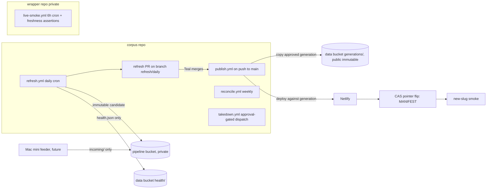

# Self-Running Corpus: Lane B Stage 1 Spec

**Date:** 2026-07-18 (v2, revised same day after council round 1)
**Status:** Council-revised draft. Round 1: Codex gpt-5.6-sol xhigh NOT SOUND; Opus 4.8 max SOUND WITH CHANGES; Sonnet 5 max SOUND WITH CHANGES. All CRITICALs and convergent IMPORTANTs applied; disposition table in section 22. Awaiting round 2 delta check and Teal sign-off.
**Owner:** Teal Emery. **Architect session:** Fable 5, Claude Code, per Project Shell Runbook v0.2 Stage 1
**Linear:** TEA-1031 (supersedes TEA-906 when refresh.yml lands)
**Grounding:** 2026-07-17 consolidation roadmap sections 4/6/9/10/11; 2026-07-06 council audit; code verified against `src/corpus/cli.py`, `src/corpus/db/{ingest,pages,markdown}.py`, `src/corpus/snapshot.py`, `src/corpus/parsers/`, `prospectus-web-ti/scripts/{build.sh,upload-snapshot.sh,provision-data-host.sh}`, workflows in both repos; interview with Teal 2026-07-18 (five decisions in section 3); GitHub/AWS/Netlify doc claims web-verified where cited

**BLUF:** A sovereign files a prospectus; within 48 hours it is on the site, rendered, and nobody at Teal Insights touched anything except one morning PR merge. The design: a daily GitHub Actions refresh builds an immutable candidate snapshot generation on a private bucket; a human-merged PR approves it; a publish workflow copies it to a public generation-addressed prefix, deploys the site against it, then activates it with a single compare-and-swap pointer write. Every mutable surface is a small pointer (state pointer, live MANIFEST); everything heavy is immutable and generation-addressed, so activation is atomic, rollback is a pointer restore plus a paired Netlify deploy restore, and no cache can be poisoned. Three correctness gates merge before the scheduler exists. Alarms reach Teal's inbox through GitHub issue notifications with a cross-repo dead-man check. Automation that creates cleanup work is worse than manual; every requirement is testable against that bar.

## 1. The user experience this buys

| Who | Today | After Lane B |
|---|---|---|
| IMF Legal / WB Debt Unit repeat visitor | Newest LuxSE doc six weeks stale; refresh happens when Teal remembers | New filings from API sources live within 48h; a public register states per-source freshness and known gaps |
| Teal | Runs the pipeline by hand, watches it | Merges one PR most mornings (~2 min); reads an alarm email when something breaks; nothing else recurring |
| Funders / forkers | "Trust us, we run it" | Every refresh is a public Actions run on the open repo; the register commits itself |

## 2. Locked decisions (inherited; built on, not reopened)

1. Daily cadence (decided 2026-07-17).
2. GHA spine; Mac mini feeder lane for bot-walled sources only.
3. PR-gated publishing. Auto-merge is earned later; its flip is a separate issue whose DoD includes the Lane D e2e suite, the real-data new-slug smoke, and a clean-cycle run.
4. Toil-free bar: zero recurring manual steps, alarms not vigilance, fail-closed.
5. Keepalive implemented as the workflow committing its own regenerated coverage register.

## 3. Decisions made in the Stage 1 interview (2026-07-18)

1. **State home: S3-canonical.** Pipeline state moves to a private S3 bucket; the Mac retires from the write path (section 5).
2. **v1 source scope: EDGAR + NSM daily; LuxSE joins by spike outcome; PDIP weekly reconcile only; LSE excluded until TEA-1008, register row marked "adapter pending."**
3. **Alert channel: email to lte@tealinsights.com** via GitHub issue notifications (section 14).
4. **Merge cadence: daily-ish**; the public SLO can honestly say 48 hours for API sources.
5. **Non-goals: all eight confirmed** (section 16), with one council-driven carve-out recorded there (the generation-addressed data contract touches the explorer data layer and wrapper build script; UI untouched).

## 4. Architecture overview



Core invariants, each load-bearing:

1. **Everything heavy is immutable and generation-addressed.** Snapshot text, parquet, register, and ledger live at `prospectus/generations/<gen>/...` and are never overwritten. The live site is defined by one small mutable object, `prospectus/snapshot/MANIFEST.json` (no-store), which names the active generation. Stable-URL overwrites of parquet/text no longer exist, so the CDN cache-poisoning class (new bytes under an old token, or old bytes under a new token) is closed by construction, and rollback needs no CloudFront invalidation.
2. **Candidates are private until merged.** refresh.yml stages candidates on the private pipeline bucket. Nothing publicly fetchable changes before the human merge (round-1 council catch: v1 staged candidates on the public bucket, defeating the gate).
3. **Every mutable pointer write is fenced.** The state pointer, the run lock, and the live MANIFEST are updated with conditional writes (If-Match / If-None-Match), so racing writers fail loudly instead of interleaving.
4. **refresh.yml never touches the public snapshot or generations prefixes.** Its only public write is `prospectus/health/refresh.json` (liveness beacon, no-store). publish.yml owns public data mutations; takedown.yml owns deletions.

## 5. State: S3-canonical, immutable revisions, fenced single writer

Refresh inputs today exist only on Teal's Mac: `corpus.duckdb` 7.1 GB, `data/original` 7.9 GB, `data/parsed` 605 MB, `data/manifests` 9.5 MB. A hosted runner starts empty.

**New private bucket `ti-sovtech-pipeline`** (separate from the public data host; Block Public Access on; versioning on with a 14-day noncurrent-version expiration lifecycle rule so daily DB pushes cannot silently accrue a terabyte of dead versions):

```
state/revisions/<run_id>/corpus.duckdb.zst   immutable per-run state revision
state/revisions/<run_id>/manifests.tar.zst
state/STATE.json                             pointer: revision id + sha256 of each artifact (hash of the compressed bytes) + updated_at + schema rev
state/parsed/                                the parsed tree (jsonl + md sidecars), synced incrementally both ways
state/suppressions.jsonl                     takedown ledger, consulted by snapshot build (section 12)
originals/{storage_key}.{ext}                append-only source archive, streamed at download time, overwrite-tolerant PUTs (idempotent retries); watermarks advance only at state commit
incoming/{source}/...                        Mini feeder staging (empty until a walled source needs it)
candidates/<gen>/snapshot/                   staged snapshot generations awaiting merge
locks/refresh.lock                           single-writer lease
```

**Commit protocol.** A run reads `STATE.json`, restores the named revision (Actions cache holds the DB keyed by its sha; S3 is the correctness path, cache the optimization). After ingest it uploads a NEW immutable revision under its own run id, then updates `STATE.json` with a conditional write. Because revisions are immutable and the pointer names exact keys and hashes, a cancellation mid-push leaves the old pointer naming intact old artifacts; there is no torn state to repair (round-1 fix: v1 overwrote mutable state keys before the pointer moved). Reconcile prunes state revisions, keeping the last 7.

**Fenced lock.** Acquire `locks/refresh.lock` with a conditional PUT (If-None-Match) carrying run id + timestamp. Before the `STATE.json` commit, re-read the lock and abort without committing if it no longer names this run (the zombie-takeover fence: a suspended laptop takeover that wakes after its lease was broken must not overwrite a day of fresher state). Release is owner-checked (conditional delete) in an `if: always()` step. A lock older than 7 hours may be broken only after an API check that the holding workflow run is no longer in progress. Local takeover is a documented runbook procedure using the same protocol.

**Cutover (one-time, from the Mac).** Compact the DB first (`build-pages` currently drops and recreates the FTS index over the whole corpus, the likely source of the 7.1 GB vs 2.5 GB gap; record before/after sizes), upload revision 0 + parsed tree + originals archive, write STATE.json, and record the baseline counts (documents, manifests, originals objects). A cutover acceptance run on a hosted runner must restore from S3 alone and reproduce the recorded counts exactly. From then on the Mac is a consumer with a documented pull recipe.

## 6. Gate 0: the parse-path fix (merges before refresh.yml exists)

**The defect, code-verified.** `cli.py:751-756` routes `.pdf` to Docling (markdown sidecar at `cli.py:867-874`), but `.htm/.html` to BeautifulSoup and `.txt` to plain text, neither of which produces markdown; `snapshot.py:_fetch_text` then serves `text_source='pages'` (raw monospace). Every future EDGAR HTML ingest would mint this daily. Fix merges as its own PR before any scheduler work.

**The fix.**

- `.htm/.html`: keep the BeautifulSoup lane for page-segmented JSONL (page-break CSS splitting preserves page citations) and ADD a Docling HTML conversion producing the markdown sidecar. Docling's HTML path uses its SimplePipeline, no ML models (council-confirmed credible; CI asserts no model download on a bare runner).
- **Provenance for the dual lane:** the parsed record carries both `parse_tool`/`parse_version` (pages lane) and `markdown_tool`/`markdown_version` (sidecar lane), so a future Docling reparse campaign can identify exactly which documents which Docling version converted.
- **Degradation, not quarantine:** if Docling HTML conversion throws on one file, the document ships pages-only with a register note; a document with usable page text is never quarantined over a missing sidecar.
- `.txt`: stays plaintext by decision, not neglect (typewriter-era SGML filings; honest monospace). Recorded so nobody reopens it as a bug.
- **Output-dir reconciliation:** the standard lane owns `data/parsed/`. `data/parsed_docling/` (4.2 GB legacy reparse trees) is a read-only archive; nothing in the refresh path reads or writes it.
- Scope boundary: this fixes the RECURRING path. Re-parsing the existing 51 pages-source documents is Lane A's one-off (non-goal 3).

**Acceptance (Gate 0).**
- When the parse command processes a fixture EDGAR `.htm` with headings and a table, then `data/parsed/` contains the JSONL and a non-empty `.md` sidecar containing heading syntax, and the record names both tool/version pairs.
- When a snapshot is built over that document, then its text JSON has `text_source='markdown'` and a non-empty TOC.
- When the HTML lane runs in CI on a bare runner, then no model download occurs.
- When Docling HTML conversion fails on a fixture, then the document ships pages-only and the failure is recorded, not quarantined.
- When a `.txt` fixture is parsed, then behavior is unchanged from today.

## 7. Gate 1: incremental-content correctness (merges before refresh.yml exists)

Round-1 council (all three seats, independently) proved the current pipeline cannot run incrementally on a stateless runner:

1. **`corpus ingest` loads manifests only**; `build-pages` and `build-markdown` are separate commands (`cli.py:1262`, `cli.py:1297`) that populate `document_pages`, the FTS index, and `document_markdown`. A refresh sequence omitting them publishes documents with NO text at all. The canonical sequence is now explicit: ingest, content update, build-pages, build-markdown, snapshot.
2. **Ingest never updates**: `_insert_document` skips any existing `storage_key` unconditionally. A sovereign re-filing a corrected supplement under the same native id would be re-downloaded, re-parsed, and then silently discarded at the door, serving superseded text forever. Gate 1 adds an update path: when a document's stored source hash (`file_hash`, which already exists in download records; the spec's `source_sha256` is this field, named once) differs, ingest transactionally replaces the document row and its derived `document_pages`/`document_markdown` rows.
3. **Parse-skip is local-file-existence-based** (`cli.py:801-803`); with the parsed tree absent it would re-parse the entire corpus. Resolved twice over: the parsed tree lives in state (`state/parsed/`, synced incrementally), and the 200-document budget applies only to documents that are new or hash-changed.
4. **`build-pages` gains a `--skip-fts` flag**: the daily run skips the full-corpus FTS drop-and-recreate (nothing in the snapshot consumes it; it is the main DB-bloat source); weekly reconcile rebuilds it.
5. **Slug-collision quarantine:** `build_snapshot` raises on slug collisions today, which in a daily loop would abort every run forever while burning API budget. Gate 1 detects collisions at ingest, quarantines the second document with a distinct register reason and alarm, and lets the run proceed.

**Acceptance (Gate 1).**
- When a fixture document's source bytes change, then ingest replaces its row and derived rows, and the rebuilt snapshot serves the new text (restated AC for the old inert "source-hash change detection").
- When the same source bytes are seen again, then no re-download, no re-parse, and no derived-row churn occur.
- When two distinct storage keys normalize to one slug, then the second is quarantined with its own register reason and the run completes green.
- When the daily sequence runs on a fixture corpus, then `document_pages` and `document_markdown` are populated for new documents and the FTS index is untouched.

## 8. Gate 2: generation-addressed data contract (merges before refresh.yml exists)

The MANIFEST gains `data_base` (the generation prefix URL) and the snapshot client and wrapper `build.sh` resolve parquet/text URLs from it, falling back to legacy stable URLs when absent (backward compatible; SCHEMA_VERSION handling per the parquet-as-API contract: additive field, coordinated bump). This is the one council-driven scope carve-out beyond Lane B's original perimeter: a data-layer change in `explorer-web` and the wrapper build script, no UI change. It is what makes activation a single pointer write and closes the cache-poisoning class, so it gates the scheduler.

**Acceptance (Gate 2).** When the deployed site reads a MANIFEST with `data_base`, then all parquet and text fetches go to the generation prefix; when it reads one without, legacy URLs still work; the fixture CI covers both.

## 9. refresh.yml: the daily run

**Trigger:** cron at an off-peak minute (e.g. `23 9 * * *` UTC; GHA cron is UTC, no DST exposure) plus `workflow_dispatch` with inputs `sources` (default `edgar,nsm`; `luxse` added when the spike passes), `since`, `dry_run`.
**Concurrency:** group `refresh`, `cancel-in-progress: false` (queued, never cancelled: cancelling a lock-holder mid-run orphans the lease; round-1 fix).
**Permissions:** explicit per job; `contents: write`, `pull-requests: write`, `actions: write` (to dispatch CI), `id-token: write` for AWS OIDC. Repo default read-only.

**Steps (failure at any step alarms and aborts; nothing public changes except the health beacon):**

1. Checkout (SHA-pinned actions), `uv sync --frozen`.
2. Acquire the fenced lock (section 5).
3. Restore state from the STATE.json revision (cache-first, sha-verified); sync `state/parsed/` down incrementally.
4. Discover per source with incremental windows from state watermarks. Circuit breakers and rate limits from `config.toml` unchanged.
5. Consume `incoming/` (validate hash, size, extension allowlist, source enum; ingest through the identical path; delete consumed fragments under GHA's incoming delete scope, keyed idempotently by fragment id recorded in state). No-op until the feeder exists.
6. Download new documents; stream originals to `originals/` (overwrite-tolerant); record `file_hash` in manifests.
7. Parse new or hash-changed documents through the Gate 0 path. Docling PDF weights from an Actions cache keyed on Docling version. Budget: 200 documents/run; overflow carries over and the register reports `parse_backlog`.
8. Ingest + content update per Gate 1. Parse failures quarantine (register reason, excluded from snapshot, never block the run).
9. Regenerate the coverage register: per source, last successful discovery, last new document date, counts, `parse_backlog` (not yet attempted) and `quarantine` (attempted, failed) as SEPARATE metrics, known-gap rows ("adapter pending, TEA-1008"; "feeder pending"). The register states holdings and known gaps, never completeness.
10. `build-pages --skip-fts`, `build-markdown`, then snapshot build (MANIFEST written last locally; suppressions ledger consulted: suppressed documents are excluded).
11. Compute the generation ledger: slug to sha256 of UNCOMPRESSED text JSON, plus parquet/register hashes. Diff against the ACTIVE generation's ledger (fetched by its immutable URL, so there is no read-from-mutable-live race). No delta at all: skip candidate creation entirely; the day is register-only.
12. Stage the candidate at `candidates/<gen>/snapshot/` on the PRIVATE pipeline bucket: upload changed/new objects, server-side copy unchanged objects from the prior immutable public generation. Completeness assertion: object count equals `text_file_count` + enumerated fixed files (parquet, MANIFEST, register, ledger), and every ledger slug is present (round-1 fix: `document_count` would abort every run, since no-text documents have no text object).
13. Upload the new state revision, fenced-commit STATE.json, release the lock.
14. Write `prospectus/health/refresh.json` (run id, timestamp, per-source outcomes; no-store): the liveness beacon that is deliberately outside the merge gate, so pipeline death and human merge cadence alarm separately.
15. Push the branch FIRST, then upsert the PR (round-1 fix for the merge race): rebuild `refresh/daily` from main, commit `docs/coverage/register.{json,md}` and `docs/refresh/RUN.json` (candidate generation id, counts, sampled slugs, ledger hash), force-push, then idempotently create-or-update the single PR by head branch, retrying once if it was merged mid-operation. **Supersede-not-stack:** never more than one open refresh PR, always describing the newest candidate.
16. Dispatch the CI workflow against the `refresh/daily` head SHA (`workflow_dispatch`; GITHUB_TOKEN-created pushes do not trigger `on: push`/`on: pull_request` runs, and bot PRs can sit in approval-required states, so CI is dispatched explicitly and its checks land on the PR SHA with no human action; verified in the walking skeleton).
17. PR body: counts by source and country, register delta, three sampled new documents with their SOURCE filing URLs and short inline markdown excerpts (candidates are private, so no candidate links), the generation id, and the exact rollback command.

**No-change days:** register-only commit on the branch (keepalive for the public corpus repo, the locked mechanism), PR notes "no new documents," no candidate exists, and a merge is a publish no-op by construction (publish checks RUN.json's generation id against the active one).

## 10. publish.yml: deploy-first activation on merge

Trigger: push to main with `docs/refresh/RUN.json` changed. Concurrency: group `publish`, queued. Reads RUN.json for the candidate generation. If the generation equals the active one (register-only merge), exit green.

1. Copy the approved candidate from the private bucket to `prospectus/generations/<gen>/snapshot/` on the public data bucket (delta by ledger diff against the prior public generation; server-side copies for unchanged objects). Generations are public the moment they are copied, which is correct: the merge WAS the approval.
2. Read the current live MANIFEST and record its ETag and generation (the CAS baseline and the rollback target). Record the current Netlify production deploy id (the paired rollback target).
3. Deploy the site against the NEW generation before activating it (the wrapper README's documented deploy-first-for-additive-releases procedure, automated): set `BUILD_DATA_FETCH_BASE` to the new generation URL via the Netlify API, trigger a deploy through the authenticated API (which returns the exact deploy id; bare build hooks do not, round-1 fix), poll THAT id to `ready` (timeout 20 min). Runtime `PUBLIC_DATA_BASE_URL` is unchanged; the new build simply pre-renders every page including the new documents.
4. **Activate: one conditional write.** PUT the live MANIFEST (naming the new generation in `data_base`) with If-Match on the ETag from step 2. A concurrent mutation fails the CAS and the run aborts with an alarm instead of interleaving (round-1 fix: no cross-workflow activation transaction existed).
5. **New-slug smoke, conditional by candidate type:** markdown-source sample asserts HTTP 200 + `text_source='markdown'` + non-empty TOC; a `.txt`-only day asserts `text_source='pages'` (correct by decision); plus MANIFEST-parity and the standing live-smoke assertions.
6. **On smoke failure, roll back the PAIR:** restore the previous MANIFEST pointer (CAS again) and republish the previous Netlify deploy recorded in step 2. Both generations remain intact and immutable; no invalidation is needed because nothing was overwritten. Alarm with evidence.
7. On success: comment the outcome on the merged PR (counts, deploy id, smoke evidence).

A torn publish (runner dies between steps) is recoverable by re-running publish.yml: every step is idempotent (copies are ledger-driven, activation is CAS-guarded), and until step 4 executes the live site is untouched. **Accepted residual risk:** an unrelated wrapper-repo push (dependency bump) can trigger an independent Netlify build mid-window; it would build against the CURRENT live MANIFEST, which is always internally consistent under this model, so the exposure is a briefly stale-but-coherent site. Documented in the runbook.

The old accepted-404-window risk from v1 is retired: deploy-first means new pages exist before the pointer exposes new rows. The brief inverse window (new site live seconds before the pointer flips) shows old rows with extra pages present, which is benign.

## 11. reconcile.yml: weekly and monthly hygiene

Weekly (cron + dispatch), under the same fenced state lock: full-window re-discovery per source (catches incremental-window misses AND provides the independent cross-check for the silent-zero-finds alarm, section 14); **PDIP full cycle** (discover/download/parse/ingest, state-writing; its results ride the next daily candidate; this is PDIP's only scheduled touch); quarantine retry (each quarantined document retried, max 3 attempts, then permanent with reason; `dequarantine` dispatch input forces a retry); FTS rebuild; state integrity audit (DB vs manifests vs originals counts vs cutover baseline); pruning with PINS: never delete the generation named by the live MANIFEST, its predecessor, or the open PR's candidate; otherwise keep the last 7 daily generations plus the first of each month; prune state revisions to the last 7. Monthly `deep=true` adds a full ledger-vs-objects sweep of retained generations and a stale-object report (no automatic deletion).

## 12. takedown.yml: designed, gated, durable

These are legal documents; takedown must be executable, named, fast, and durable (a delete that the next refresh silently reintroduces is not a takedown; round-1 convergent finding).

- **Trigger:** `workflow_dispatch` with `storage_key` + `reason`, protected by a GitHub Environment requiring Teal's approval, so no repo-write actor can trigger an unreviewed deletion.
- **Mechanism:** append a suppression record to `state/suppressions.jsonl` (under the state lock). The snapshot builder excludes suppressed documents, so every FUTURE generation omits the document by construction. Then delete the document's text objects from all RETAINED public generations, issue a CloudFront invalidation for those paths (they were immutable-cached), and record the takedown in the register. The parquet row disappears with the next daily publish; the runbook documents the dispatch-a-refresh-now option when same-hour metadata removal matters.
- **IAM:** its own role; `s3:DeleteObject` scoped to `prospectus/generations/*/snapshot/text/*` plus `cloudfront:CreateInvalidation` scoped to the distribution ARN. Reconcile's pruning role deletes only whole non-pinned generation prefixes and state revisions; GHA's incoming cleanup deletes only `incoming/*`. Three delete scopes, three roles, no overlap with publish's write scope.

## 13. Secrets and supply chain

- **AWS via OIDC only** (no long-lived AWS keys in Actions). Distinct roles: refresh (pipeline bucket RW + `health/` write, NO public snapshot/generations write), publish (public generations write + live MANIFEST write, no delete), reconcile (pruning deletes as scoped above), takedown (as scoped above). **Trust-policy acceptance:** each role's trust condition requires `aud=sts.amazonaws.com` and the exact repository + `refs/heads/main` subject; verified at cutover.
- **Netlify:** `NETLIFY_AUTH_TOKEN` (deploy trigger + poll + env set + deploy restore) with scope, expiry, and rotation recorded in the runbook; replaces the bare build-hook URL.
- All actions SHA-pinned; no `pull_request_target` anywhere; fork PRs get neither secrets nor a write token (platform default, kept).
- **Dependabot in the same PR as refresh.yml,** honestly scoped: `github-actions` ecosystem automated; Python dependencies resolve through `uv.lock`, which Dependabot's pip ecosystem does not manage, so Python bumps stay deliberate and manual, and Docling moves ONLY via a minted reparse-campaign issue (round-1 fix: the previous "Dependabot ignore rule for docling" guarded a file Dependabot never touches).
- Mini feeder credential (future): IAM user limited to `s3:PutObject` on `incoming/*`, deny-tested.

## 14. Alarms: email to lte@, per-repo issues, zero new secrets

**Mechanism.** Each repo's workflows create or comment on their OWN pinned `alarm` issue (a workflow's GITHUB_TOKEN cannot write another repo's issues; round-1 fix). Teal subscribes to both issues once (verified in the walking skeleton). Alarm lifecycle: a firing condition comments with evidence; the next fully green run of the same workflow comments "clear" and closes; a reopened issue is therefore always a live condition.

**Signals:**

| Signal | Threshold | Where checked |
|---|---|---|
| Pipeline liveness: `health/refresh.json` age | > 2 days red | wrapper live-smoke (independent dead-man) |
| Publication lag: live MANIFEST `generated_at` age | > 4 days nudge, > 8 days red | wrapper live-smoke |
| Discovery last succeeded, per active source | > 3 days red | refresh.yml self-check + live-smoke via live register |
| Silent zero-finds regression | active source with 0 new docs for 21 consecutive days AND weekly full-window reconcile also 0 | reconcile.yml |
| `parse_backlog` (not yet attempted) | > 500 red | refresh.yml |
| `quarantine` (attempted, failed) | any growth week-over-week red | reconcile.yml |
| Walled-source incoming age (once feeder exists) | > 7 days red | live-smoke via register |

The liveness/lag split (round-1 fix) means Teal traveling does not fire the "pipeline is dead" alarm: health stays fresh, only the lag nudge escalates. `register.json` and `health/refresh.json` are written with explicit `Cache-Control: no-store` (metadata replacement on copy; server-side copies preserve metadata by default and would otherwise freeze the freshness the alarms read). "Adapter pending" / "feeder pending" register rows are exempt from per-source thresholds.

## 15. Keepalive, without ritual

GitHub auto-disables scheduled workflows after 60 days of repository inactivity IN PUBLIC REPOSITORIES ONLY (web-verified against GitHub docs this session). The corpus repo (public) is covered by the locked mechanism: the daily register commit to `refresh/daily` is repository activity every run, merged or not. The wrapper repo is private, so its live-smoke cron is not subject to the rule and needs no heartbeat (v1's wrapper heartbeat branch is dropped as unnecessary; round-1 correction).

## 16. Non-goals (confirmed by Teal 2026-07-18; changes go through the pivot ceremony)

1. **grep/extract clause steps in the daily run.**
2. **New source adapters** (Dublin, ESMA, SGX, LSE/TEA-1008): the next Stage 1 spec.
3. **Lane A items:** 51-doc reparse, 19 no-text recoveries, new-this-month view, feeds, vocabulary, issuer canonicalization.
4. **Lane C items:** docs site, quickstart CI, Zenodo releases. Lane B publishes the register; Lane C surfaces it.
5. **Auto-merge flip** (separate issue; locked DoD).
6. **Corpus-wide search and clause views.**
7. **MotherDuck migration.**
8. **The e2e suite itself** (Lane D; auto-merge precondition, not v1's).

Carve-out recorded: v1 of this spec also excluded "any change to the explorer," which round 1 proved untenable. Gate 2 touches the explorer DATA LAYER (MANIFEST field + URL resolution) and the wrapper build script; the UI remains untouched. Also still excluded: Prefect/Dagster/Luigi, Selenium in the GHA lane.

## 17. Mini feeder contract (specified now, built when the first walled source needs it)

Unchanged from v1 except the cleanup scope: launchd on the Mini, one job per walled source, fetch-and-stage only (discover + download with the repo's adapter code), writing originals + manifest-fragment JSONL to `incoming/<source>/<run-ts>/`; credential is PutObject on `incoming/*` and nothing else; GHA validates (hash, size, extension, source enum) and ingests through the identical path, then deletes consumed fragments under its own incoming scope, idempotently keyed by fragment id in state. Deliberately NOT a self-hosted runner. Health observed via the register's walled-source staleness, no Mini-side monitoring. v1 ships the contract and the no-op consumption step.

## 18. LuxSE hosted-runner spike (early; gates the source list, ordered before cron-on)

Unchanged from v1: from plain `ubuntu-latest`, real discovery queries + two document downloads with production headers and rate limits; pass = LuxSE enters the daily list, fail = Mini feeder job 1 with a "feeder pending" register row. Also measures Docling PDF cold/warm cache parse time (budget evidence) and asserts the HTML no-model claim. Records the LuxSE ToS conclusion on its issue. Its outcome is a DoD line item and is sequenced BEFORE the cron-on DoD item.

## 19. Walking skeleton (slice 1: one new real document, end to end)

Gates 0-2 merged. refresh.yml exists with EDGAR only, dispatch-triggered, cron off, state bootstrapped by cutover. One dispatch: fenced lock, state restore, discover a real new EDGAR filing (`since` override permitted), download, parse via Gate 0, ingest via Gate 1, register, snapshot, ledger diff, private candidate staged (transfer log shows delta behavior: a handful of uploads, thousands of server-side copies), state revision committed, health beacon written, branch pushed, PR upserted, CI dispatched and green on the PR. Teal merges. publish.yml copies the public generation, deploys against it, polls the exact deploy id, CAS-flips the MANIFEST, and the smoke passes: the new document's live page returns 200 with `text_source='markdown'`. Then two drills: a forced failure on a scratch branch fires the corpus alarm issue and Teal confirms the email; a rehearsed publish rollback (pointer + Netlify deploy pair) restores the prior site state and the smoke re-verifies it.

Proves: fenced state shuttle, both gates in the production path, ledger delta, private candidacy, PR + dispatched CI, deploy-first activation, CAS flip, conditional smoke, paired rollback, alarm. Everything after (NSM, LuxSE, cron-on, reconcile, pruning, takedown drill) is addition, not architecture.

## 20. Definition of done (whole build)

- Gates 0, 1, and 2 merged first, each with its acceptance criteria green.
- Cutover executed with recorded baselines; hosted-runner restore reproduces the counts; pipeline bucket public-access check passes; OIDC trust-policy assertions pass.
- Walking skeleton executed against production with a real document (link on TEA-1031), including the alarm drill and the paired rollback drill.
- LuxSE spike run and dispositioned (before cron-on).
- Cron on; five consecutive scheduled runs with zero manual intervention besides PR merges; at least one published a real new document; Netlify credit burn for the window recorded against plan limits.
- Takedown drill: suppression ledger + generation deletes + invalidation executed against a test object; register records it.
- `docs/refresh-runbook.md` written: local takeover, state-revision recovery, publish rollback (the pair), torn-publish re-run, takedown, secret rotation (Netlify token; future Mini key), spike outcomes.
- TEA-906 closed as superseded; auto-merge flip issue minted with its locked DoD.
- Build metrics line per branch in `docs/build-metrics.md`.

## 21. Acceptance criteria (testable, when/then)

1. When refresh runs on a day with no new filings, then it completes green, commits a register whose timestamps moved, maintains exactly one PR, creates NO candidate, and a merge of that PR is a publish no-op.
2. When a new EDGAR `.htm` filing appears, then the next run's PR lists it, the private candidate's text JSON has `text_source='markdown'`, and after merge its live page returns 200 with rendered text under the new generation URL.
3. When a second refresh triggers while one runs, then it queues (never cancels the lock holder); when a non-GHA writer holds an unexpired lock, then the run aborts with an alarm touching nothing; when a broken-lease zombie writer resumes, then its fenced STATE commit fails and fresher state survives.
4. When a refresh run dies at any step, then the public site is byte-identical to before the run and the next run proceeds normally from the last committed state revision; when a publish run dies at any step, then re-running publish.yml converges to the same activated generation with no manual repair.
5. When a parse fails, then the document lands in `quarantine` with a reason, is excluded from the snapshot, is retried by reconcile at most 3 times, and the run stays green; when quarantine grows week-over-week, then the alarm fires.
6. When a document's source bytes change at the same storage key, then ingest replaces its row and derived rows and the next candidate's ledger shows exactly that slug changed; when bytes are unchanged, then the ledger diff is empty for it and it is server-side copied, never uploaded.
7. When a refresh PR is unmerged and a new run completes, then the PR describes the newest candidate, exactly one refresh PR exists, and pruning never touches the live generation, its predecessor, or the open PR's candidate.
8. When Teal merges, then publish deploys against the new generation BEFORE the CAS pointer flip, and the conditional smoke passes, or the MANIFEST pointer and the Netlify deploy are BOTH restored with an alarm.
9. When `health/refresh.json` is older than 2 days, or discovery for an active source has not succeeded for 3 days, or live MANIFEST age exceeds 8 days, then the wrapper live-smoke turns red and its alarm issue emails lte@; when an active source reports zero new documents for 21 days and the weekly full-window reconcile also finds zero, then the regression alarm fires.
10. When any workflow fails, then its repo's alarm issue receives a comment naming the workflow, run URL, and failing step; when the condition clears, then the issue is closed with a clear comment.
11. When any scheduled run completes, then the corpus repo received a commit within that run (keepalive by register), asserted per-run rather than waiting out 60 days.
12. When takedown runs with an approved dispatch, then the suppression ledger gains the record, the document's text objects are deleted from all retained generations, the CloudFront invalidation is issued, the register records it, and the NEXT candidate contains no trace of the document.
13. When refresh.yml, publish.yml, reconcile.yml, and takedown.yml are inspected, then every third-party action is SHA-pinned, AWS access is OIDC-only with the four scoped roles, no workflow uses `pull_request_target`, and the Dependabot config (github-actions ecosystem) landed in the same PR as refresh.yml.
14. When the Mini feeder lane is later built, then its credential can write `incoming/*` and nothing else (deny-tested), and GHA ingestion validates hash, size, and extension before ingest.
15. When the cutover completes, then a hosted runner restoring from S3 alone reproduces the recorded Mac baseline counts exactly.

## 22. Council round 1 disposition (2026-07-18)

Three seats: Codex gpt-5.6-sol xhigh (mechanism lens, NOT SOUND), Opus 4.8 max (completeness lens, SOUND WITH CHANGES), Sonnet 5 max (crash/data-loss lens, SOUND WITH CHANGES; fielded because the Gemini/agy lane refused headless file reads; fix noted for next council). Convergence-triaged; every code-level claim chair-verified against the repos before acceptance; the one external factual dispute (60-day rule scope) web-verified against GitHub docs.

**Accepted CRITICALs (all):** missing build-pages/build-markdown in the sequence (Opus + Codex + Sonnet, now section 7 and Gate 1); ingest discards re-parsed content (Sonnet + Codex, Gate 1); parse-skip statelessness (Sonnet, Gate 1 + state/parsed); mutable-live activation, CDN old-token poisoning, rollback unsoundness, TOCTOU copy race, and missing activation CAS (Codex x4 + Opus CloudFront finding, now the generation-addressed model, sections 4/8/10); pruning unpinned (Opus + Codex, section 11); STATE.json non-atomic commit (Codex, immutable state revisions); completeness assertion aborts on no-text docs (Codex, ledger-based assert); PR identity / CI never runs (Opus + Codex, dispatched CI); public candidate leak (Codex, private staging); zombie lock fencing (Sonnet, fenced commit); slug-collision permanent abort (Sonnet, ingest quarantine); takedown undesigned (all three, section 12).

**Accepted IMPORTANTs:** deploy-first ordering per the wrapper's own runbook (Opus); paired Netlify rollback + drill (Opus + Sonnet); ETag/multipart unreliability, replaced by the content ledger (Codex + Opus); cancel-in-progress orphaning (Opus + Codex); Netlify build hooks return no deploy id, API trigger instead (Codex); cross-repo alarm 403, per-repo issues (Codex); register/health cache-control metadata (Codex); PDIP reconcile disposition (Codex); quarantine/backlog metric split + retry + growth alarm (Opus + Sonnet); liveness vs merge-cadence split via the health beacon (Opus); silent zero-finds heuristic (Sonnet); originals streaming semantics (Sonnet); OIDC trust-policy assertions (Codex); dual-parser provenance + degradation (Opus); FTS daily skip + budgets (Opus + Sonnet); versioning lifecycle expiry (Opus); AC13 broadened (Sonnet).

**Accepted SUGGESTIONs:** supersede merge race, push-first upsert (Codex); conditional smoke by candidate type (Codex); wrapper heartbeat dropped after web verification (Codex); .gitignore-not-pre-commit wording (Sonnet); STATE sha names the compressed artifact (Sonnet); runbook splits state-recovery vs publish-rollback (Sonnet); Netlify credit acknowledgment in DoD (Sonnet + Opus); cutover AC + parsed-tree disposition + spike-before-cron ordering (Opus); Dependabot uv-ecosystem honesty (Opus).

**Declined, with reasons:** Opus's optional RSS/source-count spot-check as a second zero-finds signal (adds a new scraping surface for marginal signal; the reconcile cross-check achieves the alarm with existing code; revisit if the heuristic false-negatives in practice). Codex's immutable owner/repo IDs in OIDC subjects (recorded as recommended hardening in the runbook, not an acceptance criterion; standard repo+branch subjects meet the bar for a solo-operator public repo).

## 23. Risks (each mitigated or accepted, in writing)

| # | Risk | Disposition |
|---|---|---|
| 1 | GHA cron delayed or (public repo) auto-disabled | Mitigated: off-peak minute; per-run keepalive assertion; independent wrapper dead-man on the health beacon; dispatch fallback |
| 2 | State corruption in the shuttle | Mitigated: immutable revisions + fenced pointer commit; sha-verified restore; bucket versioning with 14-day noncurrent expiry; weekly integrity audit vs cutover baseline |
| 3 | DB outgrows the 10 GB Actions cache | Mitigated: FTS out of the daily path + cutover compaction (root cause addressed); per-run size metric with 9 GB alarm; pure-S3 restore is the correctness path regardless |
| 4 | Docling drift re-parses the world or changes bytes | Mitigated: hash-gated re-parse; uv.lock authority; upgrades only via reparse-campaign issues; ledger diff means unchanged content moves zero bytes |
| 5 | Big filing day blows the job cap | Mitigated: 200-doc budget with carryover; backlog alarm at 500; spike measures per-doc parse cost |
| 6 | Stale-but-coherent site window from an independent wrapper build mid-publish | Accepted: the generation model makes any MANIFEST the build reads internally consistent; residual is brief staleness; runbook note |
| 7 | Source API changes break discovery loudly | Mitigated: circuit breakers; failure alarms; quarantine absorbs partial damage |
| 8 | Source API changes break discovery SILENTLY (empty results) | Mitigated: 21-day zero-finds heuristic cross-checked by weekly full-window reconcile |
| 9 | Secrets on a public repo | Mitigated: OIDC-only with per-workflow roles and trust-policy assertions; SHA-pinned actions; no pull_request_target; Netlify token scoped and rotation-documented |
| 10 | State bucket accidentally public | Mitigated: separate bucket, Block Public Access, cutover check |
| 11 | Netlify deploy fails or hangs | Mitigated: exact-deploy-id polling with timeout; failure aborts BEFORE the pointer flip, so the live site never references a missing build |
| 12 | LuxSE spike fails with no feeder built | Accepted: LuxSE stays manual with "feeder pending" and a minted feeder issue; EDGAR/NSM unaffected |
| 13 | Teal stops merging (travel) | Accepted: publication lags and the lag nudge escalates by design; pipeline liveness stays green; data accumulates in state; SLO is a target until auto-merge is earned |
| 14 | Netlify credit exhaustion mid-month from daily deploys | Mitigated: ~30 builds/month checked against plan limits at skeleton; burn recorded in DoD; publish failure is fail-closed and alarmed either way |

## 24. Budgets

Typical daily run: under 30 minutes wall-clock (no FTS rebuild, ledger-delta upload, warm caches); hard job timeout 5h30m. Storage: generations ~2.5 GB each, 7 daily + 12 monthly retained ≈ 50 GB ≈ low single-digit dollars/month; state revisions 7 × ~2-3 GB compressed; noncurrent versions expire at 14 days. Requests and transfer: delta-driven, cents. Netlify: ~30 production builds/month at roughly 5 min each, within plan; verified at skeleton. All figures recorded per run in the metrics so drift is visible, not discovered.

## 25. Explainer principles (adopted / skipped on purpose)

From `building-big-things.md`: walking skeleton (section 19); pre-mortem framing (sections 22-23); small batches (three gates as separate PRs before the scheduler); modularity (feeder contract, four-role IAM separation). Skipped: reference-class calendar forecasting (dependency order, never weeks). From `writing-for-busy-readers.md`: BLUF, skim-test headings, tables for enumerable facts. `interface-design-for-small-data-tools.md`: skipped (no human interface) except status visibility (PR body, register, health beacon).

## 26. Licensing and terms posture

No new components; pipeline and workflows stay MIT in the open repo; public Actions runs are the open-core proof. EDGAR and NSM are documented public APIs used within their published fair-access rules (rate limits and User-Agent from config.toml). LuxSE's one-line ToS conclusion lands on the spike issue before it enters the daily loop. The register and snapshot generations are public data; the pipeline bucket is private infrastructure, not a publication.
