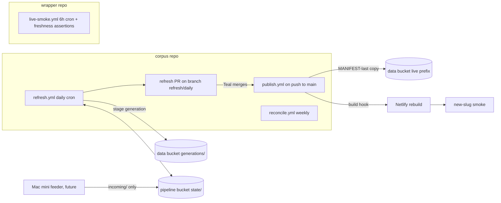

# Self-Running Corpus: Lane B Stage 1 Spec

**Date:** 2026-07-18
**Status:** Draft for council SPEC review (Codex xhigh required + Opus max external + Gemini via agy)
**Owner:** Teal Emery. **Architect session:** Fable 5, Claude Code, per Project Shell Runbook v0.2 Stage 1
**Linear:** TEA-1031 (supersedes TEA-906 when refresh.yml lands)
**Grounding:** 2026-07-17 consolidation roadmap sections 4/6/9/10/11; 2026-07-06 council audit tech-debt table; code verified against `src/corpus/cli.py`, `src/corpus/snapshot.py`, `src/corpus/parsers/`, `prospectus-web-ti/scripts/{build.sh,upload-snapshot.sh}`, `.github/workflows/` in both repos; interview with Teal 2026-07-18 (five decisions recorded in section 3)

**BLUF:** A sovereign files a prospectus; within 48 hours it is on the site, rendered, and nobody at Teal Insights touched anything except one morning PR merge. This spec makes that real with a daily GitHub Actions refresh that is fail-closed at every seam: S3-canonical state so runs are incremental, a parse-path fix gated BEFORE the scheduler exists so automation cannot mint monospace documents, PR-gated publishing with MANIFEST-last activation and a new-slug smoke, alarms that reach Teal's inbox without vigilance, and a Mac mini feeder contract that keeps GHA the sole writer. Automation that creates cleanup work is worse than manual; every requirement below is testable against that bar.

## 1. The user experience this buys

| Who | Today | After Lane B |
|---|---|---|
| IMF Legal / WB Debt Unit repeat visitor | Newest LuxSE doc six weeks stale; refresh happens when Teal remembers | New filings from API sources live within 48h; a public register states per-source freshness and known gaps |
| Teal | Runs the pipeline by hand, watches it | Merges one PR most mornings (~2 min); reads an alarm email when something breaks; nothing else recurring |
| Funders / forkers | "Trust us, we run it" | Every refresh is a public Actions run on the open repo; the register commits itself |

## 2. Locked decisions (inherited; this spec builds on them, does not reopen them)

1. Daily cadence (decided 2026-07-17).
2. GHA spine; Mac mini feeder lane for bot-walled sources only.
3. PR-gated publishing. Auto-merge is earned later; its flip is a separate issue whose DoD includes the Lane D e2e suite, the real-data new-slug smoke, and a clean-cycle run.
4. Toil-free bar: zero recurring manual steps, alarms not vigilance, fail-closed.
5. Keepalive implemented as the workflow committing its own regenerated coverage register.

## 3. Decisions made in the Stage 1 interview (2026-07-18)

1. **State home: S3-canonical.** Pipeline state (DuckDB, manifests, originals archive) moves to a private S3 bucket; the Mac retires from the write path. Section 5.
2. **v1 source scope: EDGAR + NSM daily; LuxSE joins by spike outcome; PDIP weekly reconcile only; LSE excluded until TEA-1008, register row marked "adapter pending."**
3. **Alert channel: email to lte@tealinsights.com**, delivered via GitHub issue notifications (section 10), no SMTP secret to rot.
4. **Merge cadence: daily-ish.** Teal merges the refresh PR most mornings; the public SLO can honestly say 48 hours for API sources.
5. **Non-goals: all eight confirmed** (section 13).

## 4. Architecture overview

Two workflows in the corpus repo plus one changed workflow in the wrapper repo:



- **refresh.yml** (daily cron + dispatch): lock, restore state, discover/download/parse/ingest new documents, regenerate the coverage register, build the snapshot, stage a complete immutable generation on the data bucket, push state, commit register + run metadata to `refresh/daily`, open or update the single refresh PR.
- **publish.yml** (on merge to main touching the refresh run file): copy the approved generation into the live prefix with MANIFEST last, fire the Netlify build hook, poll the deploy, run the new-slug smoke, auto-roll back MANIFEST + parquet on smoke failure, alarm on any failure.
- **reconcile.yml** (weekly): full-window re-discovery, PDIP check, state integrity audit, generation pruning. Monthly deep sweep is the same workflow with `deep=true`.
- **live-smoke.yml** (wrapper, exists): gains MANIFEST-age and per-source freshness assertions. It is the cross-repo dead-man switch: it alarms even when the corpus repo's automation is entirely dead.

Nothing publishes without a human merge. Every failure path ends in an alarm or a no-op, never a partially published site.

## 5. State: S3-canonical, single writer

Today the refresh inputs exist only on Teal's Mac: `corpus.duckdb` 7.1 GB, `data/original` 7.9 GB, `data/manifests` 9.5 MB. A hosted runner starts empty, so state gets a canonical cloud home.

**New private bucket `ti-sovtech-pipeline`** (separate from the public data host so no bucket-policy interaction can expose it; Block Public Access on; versioning on):

```
state/corpus.duckdb.zst      the database, zstd-compressed
state/manifests/*.jsonl      discovery/download manifests (the durable record of holdings)
state/STATE.json             tiny commit pointer: db sha256, size, updated_at, schema rev
originals/{storage_key}.{ext}  append-only archive of source documents
incoming/{source}/...        Mini feeder staging (empty until a walled source needs it)
locks/refresh.lock           single-writer lock object
```

**Protocol.** A run reads `STATE.json` first; if the GitHub Actions cache already holds a DB with that sha, no download happens (daily runs stay warm; S3 egress only on cache miss or eviction). After ingest the run uploads `corpus.duckdb.zst`, then manifests, then `STATE.json` LAST: the pointer write is the commit, mirroring the MANIFEST-last discipline. Bucket versioning makes any torn or bad push recoverable by pointer rollback.

**Single writer.** The GHA `concurrency` group serializes workflow runs; the lock object guards against non-GHA writers. A local run becomes a documented takeover: acquire the lock, pull state, run, push, release (runbook section, section 15). The Mini feeder never touches `state/`; it writes `incoming/` only.

**Cutover (one-time, from the Mac).** Compact the DB first (7.1 GB against a 2.5 GB snapshot suggests bloat; record before/after sizes), then upload DB + manifests + the originals archive, then write STATE.json. From that moment the Mac is a consumer; a documented pull recipe refreshes the local mirror on demand.

## 6. Gate 0: the parse-path fix (merges before refresh.yml exists)

**The defect, code-verified.** `cli.py:751-756` routes `.pdf` to Docling (which emits the markdown sidecar at `cli.py:867-874`), but `.htm/.html` to BeautifulSoup and `.txt` to a plain-text parser, neither of which produces markdown. `snapshot.py:_fetch_text` then serves those documents as `text_source='pages'`, which the explorer renders as raw monospace. Every future EDGAR HTML ingest would mint this defect daily; the roadmap council rated it CRITICAL. It merges as its own PR, green and deployed to the standard parse path, before any scheduler work begins.

**The fix.**

- `.htm/.html`: keep the existing BeautifulSoup lane for page-segmented JSONL (page-break CSS splitting preserves page citations), and ADD a Docling HTML conversion producing the markdown sidecar. Docling's HTML backend is the no-ML path; Gate 0 CI asserts it runs on a bare runner with no model download.
- `.txt`: stays plaintext by decision, not neglect. These are typewriter-era SGML filings; honest monospace is the correct rendering. Recorded here so the council and future sessions do not reopen it as a bug.
- **Output-dir reconciliation:** the standard lane owns `data/parsed/` (`{storage_key}.jsonl` + `{storage_key}.md`). `data/parsed_docling/` (4.2 GB, the one-time reparse trees) is declared a read-only legacy archive; nothing in the refresh path reads or writes it. `build-markdown` and ingest continue to read sidecars from `parsed_dir` only.
- Scope boundary: this gate fixes the RECURRING path for new ingests. Re-parsing the existing 51 pages-source documents is Lane A's one-off batch, out of scope here (non-goal 3).

**Acceptance (Gate 0).**
- When the parse command processes a fixture EDGAR `.htm` with headings and a table, then `data/parsed/` contains both the JSONL and a non-empty `.md` sidecar, and the markdown contains heading syntax.
- When a snapshot is built over that document, then its text JSON has `text_source='markdown'` and a non-empty TOC.
- When the HTML lane runs in CI on a bare runner, then no Hugging Face model download occurs (assert the cache directory stays absent).
- When a `.txt` fixture is parsed, then behavior is unchanged from today (pages lane, no sidecar).

## 7. refresh.yml: the daily run

**Trigger:** cron at an off-peak minute (e.g. `23 9 * * *` UTC) plus `workflow_dispatch` with inputs: `sources` (default `edgar,nsm`, extended to include `luxse` when the spike passes), `since` (discovery window override), `dry_run`.
**Concurrency:** group `refresh`, cancel-in-progress true (safe: nothing in this workflow touches the live prefix).
**Permissions:** explicit per job; `contents: write` and `pull-requests: write` for the PR job; `id-token: write` for AWS OIDC. Repo-level default stays read-only.

**Steps, in order (each step's failure alarms and aborts; no step leaves the site half-changed because this workflow never touches the live prefix):**

1. Checkout (SHA-pinned actions), `uv sync --frozen`.
2. Acquire `locks/refresh.lock` via conditional PUT with run id + timestamp; a lock older than 7 hours is stale and may be broken with a logged warning.
3. Restore state per section 5 (cache-first, sha-verified).
4. Discover per source with an incremental window from the state watermark. One API call per LEI/CIK per the NSM lessons; circuit breakers and rate limits from `config.toml` apply unchanged.
5. Consume `incoming/` (validate hash, size, extension allowlist, source enum; ingest through the same path; archive consumed fragments). No-op while the feeder lane is unbuilt.
6. Download new documents to the originals archive layout; append manifest records including `source_sha256` of the fetched bytes.
7. Parse only documents that are new or whose `source_sha256` changed (section 12). Docling PDF weights come from an actions cache keyed on the Docling version; the HTML lane needs none. Per-run parse budget: at most 200 documents; overflow carries to the next run and the register reports `parse_backlog` (alarm at threshold 500, meaning three-plus runs behind).
8. Ingest to DuckDB. Documents that fail parsing are ingested with a quarantine status, listed in the register, and excluded from the snapshot; they never block the run (fail-closed, not fail-loud-and-stop).
9. Regenerate the coverage register (JSON + markdown table): per source, last successful discovery timestamp, last new document date, document counts, quarantine list with reasons, known-gap rows (LSE: "adapter pending, TEA-1008"; walled sources later: "feeder pending"). The register states holdings and known gaps; it never claims completeness (roadmap coverage-language discipline).
10. Build the snapshot (full local regeneration; MANIFEST.json written last locally, existing discipline). The snapshot copies `register.json` alongside MANIFEST so freshness is publicly readable and the wrapper smoke can assert it.
11. Stage a complete immutable generation at `prospectus/generations/<generated_at>/snapshot/` on the data bucket: gzip-stage locally (`gzip -n`, existing), list the live prefix once, then per text object either server-side copy from live (unchanged: local gzip MD5 equals live ETag) or upload (new/changed). Parquet, MANIFEST, and register always upload. Assert generation object count equals manifest document count plus fixed files. This is the incremental-upload fix: daily transfer is the delta, yet every generation is a complete, activatable, rollbackable snapshot.
12. Push state (DB, manifests, STATE.json last), release the lock.
13. Commit the regenerated register (`docs/coverage/register.json` + `docs/coverage/register.md`; NOT under `data/`, which pre-commit blocks from git) and `docs/refresh/RUN.json` (generation id, counts by source and country, sampled new slugs, hashes) to branch `refresh/daily` (force-push; the workflow rebuilds this branch from main each run). Open the PR if none is open, else the force-push updates it: **supersede-not-stack** means there is never more than one open refresh PR and it always describes the newest generation. Superseded generations are pruned by reconcile after 7 days; nothing is lost because ingested state already holds the documents and the next generation includes them.
14. PR body: counts by source and country, register delta, three sampled new documents with links to their source filing URLs and staged text JSONs, the generation id, and the exact rollback command.

**No-change days:** the register still updates (last-verified timestamps), the branch still gets its daily commit (keepalive, section 11), and the PR notes "no new documents." Merging it is optional; freshness of the SITE only lags when real documents wait.

## 8. publish.yml: activation on merge

Trigger: push to main with `docs/refresh/RUN.json` in the changeset. Reads RUN.json for the generation id, then:

1. Copy generation to the live prefix, ETag-diff so only changed objects move: text objects first, then `documents.parquet`, then `register.json`, then **MANIFEST.json LAST** (no-store). The mid-upload cache-poisoning reasoning in `upload-snapshot.sh` carries over verbatim; the long-window variant (a merged-but-not-yet-activated generation must never overwrite live parquet under the old version token) is exactly why the refresh stages to a generation prefix instead of writing live directly.
2. Fire the Netlify build hook (secret URL). Netlify's build fetches the NEW live MANIFEST + parquet (existing `build.sh` behavior) and regenerates every per-document page.
3. Poll the Netlify API for the triggered deploy until `ready` (timeout 20 minutes).
4. **New-slug smoke:** for a sampled slug from RUN.json (preferring a markdown-source NEW document), assert the live doc page returns HTTP 200, the live text JSON has `text_source != 'pages'`, and the site's browse payload reflects the new MANIFEST `generated_at`. Plus the existing live-smoke assertions.
5. On smoke failure: auto-restore the previous generation's MANIFEST.json and documents.parquet to the live prefix (both retained in generations/), then alarm with the failing evidence. The site returns to its pre-merge state; the 404 exposure is bounded to minutes.
6. On success: comment the outcome on the merged PR (counts, deploy id, smoke evidence) and close the loop on the run.

**Accepted risk, in writing:** between MANIFEST activation (step 1) and the Netlify deploy going live (step 3), the already-deployed site's runtime parquet fetch can show new rows whose pages 404. The window is minutes, bounded by the Netlify build, and ends in a verified state or an auto-rollback. Eliminating it entirely requires build-against-staging plus coordinated deploy activation (`BUILD_DATA_FETCH_BASE` exists for this); that refinement is deliberately deferred until evidence shows the window matters.

## 9. reconcile.yml: weekly and monthly hygiene

Weekly (cron, plus dispatch): full-window re-discovery per source to catch anything incremental windows missed; PDIP check (its only scheduled touch, per the interview decision); state integrity audit (DB counts vs manifests vs originals object counts); generation pruning: keep the last 7 daily generations plus the first of each month, delete the rest using the scoped delete permission. Monthly `deep=true` adds: live-prefix object sweep against the current MANIFEST (stale-object report; no automatic deletion, takedown stays deliberate) and a full ETag reconciliation.

## 10. Alarms: email to lte@, via GitHub issues, zero new secrets

**Mechanism.** Every workflow's failure handler (and every explicit staleness check) creates or comments on a single pinned issue labeled `alarm` in the corpus repo. GitHub emails issue activity to lte@tealinsights.com reliably (subscription confirmed once during the walking skeleton). This gives email delivery with no SMTP credential to rot, plus a public, timestamped alarm history for free. Default Actions failure emails remain as backstop.

**Per-source freshness thresholds (from the register, enforced in two places):**

| Signal | Threshold | Where checked |
|---|---|---|
| Discovery last succeeded, per active source | > 3 days red | refresh.yml (self) AND wrapper live-smoke (independent) |
| Live MANIFEST `generated_at` age | > 8 days red | wrapper live-smoke |
| Parse quarantine backlog | > 500 red | refresh.yml |
| Walled-source incoming age (once feeder exists) | > 7 days red | live-smoke via register |

**Dead-man principle.** The corpus repo cannot alarm its own total death (disabled cron, revoked credentials). The wrapper's live-smoke reads the PUBLIC live `register.json` and MANIFEST age, so a silently dead refresh pipeline turns red from a different repo on a different schedule within 8 days worst case. Register rows marked "adapter pending" or "feeder pending" are exempt from the per-source threshold so known gaps do not cry wolf.

## 11. Keepalive, without ritual

GitHub disables scheduled workflows in repos with no activity for 60 days. The refresh workflow's daily register commit to `refresh/daily` is repo activity, so the corpus repo's clock resets every run even when nothing merges (the locked keepalive decision, implemented). The WRAPPER repo has the same clock and rarely gets commits: its live-smoke workflow therefore force-pushes a one-line heartbeat file to a non-main branch (`smoke-heartbeat`) once a week. Non-main, because wrapper main pushes trigger Netlify deploys. Both keepalives are workflow-owned artifacts, not remembered chores; both are asserted in the acceptance criteria.

## 12. Determinism: pinning and change hashing

- **Docling pinned by uv.lock** (pyproject carries a floor, `docling>=2.86.0`; the lock is the authority and refresh runs `uv sync --frozen`). Each parsed record stores `parse_tool` + `parse_version` (already in ParseResult). PDF model weights are cached keyed on the Docling version.
- **Change detection hashes source bytes, never markdown.** `source_sha256` of the fetched artifact is recorded at download; a document re-parses only when its source hash changes or a deliberate reparse campaign says so. Docling output nondeterminism across versions therefore cannot cause churn: same source bytes, no re-parse, byte-identical snapshot text, and the ETag-diff upload moves nothing.
- **Docling upgrades are deliberate:** bumping the lock requires a reparse-campaign decision (a minted issue), never a side effect of a routine dependency PR. The Dependabot config carries an ignore rule for docling so version bumps arrive only through those deliberate issues.
- `gzip -n` staging (existing) keeps compressed bytes stable so the ETag-diff mechanism works at all.

## 13. Non-goals (confirmed by Teal, 2026-07-18; changes go through the pivot ceremony)

1. **grep/extract clause steps in the daily run.** The snapshot consumes documents, pages, markdown only; extraction reruns when the clause track needs it.
2. **New source adapters** (Dublin, ESMA, SGX, LSE/TEA-1008). Dublin and the onboarding pattern are the next Stage 1 spec.
3. **Lane A items:** the 51-document one-off reparse, 19 no-text recoveries, new-this-month view, feeds, vocabulary, issuer canonicalization. Gate 0 fixes the recurring path only.
4. **Lane C items:** docs site, quickstart CI, Zenodo releases. Lane B publishes `register.json`; Lane C surfaces it.
5. **Auto-merge flip** (separate issue; e2e suite + real-data smoke + clean cycles as DoD; locked).
6. **Corpus-wide search and clause views** (parked, unchanged).
7. **MotherDuck migration.** State is S3-canonical by decision; revisit only if the shuttle mechanics fail in practice.
8. **The e2e suite itself** (Lane D; precondition for auto-merge, not for v1).

Also explicitly not here: Prefect/Dagster/Luigi (Makefile-and-Actions only, ratified decision 9), Selenium anywhere in the GHA lane, and any change to the explorer UI.

## 14. Mini feeder contract (specified now, built when the first walled source needs it)

- Runs on the Mac mini under launchd, one job per walled source, reusing the repo's adapter code in fetch-only mode: discover + download, then write originals plus a manifest-fragment JSONL to `incoming/<source>/<run-ts>/` on the pipeline bucket.
- Credentials: a dedicated IAM user whose ONLY permission is `s3:PutObject` on `incoming/*`. No reads of state, no deletes, no data-bucket access. Key rotation noted in the runbook.
- **GHA remains the sole ingester and publisher** (locked): the refresh run validates and ingests incoming artifacts through the identical parse/ingest path; nothing the Mini writes reaches the site without passing the same gates.
- The Mini is deliberately NOT a self-hosted runner (public-repo fork-PR exposure, named in the roadmap).
- Health is observed, not monitored: a dead Mini shows up as walled-source staleness in the register and trips the live-smoke threshold. No heartbeat infrastructure on the Mini itself.
- v1 ships this contract on paper and the `incoming/` consumption step in refresh.yml as a no-op scan. The first implementation lands with whichever walled source arrives first (LuxSE if the spike fails; SGX with wave 2 otherwise).

## 15. LuxSE hosted-runner spike (early task, timeboxed to one session)

From a plain `ubuntu-latest` runner: execute real LuxSE discovery queries and download two known documents with production headers and rate limits; record HTTP outcomes. Pass: LuxSE enters the daily source list from GHA. Fail (403 or challenge): LuxSE becomes Mini feeder job 1 and the register marks it "feeder pending" until then. The spike also measures a Docling PDF parse cold vs warm weights cache (runtime budget evidence) and asserts the HTML lane's no-model claim (feeds Gate 0 CI). Its one-line LuxSE terms-of-use conclusion is recorded on the spike issue per the roadmap's per-source ToS gate. Spike output: a comment on its Linear issue plus a one-line addendum to this spec's section 3.

## 16. Walking skeleton (slice 1: one new real document, end to end)

The smallest daily run that publishes one new real document with zero manual steps beyond the merge:

refresh.yml exists with EDGAR only, dispatch-triggered (cron stays off), state bootstrapped by the cutover. One dispatch run: acquires the lock, restores state, discovers a real new EDGAR filing (`since` override permitted to guarantee one), downloads, parses through the Gate 0 path (markdown sidecar present), ingests, regenerates the register, builds the snapshot, stages a complete generation whose transfer log shows the delta mechanism worked (a handful of uploads, thousands of server-side copies), pushes state, opens the PR with counts and sampled links. Teal merges. publish.yml activates MANIFEST-last, fires the Netlify rebuild, polls the deploy, and the new-slug smoke passes against production: the new document's page returns 200 with `text_source='markdown'`. Separately, a forced failure on a scratch branch fires the alarm issue and Teal confirms the email landed.

The skeleton proves: state shuttle, lock, Gate 0 in the production path, incremental staging, PR gate, activation ordering, rebuild, smoke, alarm. Everything after (NSM, LuxSE, cron-on, reconcile, pruning) is addition, not architecture.

## 17. Definition of done (whole build)

- Gate 0 merged first, all its acceptance criteria green.
- Walking skeleton executed against production with a real document (link recorded on TEA-1031).
- Cron on; five consecutive scheduled runs with zero manual intervention besides PR merges; at least one published a real new document.
- One forced-failure drill: alarm issue created, email received, confirmed by Teal.
- Freshness assertions live in the wrapper smoke; both keepalives observed working (register commit; wrapper heartbeat).
- Takedown drill: the scoped-delete workflow removes a test object from the live prefix and the runbook records the procedure.
- `docs/refresh-runbook.md` written: takeover procedure, rollback, takedown, secret rotation, spike outcomes.
- TEA-906 closed as superseded; the auto-merge flip issue minted with its locked DoD; Mini feeder and LuxSE outcomes recorded.
- Build metrics line per branch in `docs/build-metrics.md` (shell discipline).

## 18. Acceptance criteria (testable, when/then)

1. When refresh.yml runs on a day with no new filings, then it completes green, commits a register whose timestamps moved, updates or opens exactly one PR, and transfers at most the parquet, MANIFEST, and register to the generation (text delta zero).
2. When a new EDGAR `.htm` filing appears, then the next run's PR lists it, its staged text JSON has `text_source='markdown'`, and after merge its live page returns 200 with rendered text.
3. When two refresh runs are triggered concurrently, then the concurrency group cancels one; when a non-GHA writer holds the lock, then the run aborts with an alarm and touches nothing.
4. When a run is killed mid-flight at any step, then the live site is byte-identical to before the run, and the next run creates a fresh generation; partial generations are inert and pruned by reconcile.
5. When a parse fails, then the document is quarantined with a reason in the register, the run stays green, and the document does not appear in the snapshot.
6. When the same source bytes are re-downloaded, then no re-parse occurs and the generation's text delta for that document is zero (source-hash change detection).
7. When a refresh PR is unmerged and a new run completes, then the old PR content is superseded in place, exactly one refresh PR exists, and the superseded generation is pruned only after 7 days.
8. When Teal merges the PR, then publish.yml activates the generation with MANIFEST last, and the new-slug smoke passes or MANIFEST + parquet auto-roll back with an alarm.
9. When discovery for an active source has not succeeded for 3 days, or live MANIFEST age exceeds 8 days, then the wrapper live-smoke turns red and the alarm issue emails lte@.
10. When any workflow fails, then the alarm issue receives a comment naming the workflow, run URL, and failing step.
11. When 60 days pass with no human commits, then scheduled workflows in BOTH repos remain enabled (register commits; wrapper heartbeat branch).
12. When the takedown workflow runs with a slug input, then exactly that object set is deleted from the live prefix using the scoped permission, and the register records the takedown.
13. When refresh.yml is inspected, then every third-party action is SHA-pinned, AWS access is via OIDC role assumption (no long-lived AWS keys in Actions secrets), no workflow uses `pull_request_target`, and Dependabot config for github-actions + pip landed in the same PR that created refresh.yml.
14. When the Mini feeder lane is later built, then its IAM credential can write `incoming/*` and nothing else (deny-tested), and GHA ingestion validates hash, size, and extension before ingest.

## 19. Risks (each mitigated or accepted, in writing)

| # | Risk | Disposition |
|---|---|---|
| 1 | GHA cron delayed (5-30 min) or silently disabled | Mitigated: off-peak minute; keepalive commits both repos; cross-repo dead-man freshness alarm; dispatch always available |
| 2 | State push torn mid-upload corrupts the DB | Mitigated: STATE.json-last commit pointer; bucket versioning; sha verification on restore; weekly integrity audit |
| 3 | DB (7.1 GB) outgrows the 10 GB Actions cache | Mitigated: compaction at cutover with recorded sizes; zstd; size in run metrics; pure-S3 pull works (slower) as fallback |
| 4 | Docling version drift re-parses the world or changes bytes | Mitigated: source-hash change detection; uv.lock pin; upgrades only via deliberate reparse-campaign issue |
| 5 | Big filing day blows the 6h job cap | Mitigated: 200-doc parse budget with carryover; backlog metric alarms at 500 |
| 6 | Minutes-long 404 window after activation before rebuild is live | Accepted: bounded by Netlify build time, ends in verified state or auto-rollback; build-against-staging refinement deferred until evidence |
| 7 | Source API changes break discovery | Mitigated: circuit breakers exist; failure alarms rather than corrupts (fail-closed); quarantine absorbs partial damage |
| 8 | Secrets on a public repo | Mitigated: OIDC (no stored AWS keys); scoped roles per workflow; SHA-pinned actions; no pull_request_target; secrets absent in fork PRs by platform default |
| 9 | State bucket accidentally public | Mitigated: separate bucket, Block Public Access on, acceptance check in cutover |
| 10 | Netlify build hook fires but deploy fails | Mitigated: publish polls deploy state; timeout alarms; MANIFEST rollback restores coherence |
| 11 | LuxSE spike fails with no feeder built | Accepted: LuxSE stays manual with a "feeder pending" register row and a minted feeder issue; EDGAR/NSM freshness unaffected |
| 12 | Teal stops merging (travel, illness) | Accepted: site goes stale, staleness alarms fire by design; data keeps accumulating in state; nothing breaks. The SLO is a target, not a promise, until auto-merge is earned |

## 20. Explainer principles (adopted / skipped on purpose)

From `building-big-things.md`: walking skeleton (section 16), pre-mortem framing (section 19), small batches (Gate 0 as its own PR before any scheduler), modularity via the feeder contract's one-way interface. Skipped: reference-class calendar forecasting (the shell plans in dependency order, never weeks). From `writing-for-busy-readers.md`: BLUF, skim-test headings, tables for enumerable facts. `interface-design-for-small-data-tools.md`: skipped (no human interface in this lane) except status visibility, which the PR body and register implement.

## 21. Licensing and terms posture

No new components; the pipeline and workflows stay MIT in the open repo, and public Actions runs are themselves the open-core proof. EDGAR and NSM are documented public APIs used within their published fair-access rules (rate limits and User-Agent already enforced from config.toml). LuxSE gets its one-line terms-of-use conclusion recorded on the spike issue before it enters the daily loop, per the roadmap's per-source ToS gate. The register and snapshot remain public data; the pipeline bucket is private infrastructure, not a publication.
