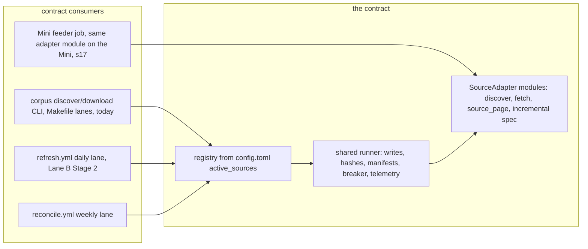

# Source Onboarding Pattern + Euronext Dublin Adapter: Stage 1 Spec

**Date:** 2026-07-19 (v3.1; council rounds 1, 2, and 3 fully triaged in)
**Status:** Round 1 (Codex gpt-5.6-sol xhigh NOT SOUND; four fresh internal seats, generalist / sovereign-debt domain / consumer / pipeline-seams, all SOUND WITH CHANGES) applied in v2. Round 2 (Codex delta on v2: 3 CLOSED, 7 PARTIAL, NOT SOUND on 10 new findings in v2's mechanisms) applied in v3, which also reconciled with PR #128 (ontology pilots merged mid-council). Round 3 (Codex closure check on v3, the final round per doctrine: round-2 score 5 CLOSED 5 PARTIAL, round-1 partials 4 CLOSED 3 PARTIAL, 3 CRITICALs + 4 IMPORTANTs residual, all with undisputed mechanical closures) applied chair-side in this v3.1 per the Lane B v3.1 precedent; no fourth round. Dispositions in section 18. **Awaiting Teal sign-off.** After sign-off: Stage 2 branch plan, separate session.
**Owner:** Teal Emery. **Architect session:** Fable 5, Claude Code, per Project Shell Runbook v0.2 Stage 1.
**Linear:** TEA-1035 (Dublin adapter + the source-onboarding pattern; this spec is its Stage 1), with TEA-1053 (ESMA PRIII) and TEA-1055 (SGX via the Mini feeder) reusing the pattern. All three minted 2026-07-19 in the Launch 0 batch.
**Grounding:** 2026-07-17 consolidation roadmap sections 7/11 (source ranking, live probes, dedup and ToS rulings); 2026-07-18 self-running-corpus spec v3.1 (the platform this plugs into); code read and chair-verified this session: `src/corpus/sources/{nsm,edgar,luxse,pdip,provenance}.py`, `src/corpus/cli.py`, `config.toml`, `sql/001_corpus.sql`, `src/corpus/db/ingest.py`, `src/corpus/snapshot.py` (filing_url COALESCE at 250; ISSUER_TO_COUNTRY exact-name lookup at 28/139/287; in_scope filter at 255; stale-slug text sweep at 401-413); live DB checks (hash coverage per source incl. pdip 0/823; 454 exact-hash clusters over 1,173 docs, 5 cross-source; zero LuxSE Kenya docs); live probes 2026-07-18/19 (plain fetches, no bot-wall circumvention: directory page 200 with bulk-download endpoint and `#dublin-issuer-list` widget; `?letter=K` returns no server-rendered rows; DOL 403 for 2026-07-17 from two fetch shapes, while a council seat separately fetched a live March DOL PDF, so the pattern stands and the 403 looks date-specific); interview with Teal 2026-07-19 (three decisions in section 3); PR #128 reference tables read from main (issuer_canonical.csv 268 raw names to 146 entities; doc_class_map.csv + title rules; doc_classes.csv, all status=approved, with this spec's dedup soft key named consumer 3 of that vocabulary); round-2 verification points (snapshot.py SCHEMA_VERSION comment vs the ratified additive-within-version parquet contract; snapshot-client.ts SUPPORTED_SCHEMA_VERSION = 1 hard check; ingest _insert_countries already consuming {country_code, country_name, role} lists).

**BLUF:** One adapter contract, six seams (discovery, retrieval, provenance, incremental refresh, ledger wiring, per-source alarms), enforced by a registry, a shared runner, and a parametrized contract test suite, so that a new source is exactly: one module, one config block, one ToS line, one fixture set, one reference-data file if needed, and zero edits anywhere else. A synthetic toy source proves that bar mechanically, and three one-time platform refactors landing WITH the contract (snapshot country resolution from `document_countries` with obligor precedence; the filing_url fallback rule; the parquet additive-within-version policy reconciliation) make the bar true rather than aspirational. Dublin instantiates the pattern first: allowlist-scoped discovery over the exchange directory, S3 document retrieval, a daily incremental signal (Daily Official List or directory diff, spike-decided), and the corpus-wide exact-dedup pass (SHA-256 hard key, one document with multi-venue listings) that the Lux/Dublin duopoly and the 454 duplicate clusters already in the corpus make necessary. ESMA and SGX are validated against the contract on paper and become config-plus-one-module builds in their own turns. The how-to doc, written with Dublin as the worked example, makes the pattern the product.

## 1. The job and the users

The corpus stands at 9,795 documents across five sources (LuxSE 4,965; EDGAR 3,339; PDIP 823; NSM 665; LSE 3). Source expansion serves the repeat visitor whose country is not yet covered (the Janet He class of gap report), and Dublin is ranked first because it is the other half of the historic Lux/Dublin listing duopoly: likely new sovereigns none of the five sources hold (Albania, Armenia, Azerbaijan, Kenya confirmed on the live directory), heavy Turkiye quasi-sovereign and Gulf/Indonesia sukuk paper, plus cross-venue duplicates of documents the corpus already holds, which the dedup pass turns from double-counting into attested multi-venue provenance. The pattern, not the source, is the durable asset: ESMA (archive recovery), SGX (Asia coverage via the feeder), and later sources should each cost one module.

## 2. Locked decisions (inherited; built on, not reopened)

1. Wave 1 order: Dublin, then ESMA, then SGX on the Mini feeder (decided 2026-07-17/18).
2. Dedup: PDF SHA-256 is the only hard key. (canonical issuer + class + publication date) is a soft near-dup signal routed to review, never a uniqueness constraint. ISINs are a multi-valued attribute, never a dedup key.
3. Every source records a one-line ToS and reproduction-rights conclusion before its adapter ships. Fetch feasibility alone clears nothing.
4. ESMA backfill routes to the archive strip, never the new feed.
5. Platform invariants from the self-running spec v3.1: adapters return `skipped_exists` for known files and never re-fetch; skip decisions key on recorded source hashes, not local disk; content-addressed originals; watermarks advance only at state commit; holdings register changes only when holdings change while run ids and operational state live in the health beacon; per-source freshness alarms; quarantine never blocks a run; the Mini feeder is fetch-and-stage only (its section 17).
6. Ratified architecture decisions 2, 6, 7 (breadth within sovereign issuers; core table + JSON metadata; `{source}__{native_id}` storage keys, no country in paths) and the NSM lessons (two-phase discover/download; name-search false positives; circuit breakers tested; config read in the CLI layer).

## 3. Decisions made in the Stage 1 interview (2026-07-19)

1. **Dublin crawl perimeter: sovereign + linked SPVs.** Central governments plus sovereign sukuk SPVs and explicit state-linked quasi-sovereigns, via a curated allowlist built from one full directory sweep, classified once, committed as reference data. New issuers surfaced by the incremental signal route to review before joining the crawl. `issuer_type` tags per the existing schema.
2. **Exact-dup resolution: one document, multi-venue listings.** A SHA-256 match attaches a listing record to the incumbent document instead of minting a second document row. ISINs union across venues at the listing level. Forward-only: a one-time audit reports existing cross-source duplicate clusters, and no already-published document row is merged away in wave 1 (no published URL changes).
3. **Near-dup review lane: non-blocking advisory.** Candidates appear in the refresh PR body and a register section; both documents publish normally in the meantime; dispositions are batched into a committed decisions file the pipeline consults. **Mechanism corrected by council round 1:** the originally proposed `scope_status='excluded'` demotion would in fact 404 the page (the snapshot builder selects `in_scope` only and its stale-slug sweep deletes the text JSON; chair-verified). v2 preserves the decision's principle (page stays reachable, browse hides it, URL stability absolute) with a visibility marker instead: `documents.duplicate_of_document_id` plus an additive snapshot column, section 5.8.

## 4. Where the contract sits (consumers on both sides)



The contract is the seam the self-running spec's refresh.yml already assumes ("discover per source with incremental windows from state watermarks"). It must work in both worlds: the manual CLI/Makefile world that exists today (Dublin can build and backfill before refresh.yml exists) and the scheduled world when Lane B Stage 2 lands. Feeder-staged sources run the same adapter module on the Mini; GHA consumes their `incoming/` output through the identical ingest path (self-running spec sections 9.5 and 17).

**Registration is not activation.** The registry knows every source; the descriptor's `cadence_class` says WHICH lane runs it when scheduled (active-feed = daily, archive = weekly reconcile, feeder-staged = Mini cadence), and a separate `scheduled` boolean says WHETHER the platform runs it at all. A source merges with `scheduled = false`, is exempt from discovery-stale and zero-finds alarms while unscheduled (register row shows "enrolled, not yet scheduled"), and earns `scheduled = true` by a config-only change after its walking skeleton plus clean runs. Lane-B lane membership derives from the registry (`cadence_class` x `scheduled` x `execution_venue`), never from per-source workflow edits; the platform spec's literal `sources` input default becomes an override.

**Division of labor with Lane B, explicit:** this spec owns the contract, the registry, the runner, the dedup pass, the three one-time platform refactors named in section 5.14, and the Dublin adapter. Lane B owns the schedulers, state shuttle, register/health/alarm **evaluation**, and the feeder plumbing. The contract **declares** per-source register fields, health fields, and alarm thresholds; Lane B's builders iterate the registry to evaluate them. Either can land first.

**Seam deltas handed to Lane B Stage 2** (recorded here so neither spec silently double-owns them):
1. refresh.yml and reconcile.yml derive their source lists from the registry as above (the hardcoded `edgar,nsm` default becomes an override).
2. The state revision artifact list gains the per-source state pointers (`source_state/<source>.json`) and their state trees (small per-source artifacts such as Dublin's directory snapshot basis).
3. The monthly revalidation sample extends to non-primary exact-hash listing URLs (listings carry `download_url` and attach-time `file_hash` for exactly this). Until Lane B lands this, listing-byte divergence is recorded as unmonitored in the register's limitations, not silently assumed covered.
4. EDGAR and NSM incremental discovery (`supports_since = true`) is implemented in Lane B Stage 2, where refresh needs it; wave-1 shims declare their current capability honestly (section 5.5).
5. takedown.yml resolves the dedup equivalence class: suppressing a storage key also suppresses the full class (documents demoted as its duplicates via the `duplicate_of` chain, unmerged same-SHA-256 peers, and their listings, per section 5.8's fixed-point closure), and the takedown drill proves a canonical/demoted pair cannot leave or resurrect equivalent public content. This build's ingest-side halves of the same contract (never attach to a suppressed document; a hash match against suppressed bytes suppresses the newcomer) are section 5.8's.

## 5. The adapter contract

### 5.1 Shape: registry, descriptor, protocol, runner

- **Registry:** `config.toml` gains `[corpus] active_sources = ["nsm", "edgar", "pdip", "luxse", "lse", "dublin"]` (order = display order). The registry resolves each name against a configurable package list (default `["corpus.sources"]`; tests prepend a fixture package, which is how toysource exists without shipping in the product package) and validates the protocol at startup. **Catalog vs runnable adapters:** a descriptor may set `adapter_status = "pending"` (LSE: three live corpus documents, register row "adapter pending, TEA-1008", ToS section enforced, but no module, never protocol-validated, never schedulable); everything else defaults `"active"`. This keeps the register total over real holdings, per the platform's known-gap rows, without pretending an adapter exists. `[pdip_annotations]` and other non-source config sections are untouched; only `active_sources` names are sources.
- **Descriptor (config block per source),** extending the existing `[<source>]` convention:

```toml
[dublin]
display_name = "Euronext Dublin (GEM + MSM)"
cadence_class = "active-feed"      # active-feed | archive | feeder-staged
execution_venue = "gha"            # gha | feeder
feed_routing = "new-feed-eligible" # new-feed-eligible | archive-only (consumed from config at build time, section 5.10)
scheduled = false                  # activation; flipped by config-only change after skeleton + clean runs
landing_url = "https://live.euronext.com/en/markets/dublin/bonds/list"  # filing_url fallback, section 5.14
delay = 1.0
max_retries = 3
timeout = 60
rate_limit_sleep = 60
[dublin.circuit_breaker]
total_failures_abort = 10
[dublin.alarms]                    # optional overrides of cadence-class defaults
review_pending_days = 14
[dublin.cli_options]               # optional extra per-source CLI options, schema in the prose below
```

`cli_options` entries carry: `param` (e.g. `"--tiers"`), `type` (`str | int | path | flag`), `default`, `help`, `multiple` (bool), and which phase they bind to (`discover | download`). The CLI builds per-source subcommands at startup by iterating the registry, so Click registration happens before parsing and no runtime-dynamic option injection is needed. NSM's `--reference-csv` and EDGAR's `--tiers` become declared options; the parity matrix covers the rest, including discover's current `--output`.

- **Protocol (`src/corpus/sources/base.py`),** typed, minimal, names fixed here so Stage 2 is transcription:

```python
class SourceAdapter(Protocol):
    name: str
    def discover(self, ctx: DiscoveryContext) -> DiscoveryResult: ...
    def fetch(self, record: DocRecord, ctx: FetchContext) -> FetchResult: ...
    def source_page(self, record: DocRecord) -> tuple[str | None, str]: ...
    incremental: IncrementalSpec
```

`DiscoveryContext` carries the HTTP client, source config, mode (`incremental` | `full`), the watermark window, a per-source `state_dir` for small source-state artifacts (e.g. Dublin's directory snapshot basis), and read-only access to reference data. `DiscoveryResult` is the structured output channel every existing adapter already returns informally (chair-verified: all four return stats dicts today): `records: list[DocRecord]`, `stats` (per query: label, available, captured; totals), `watermark: str | None` (opaque per-source token, a few KB max; larger diff bases live in `state_dir`), `outcome: ok | partial | failed`, `notes`. `FetchResult` is a status plus optional content as `bytes` or a chunk iterator (the runner owns the sink; local file writes today, streaming S3 PUTs under Lane B, so the platform's streaming-upload requirement lands runner-side without adapter changes). `DocRecord` is the manifest record formalized as a TypedDict: `source, native_id, storage_key, title, issuer_name, lei (optional), isins (list, may be empty), doc_type (raw source code), publication_date (optional), submitted_date (optional), download_url, file_ext, issuer_type (optional), countries (optional), source_metadata (dict)`. `countries` is a list of `{country_code, country_name, role}` dicts, deliberately the exact shape `_insert_countries` already consumes (chair-verified: ingest handles the list with role support today, so insertion needs no ingest surgery; only the `obligor` role value is new). Dublin fills `issuer_type` and `countries` from the allowlist; legacy shims omit both so existing DB defaults and behavior are unchanged. `IncrementalSpec` is section 5.5. Protocol coverage by tier: `discover`, `source_page`, and `incremental` are universal; `fetch` is Tier A; Tier B sources satisfy retrieval through the `legacy_batch` hook (section 6), and the contract suite asserts each source wires exactly one retrieval path.

- **Runner (`src/corpus/sources/runner.py`):** owns everything adapters currently copy-paste: existence checks against recorded manifests and listings (never `target.exists()` alone), safe_write to `data/original/` today and content-addressed originals under Lane B, SHA-256 hashing, manifest append, JSONL telemetry with real statuses (NSM lesson 7), the circuit breaker (failures count, skips never do; NSM lesson 5), per-source delay and rate-limit backoff, and discovery-output persistence. **Runner-executed sources' adapters never write files and never sleep.** Conformance is two-tier (section 6): Tier A (Dublin onward, plus toysource) is fully runner-executed; the four legacy adapters are Tier B shims whose internals are grandfathered until each migrates.
- **Disk-present, manifest-absent repair:** when the runner finds bytes on disk with no manifest record (today's reality after any interrupted run), it hashes the existing file, appends the manifest record, and reports `skipped_exists` with a repair note, converting a latent lost-document state into self-healing instead of a safe_write refusal.
- **Status vocabulary, closed:** `downloaded | skipped_exists | skipped_no_url | skipped_no_document | failed_http | failed_invalid_content | failed_error | rate_limited`. `skipped_no_document` generalizes NSM's `no_pdf_link` (a skip, not a failure). Exceptions raised by the HTTP client map to `failed_http`; unexpected exceptions map to `failed_error`; both count toward the breaker. `rate_limited` triggers runner backoff (`rate_limit_sleep` from config), one retry of the same record, then counts as a failure if rate-limited again; it never increments the breaker on the first hit.
- **Coverage honesty:** discovery must report available vs captured per query and log any cap or dropped page loudly. The register can only state "what we hold, what we know we lack" if adapters never truncate silently. A contract test asserts `file_hash` is non-null on every ingested record, so no future source can silently degrade dedup the way PDIP's bypass did.

### 5.2 Discovery

`discover()` returns a `DiscoveryResult`; the runner persists the discovery JSONL (existing two-phase pattern kept: inspectable discovery, re-runnable download). Modes:

- `incremental`: driven by the source's IncrementalSpec signal and the watermark window. Must be cheap (a handful of requests).
- `full`: the complete sovereign-scoped sweep (backfill and the weekly reconcile cross-check).

**The discovery envelope survives the two-phase CLI, and it is BOUND and COMMITTED properly.** Discovery persists TWO artifacts: the DocRecord JSONL (as today) and a sidecar envelope `<source>_discovery.meta.json` carrying run id, window, mode, outcome, stats, the candidate watermark, references to any staged source state, AND the SHA-256 of the JSONL it describes. `corpus download` validates that binding (envelope run id + JSONL digest) and refuses a mismatched pair, so a second discovery overwriting the sidecar can never promote a newer watermark against an older record file. During discovery, `state_dir` is READ-ONLY except `state_dir/staged/<run-id>/` (Dublin's new directory-snapshot basis is written there, never over the live basis). **Advancement rule:** the watermark advances only when every record in the envelope's window reached a terminal non-failure state (downloaded or any `skipped_*`); any `failed_*` record blocks advancement and is recorded in the envelope as a retry backlog, and a record failing three consecutive runs moves to a download-quarantine list (register reason, per-source alarm counter) so one permanently dead URL cannot freeze the watermark forever. **Commit mechanism, local:** one pointer file per source, `data/config/source_state/<source>.json` (watermark + live state-tree reference + envelope digest), replaced atomically via a single rename after the staged tree is in place; the rename IS the commit, the miniature of Lane B's STATE.json pattern, and under Lane B the pointer rides the state revision. An `outcome = partial` envelope never advances or promotes (the weekly reconcile covers the gap), so missed pages cannot be skipped permanently and a failed run cannot corrupt the diff basis. Discovery-file format: runner-persisted DocRecord JSONL + envelope supersedes the legacy per-source shapes (NSM raw `_source` dicts, PDIP un-enriched rows); legacy discovery files are void, regenerated by re-running discover (cheap), and the generic download command reads the new format only.

### 5.3 Retrieval

`fetch()` returns content (bytes or chunk iterator) plus extension, or a skip/fail status. The runner validates content (`%PDF` magic for pdf ext; non-empty for html/txt), hashes, writes, appends the manifest record enriched with `file_path` (relative, lesson 11), `file_hash`, `file_size_bytes`. Retrieval must use only stable or re-derivable URLs; if a source hands out expiring signed URLs (LuxSE's defect, issue #93), the adapter must re-derive a fresh URL at fetch time rather than persisting the signed form.

### 5.4 Provenance

`source_page()` is required and must return a **stable, human-facing deep link** (`filing_index | artifact_html | artifact_pdf | search_page | none`). The current `provenance.py` dict covers only edgar/nsm/pdip; LuxSE falls through to `COALESCE(source_page_url, download_url)` in the snapshot, which is how expiring signed URLs reached the site (issue #93). The contract moves resolution into the adapter protocol; `provenance.py` becomes a thin dispatcher over the registry with the legacy functions kept for the sources that have them. Contract rule, enforced by test: `source_page()` never returns a URL with credential or expiry query material. The snapshot fallback rule changes once, platform-side, in this build (section 5.14).

### 5.5 Incremental refresh (IncrementalSpec)

A small declarative dataclass per source:

- `signal: str` (human-readable mechanism id: EDGAR submissions recency; NSM dated query; Dublin DOL-or-directory-diff; ESMA Solr timestamp filter; SGX feeder-side discovery).
- `supports_since: bool`. Wave-1 truth: Dublin `true`; the four legacy shims `false` (no incremental code exists in src/corpus today, chair-verified); EDGAR and NSM flip to `true` in Lane B Stage 2 where refresh needs them (handed delta 4). `--mode incremental` on a `supports_since = false` source runs full with a logged notice, never an error, so platform lanes can call uniformly.
- `reconcile: str` (what the weekly full sweep re-checks; also the cross-check leg of the zero-finds alarm).

Requirement: a new listing on the source is discoverable within one daily cycle for `active-feed` sources; `archive` sources run on the weekly lane only; `feeder-staged` sources run on the Mini's cadence and are observed via incoming-age.

### 5.6 Ledger and register wiring

Per-source register row fields the contract guarantees (Lane B's builder renders them): display name, cadence class, scheduled state, adapter status, TWO holdings counters (canonical documents whose `documents.source` is this source, and attested listings this source holds on other sources' documents; a Dublin record attached to a PDIP document counts in Dublin's listings, never in its documents), known-gap notes (config-declared), quarantine count, near-dup pending pairs, review-lane items (each with its stable detected date), ToS pointer. **Holdings-register discipline (platform round-2 seam, honored):** no run ids, no timestamps-of-latest-run, nothing that changes on a no-change day; run ids and operational state live in the health beacon. Review-lane and near-dup entries change the register only when items appear or resolve, which are real changes. Health beacon fields per source (Lane B evaluates): last discovery success, last new document date, latest run outcome. The adapter contributes outcomes through runner telemetry; it never writes the register itself.

### 5.7 Per-source alarms (declaration here, evaluation in Lane B)

Cadence-class defaults, overridable per source in `[<source>.alarms]`:

| Class | discovery-stale | zero-finds | other |
|---|---|---|---|
| active-feed | 3 days red | 21 consecutive zero-find days AND weekly reconcile also zero | standard |
| archive | 10 days red (weekly lane) | exempt (an archive source finding nothing new is normal) | backfill-complete flag in register |
| feeder-staged | n/a (GHA does not discover) | exempt | incoming/ age > 7 days red (self-running s14) |

Two additional declarations: `scheduled = false` sources are exempt from discovery-stale and zero-finds entirely (enrolled, not yet scheduled; the register row says so); `review_pending_days` (Dublin default 14) alarms when a review-lane item's stable detected date ages past the threshold, so a flagged debut sovereign cannot sit unreviewed for weeks while a user reports the gap the pipeline already fetched a signal for. This closes the gap the self-running spec left open for non-daily sources: ESMA must never page Teal for the crime of being an archive.

### 5.8 The dedup pass (lands with Dublin, corpus-wide mechanism)

**Hard key: SHA-256 of the document bytes. Nothing else is hard.**

**The table (generic, additive, schema conventions kept: explicit sequence + `DEFAULT nextval`):**

```sql
CREATE TABLE document_listings (
    listing_id       INTEGER PRIMARY KEY DEFAULT nextval('document_listings_seq'),
    document_id      INTEGER NOT NULL REFERENCES documents(document_id),
    source           VARCHAR NOT NULL,
    native_id        VARCHAR NOT NULL,
    storage_key      VARCHAR NOT NULL,
    source_page_url  VARCHAR,
    download_url     VARCHAR,          -- fetchable venue URL (revalidation input, handed delta 3)
    publication_date DATE,             -- the venue's date; document-level date stays the canonical listing's
    isins            JSON,
    file_hash        VARCHAR,          -- bytes hash at attach time (original: the document's own hash)
    attachment_basis VARCHAR NOT NULL, -- 'original' | 'exact-hash' | 'curated'
    metadata         JSON,             -- the listing's DocRecord source_metadata + issuer_type + linkage, preserved
    detected_at      TIMESTAMP DEFAULT current_timestamp,
    UNIQUE(source, native_id)
);
```

`attachment_basis='original'` marks the listing minted with its own document row ("primary listing" deliberately avoided: to this audience that is a venue term of art, and this field means ingest lineage, not listing venue).

**Invariants and rules:**

- Every non-demoted document has exactly one `original` listing; a demoted document has zero (its listing was re-pointed, below). Document insert and its original-listing insert are ONE explicit transaction (current ingest autocommits per statement, chair-verified; a crash between the two must not orphan the invariant).
- **Ingest attach rule with root eligibility:** a new record whose `file_hash` matches an existing document attaches as an `exact-hash` listing and mints no document row, targeting the oldest ELIGIBLE root: `scope_status = 'in_scope'`, not suppressed, and not demoted (a match on a demoted document follows `duplicate_of` ONE hop to its canonical; `dedup apply` refuses self-demotion and cycles by construction, so one hop always terminates). **Basis integrity:** `exact-hash` is claimed only when the newcomer's bytes equal the FINAL target's bytes; a match routed one hop through a demoted row whose canonical carries DIFFERENT bytes attaches with basis `curated` (it inherits the human same-work judgment, never a false byte-identity claim). A match whose only candidates are quarantined mints the newcomer normally (the quarantined row is unpublished failed-parse state, not a publishable root); if the quarantined document later heals, the resulting same-hash document pair surfaces in the weekly audit for review, never auto-merged (forward-only). A match against a SUPPRESSED document attaches nothing and publishes nothing: the bytes are suppressed, the newcomer is recorded in the register's takedown section and excluded from the snapshot (the ingest-side half of handed delta 5), and that takedown record is durable and keyed by the newcomer's storage key, which joins the ingest skip set (idempotency below) so the suppression decision persists across manifest rescans instead of re-recording. The manifest record persists on disk in every case. The listing's `metadata` preserves the newcomer's FULL DocRecord minus content (title, issuer spelling, lei, raw doc_type, publication date, isins, issuer_type, countries with roles, source_metadata), so per-venue attribution survives even where document-level merges are unattributed; its `countries` merge into `document_countries` (additive inserts in the same transaction; the PK dedups); the canonical document's own fields are never overwritten. Attachments never mint feed entries.
- **Idempotency:** the ingest skip set is `documents.storage_key` UNION `document_listings.storage_key` UNION the takedown section's suppressed-newcomer storage keys (without that third leg, a manifest line whose hash matches suppressed bytes would re-record its takedown item on every rescan; Codex P2, PR #129 review), so re-reading the same manifest line (routine: ingest rescans manifest dirs) reports `skipped_exists` instead of violating UNIQUE, double-attaching, or re-recording a suppression.
- **Determinism:** within a batch, records process in ascending `publication_date` (nulls last), then `storage_key`; across batches the pick is arrival-order (whoever ingested first is canonical), which forward-only makes harmless and PERMANENT: nobody later "fixes" arrival order with a retroactive re-pick, because that changes published URLs.
- **Lookup mechanics:** the hash check runs as one batch anti-join per ingest batch, not per-record point lookups (`documents.file_hash` is unindexed; fine at corpus scale only if batched).
- **Hash-coverage precondition:** the hard key only sees rows that HAVE a hash, and PDIP's 823 documents carry none (chair-verified: luxse 4,965/4,965 hashed, edgar 3,339/3,339, nsm 665/665, lse 3/3, pdip 0/823; PDIP ingest bypassed the manifest pipeline, issue #66). The dedup pass ships a one-time PDIP hash backfill BEFORE the Dublin backfill runs, resolving paths from the DB (PDIP's legacy `file_path` values predate decision 7 and contain country directories), with rows whose originals are genuinely absent listed in the audit report rather than silently skipped.
- **Soft near-dup advisory (upgraded: the pilots landed mid-council as PR #128, status approved, with this signal named consumer 3 of the vocabulary):** after each ingest batch, candidate pairs key on canonical issuer + document class + non-null `publication_date`, exactly the locked tuple, resolved through the shipped reference tables: issuer via `issuer_canonical.csv` (268 raw names to 146 entities; unmapped names, which every new Dublin issuer initially is, fall back to casefold-collapsed raw with the pair marked lower-confidence), class via `doc_class_map.csv` + title rules; when EITHER side is unclassified, the class term relaxes and the pair matches on issuer + date alone, marked lower-confidence (requiring raw `doc_type` equality cross-source would make the advisory structurally blind to exactly the cross-venue case that motivates it). Suppression, narrowed twice: a pair is suppressed only when BOTH sides classify `final_terms` AND both ISIN sets are non-empty and disjoint (same-day multi-series drawdowns are distinct by construction; `final_terms` is the one approved class that is tranche-specific by definition). `supplement` is NOT tranche-level in the approved taxonomy (it amends a prospectus or base), so supplement pairs with disjoint ISINs are annotated, never suppressed, like every other class: two venues can extract different partial ISIN subsets from one programme document. Empty sets never suppress. Different hashes required, dispositioned pairs excluded. Advisories render in the register section and refresh PR body; never blocking, never auto-suppressing. Known limitations, stated in the register's coverage language: unmapped-issuer fallback under-detects until names are added to the canonical table (the pilots' governance owns additions; unmapped-issuer alarms extend issue #85), and byte identity under-detects same-work cross-venue pairs whenever a venue re-linearizes the PDF. Whether byte-identical cross-venue pairs exist at volume is an empirical output of the backfill, not an assumption.
- **Decisions file:** `docs/coverage/dedup-decisions.jsonl`, committed, append-only: `{pair: [storage_key_a, storage_key_b] sorted, canonical: storage_key, disposition: "distinct" | "duplicate", note, decided, by}`. Ingest consults it to silence dispositioned pairs. `corpus dedup apply` executes "duplicate" dispositions idempotently (re-apply is a no-op).
- **Demotion mechanics (corrected in v2, completed in v3):** apply migrates ALL of the demoted document's listings to the canonical atomically: its `original` listing re-points with `attachment_basis='curated'`, and any `exact-hash` listings it had accumulated re-point with their basis RE-DERIVED by the integrity rule: a migrated listing keeps `exact-hash` only if its recorded hash equals the canonical's hash; otherwise it converts to `curated` (the bytes matched the demoted document, not the canonical; carrying `exact-hash` forward would mint false byte-identity claims against the SHA-only contract). UNIQUE(source, native_id) holds throughout; the demoted document ends with zero listings, and the invariant reads: every non-demoted, non-suppressed document has exactly one `original` listing. Apply refuses self-demotion, cycles, demoting a document that is itself a canonical target in the same decisions file (chain decisions must name the final canonical), and any canonical target whose `scope_status` is not `in_scope` or that is suppressed. It then sets `documents.duplicate_of_document_id` (new nullable column, additive ALTER) and leaves the row `in_scope`. The snapshot emits the row with an additive `duplicate_of` slug column, legal at SCHEMA_VERSION 1 under the ratified additive-within-version parquet contract (section 5.14 refactor 3 reconciles the stricter code comment and proves client tolerance), so the page stays live and the URL never breaks; browse hiding and count exclusion happen when Lane A consumes the column. `scope_status='excluded'` is NOT used for this: chair-verified, exclusion means absent from parquet AND the stale-slug sweep deletes the text JSON, and the platform's takedown semantics rely on exclusion meaning exactly that.
- **Takedown and the equivalence class, to a fixed point:** these are legal documents, and both a demoted duplicate and an unmerged byte-identical row are the SAME work, so suppression must cover the FULL class: starting from the named storage key, close over `duplicate_of` edges (both directions) AND same-SHA-256 edges across documents and listings, iterated to a fixed point, and suppress every member. The unmerged case is live today (five cross-source exact-hash clusters exist with no `duplicate_of` schema yet), so a takedown that stopped at the named row would leave byte-identical public content standing. Ingest never attaches to suppressed roots and suppresses hash-matching newcomers (the attach rule above). The workflow half (takedown.yml resolving the class, plus the drill proving no class member survives or resurrects) is handed delta 5 to Lane B; this build ships the ingest half and the fixed-point class-resolution query both sides share.
- **Curated listings, the divergence edge, and canonical updates:** `curated` listings are excluded from byte-divergence logic by basis (their bytes never matched the canonical's). For `exact-hash` listings, divergence monitoring (venue silently replaces its copy) requires the Lane B revalidation extension (handed delta 3); until it lands, the register's limitations note says listing URLs are not re-checked. When a CANONICAL document's bytes change in place via the platform's update path, its `exact-hash` listings' recorded hashes no longer match; the weekly integrity audit recomputes listing-hash agreement and routes mismatches to the advisory lane for review, never auto-detaching (forward-only). Page-citation integrity note for whenever a listing link is rendered: a curated listing's venue copy may paginate differently from the canonical text, so any future listing UI labels curated links as a venue variant, never as the cited text.
- **One-time audit:** a read-only report of existing exact-hash clusters, committed as `docs/coverage/duplicate-audit-<date>.md`. Not hypothetical: 454 clusters involving 1,173 documents exist today (5 cross-source before the PDIP backfill; expect more after). Informational in wave 1; feeds later curation. No retroactive merging.
- **Explorer surface:** none in wave 1 beyond the additive `duplicate_of` column. "Also listed on" display data is available from listings for a later additive column; nothing here blocks or requires it.

### 5.9 The ToS gate (mechanically enforced)

`docs/sources.md`, one section per source: a one-line terms-of-use and reproduction-rights conclusion, the date, who concluded it, and a link to the source's terms page. A contract test fails if any registered source lacks its section (test takes the docs path as a parameter so toysource's fixture doc satisfies it without weakening the production gate). This build backfills the five existing sources' entries (EDGAR, NSM, PDIP, LuxSE, LSE; LuxSE's rides the Lane B spike conclusion if that lands first; Teal confirms wording). Dublin's entry lands in the spike PR before the adapter ships. The register row links each entry.

### 5.10 Feed routing

`feed_routing` declares whether a source's documents may ever appear in "new this month" surfaces: `new-feed-eligible` (Dublin: backfill items self-select out because those views key on publication date) or `archive-only` (ESMA, locked: even a 2026-dated ESMA record routes to the archive strip). Consumers derive routing from the registry config at build time (source is on every document row; a join at feed-build time cannot drift), rather than stamping per-document copies that would need defaults and backfills across 9,795 existing rows. Attachments never mint feed entries (section 5.8), so an ESMA listing attached to a LuxSE document adds no feed exposure either way.

### 5.11 CLI

`corpus discover <source>` and `corpus download <source>` become registry-generic commands: existing flags preserved (`--discovery-file` with per-source defaults, `--output-dir`, `--manifest-dir`, `--log-dir`, `--run-id`), new `--mode` and `--since` for incremental windows, and per-source extra options declared in the descriptor's `[<source>.cli_options]` and exposed dynamically (NSM's `--reference-csv`, EDGAR's `--tiers` become declared options, so source-specific needs never require cli.py edits again). **Parity is a matrix, not a vibe:** the migration branch produces an explicit parity matrix covering flags and defaults per source, NSM's `delay_api`/`delay_download` split vs the generic `delay`, EDGAR's `CONTACT_EMAIL` User-Agent plumbing and 660s rate-limit sleep, abort exit codes as they are today (nsm/edgar exit 0 with a warning; pdip/luxse exit 1; recorded and preserved so `make download-all` chain behavior is unchanged; any normalization is a separate deliberate change), and the stats-key translation table (section 6). New parity tests lock the matrix, because the existing CLI tests are `--help` smoke only (chair-verified) and would pass any regression. `corpus source list` prints the registry with cadence, venue, scheduled state, routing, and ToS status.

### 5.12 Contract test suite (what makes one-module additions safe)

`tests/sources/test_contract.py`, parametrized over the registry with tier awareness (section 6): discovery fixtures parse to valid DocRecords (schema-checked); DiscoveryResult stats complete (available vs captured); status vocabulary respected at the reporting boundary; circuit breaker fires (NSM lesson 8, generalized to every source forever); breaker ignores skips; `source_page()` returns stable URLs (no expiry material); `file_hash` non-null on ingested records; dedup attach and idempotent re-ingest exercised with fixture hash collisions; ToS section present. Plus the **synthetic toysource** (registered via the test package list, config in test fixtures only) proving end to end that a source needs exactly one module + config: the toysource test invokes the real CLI commands, the real runner, and the real ingest against fixtures with zero edits outside its module.

### 5.13 What a new source requires (the bar, exhaustively)

1. `src/corpus/sources/<name>.py` implementing the protocol.
2. One `[<name>]` config block and its name appended to `active_sources` (with `scheduled = false` until earned).
3. One `docs/sources.md` ToS section.
4. `tests/sources/test_<name>.py` with recorded fixtures (the parametrized contract suite picks the source up automatically).
5. Reference data if the source needs scoping (e.g. Dublin's issuer allowlist), including issuer-to-country facts that flow through `DocRecord.countries` into `document_countries` (which the snapshot consumes after the section 5.14 refactor, so no shared mapping file needs editing).

And explicitly zero edits to: `cli.py`, the runner, register/health/alarm builders, refresh.yml, the snapshot builder, the schema. Flipping `scheduled = true` later is a config-only enrollment change. If onboarding source N+1 requires touching any of those, the contract failed and that is a defect, not a workaround.

### 5.14 Three one-time platform refactors that make the bar true (this build, not per source)

1. **Snapshot country resolution with obligor precedence.** Today the snapshot resolves country by exact `issuer_name` lookup in the hard-coded `ISSUER_TO_COUNTRY` map and ignores `document_countries` entirely (chair-verified at snapshot.py:28/139/287), so any new source's unfamiliar issuer spelling renders "Unknown" until someone edits a platform reference file, which breaks the zero-edit bar and worsens the three-way country-reference drift (issue #80). One-time refactor landing with the contract: the snapshot's display country prefers the `obligor` role row, then the `issuer` role row, then the legacy map. Obligor-first is the domain-correct order: a user filtering to Indonesia must find Indonesia's sukuk, not a Cayman SPV jurisdiction; the SPV's incorporation stays visible as data. **Disclosed delta:** the corpus's only three existing `document_countries` rows are the LSE Republic of Congo documents, currently rendering "Unknown" because their issuer spelling is absent from the legacy map; this refactor correctly flips them to Congo, a real, audited, called-out improvement, so "existing rows unaffected" holds for every row EXCEPT those three, by design. Dublin rows carry countries from the allowlist through the existing ingest path.
2. **filing_url fallback rule.** `COALESCE(source_page_url, download_url)` is how LuxSE's expiring signed URLs reached the public site (issue #93). One-time change landing with the contract: for registry sources, `filing_url` falls back from `source_page_url` to the descriptor's `landing_url`, and only then to `download_url`. This retroactively improves 4,965 LuxSE rows from dead signed URLs to a working landing page, a data-affecting change called out in the migration notes. A LuxSE mini-spike (part of the shim branch) checks whether a stable per-document page scheme exists; if yes, a LuxSE resolver + provenance backfill is minted as its own follow-up item; if no, landing-page fallback is the recorded end state and issue #93's link-check remains open.
3. **Parquet additive-within-version policy reconciliation.** The ratified parquet-as-API contract (roadmap section 5, council-accepted) says columns are additive-only WITHIN a schema version and version bumps are deliberate; the snapshot.py comment says bump on ANY consumer-visible shape change, and the deployed client hard-checks `SUPPORTED_SCHEMA_VERSION = 1` (both chair-verified). Those conflict the moment the additive `duplicate_of` column lands. Resolution, in the ratified contract's favor: the producer comment is rewritten to the additive-within-version policy, SCHEMA_VERSION stays 1, and a fixture test in explorer-web proves the deployed client path reads a version-1 parquet CARRYING the extra column (DuckDB-WASM queries named columns; unknown columns are invisible to it, and the fixture makes that a guarantee instead of an assumption). This is a data-contract test addition, not a UI change, the same carve-out class as Lane B's Gate 2.

## 6. Migration of the four existing adapters (two-tier conformance, stated honestly)

Council round 1 (three seats convergent) established that "thin shims with zero behavior change" and "the runner owns writes, sleeps, and skips" cannot both be true: the legacy internals do their own `target.exists()` checks, safe_writes, hashing, and sleeps (chair-verified). v2 resolves this with explicit tiers:

- **Tier A (runner-executed): Dublin onward, plus toysource.** The full section 5.1 runner contract holds: adapters never write, never sleep, skips key on recorded hashes.
- **Tier B (legacy shims): nsm, edgar, pdip, luxse.** Each gains a protocol shim exposing `discover`/`source_page` and an IncrementalSpec (`supports_since = false`), with internals grandfathered: they keep their own writes, sleeps, and disk-keyed skips for now. **Tier B dispatch is a batch hook, stated plainly:** the legacy download flow is batch-level (`run_<source>_download` owns the loop, breaker, sleeps, and manifest writes), so per-record `fetch()` cannot preserve it; instead each shim registers `legacy_batch(ctx, records) -> stats`, where the generic CLI parses the persisted DocRecord JSONL (envelope-validated) and the shim converts records to its legacy per-record shape via its own `to_legacy_records()` before feeding a lightly refactored run body that accepts records instead of re-reading the file (a three-line change to each `run_*`, not a rewrite; the legacy readers cannot parse DocRecords directly, chair-verified for NSM's `_source` re-wrap and PDIP's un-enriched rows, so the conversion hook is where the format boundary lives). The contract suite drives the ACTUAL persisted generic file through each legacy dispatch on fixtures. Status translation applies at the reporting boundary (`no_pdf_link` to `skipped_no_document`, `failed_invalid_pdf` to `failed_invalid_content`, etc.). The contract suite asserts each source wires exactly one of the two paths. The translation table ships in the parity matrix, stats keys unify, manifest FORMAT is unchanged, and the affected assertions in the existing per-source tests are updated deliberately. The contract suite asserts protocol shape, provenance, ToS, registry membership, and boundary status vocabulary for Tier B; runner-execution assertions (no-write, no-sleep, hash-keyed skips) apply to Tier A only.
- **Tier migrations are named follow-ups, not silent scope:** EDGAR and NSM migrate to Tier A in Lane B Stage 2 (refresh on a stateless runner needs hash-keyed skips and runner-owned writes there; handed delta 4); LuxSE and PDIP migrate as hygiene when touched. Until a source migrates, the platform invariant "skip decisions key on recorded source hashes" is true for Tier A sources only, and this spec says so rather than pretending.
- **Cadence and activation for the four:** nsm `active-feed, scheduled = true`; edgar `active-feed, scheduled = true`; luxse `active-feed, scheduled = false` until the Lane B hosted-runner spike dispositions it; pdip `archive, scheduled = true` (weekly lane, honoring the platform's PDIP-weekly decision).
- The four near-identical CLI command bodies collapse into the generic dispatch under the parity matrix. Deeper unification of adapter internals is not wave-1 work.

## 7. Dublin instantiation

### 7.1 Spike D0 (the first implementation task, before adapter code)

Recorded findings, both sessions:

- 2026-07-17 (memo research pass): A-Z list server-rendered with sovereigns visible on letter pages; documents on an open S3 bucket (HTTP 206 `application/pdf` from a datacenter IP); DOL at `live.euronext.com/sites/default/files/statistics/dol/DOLYYYY-MM-DD.pdf` described as a predictable-URL daily PDF.
- 2026-07-18/19 (this session, plain fetches): the directory page returns 200 and embeds first-page issuer rows plus a bulk-download endpoint (`/en/markets/dublin/bonds/list/download?product_data=` and a "Directory List" download route) and a `#dublin-issuer-list` widget; `?letter=K` returned NO server-rendered rows, implying the table body loads through a data endpoint; the DOL URL for 2026-07-17 returned 403 (S3-style AccessDenied) from two fetch shapes while the directory page fetched clean from the same client. A council seat independently fetched a live March 2026 DOL PDF and the DOL landing page, so the URL pattern is verified and the 403 looks date-specific (publication timing or a gap day). A separate `govbonds/list` route exists.

Spike burn-downs, each with a recorded answer on the Linear issue:

1. **Directory discovery mechanism:** does the bulk-download endpoint return the full securities directory (issuer, security name, ISIN, market) to a plain scripted request? If yes it becomes the discovery backbone. If not, capture the data endpoint behind the issuer table (one AJAX endpoint is fine per the no-Selenium rule; a headless-browser requirement is a STOP-and-report).
2. **Documents mechanism (the memo's hour-one question):** from an issuer or security row to its document PDFs: server-rendered tab or one AJAX endpoint; the native document id (the stable `native_id` candidate); the S3 URL shape; metadata fields available. Confirm S3 objects fetch from a datacenter-shaped client.
3. **DOL:** exact URL/date behavior (weekends, holidays, publication hour), required headers, access from a hosted-runner IP, and whether the new-admissions section is extractable. If DOL stays brittle, the fallback incremental signal is a daily directory diff against the prior snapshot basis in `state_dir`, which burn-down 1 may make one cheap request anyway.
4. **Which date the metadata carries:** document date vs venue posting date, recorded explicitly (listing dates and prospectus dates routinely differ; the corpus's document-level date is the canonical listing's and the rule must be grounded in what Dublin actually provides).
5. **`govbonds/list`:** one look: does it list sovereign issues absent from `bonds/list`?
6. **Volume bound:** count securities and documents for two allowlist-shaped issuers (one sovereign, one sukuk SPV) to size the backfill and the per-day request budget.
7. **ToS read:** draft the one-line conclusion for `docs/sources.md` from Euronext's website terms; flag anything constraining public rehosting for Teal's confirmation before the adapter PR.

Spike exit: all seven answered with evidence, or a STOP-and-report naming what is blocked. Timebox one session.

### 7.2 Discovery design

- **Allowlist (interview decision 1):** one full directory sweep enumerates issuers; a one-time classification pass (name heuristics + LLM assist) produces `src/corpus/reference/data/dublin_issuers.csv` (the reference-data home PR #128 established) with columns: issuer name as listed, normalized key, `issuer_type` (sovereign | quasi-sovereign), `incorporation_country`, `obligor_country`, `spv_of` (the sovereign a vehicle fronts, empty for direct issuers), status (`active | review | excluded`), evidence note. **Every SPV row is hand-checked and its evidence note cites the obligor from the prospectus cover page** (the boundary traps are real: sovereign-sounding corporate vehicles like Aramco's sukuk SPVs must classify as corporate and stay out). Sub-sovereign rule: regional and municipal issuers classify `quasi-sovereign` with `obligor_country` their sovereign's code. Committed, PR-reviewed, and the single place the crawl perimeter lives. **Vocabulary and issuer-table citizenship (pilots governance, three tables, approval-gated):** the Dublin build also ships `doc_class_map.csv` rows for every observed Dublin source code (with title rules where routing needs them; `needs_review` and honest `unclassified` are acceptable, never forced) and PROPOSES issuer rows across the full three-table model: `issuer_canonical.csv` entries for new raw names, matching `issuer_entities.csv` rows (sukuk SPVs stay DISTINCT legal entities per the approved entity rules, linked to their sovereign through the allowlist's `spv_of` and `obligor_country`, never merged into the sovereign's entity), and `issuer_entity_members.csv` where composites arise. Rows land `status=proposed` in the adapter PR and activate when Teal's review flips them to approved (the pilots' governance gate); until then the soft key's raw-normalized fallback applies honestly, and the unmapped-issuer alarms (issue #85 extension) track the residue. "Classify and canonicalize on arrival" therefore means: proposed on arrival, active at PR approval.
- **Daily incremental:** the spike-chosen signal (DOL parse or directory diff) yields new or changed securities. Securities of allowlisted issuers route to targeted document discovery. Securities of UNKNOWN issuers matching sovereign-candidate heuristics are flagged as review-lane items (register + PR body, stable detected dates, `review_pending_days` alarm declared); they join the crawl only when their allowlist row flips to `active`.
- **Weekly reconcile:** full directory sweep + full document re-list for allowlisted issuers (bounded: allowlist-only, not the exchange), which is also the zero-finds cross-check.
- **Backfill:** full document crawl for every `active` allowlist issuer, breadth within the perimeter (every document on their tabs, no type filter, ratified decision 2). Runs locally on the Mac/Mini with a recorded run id (the LuxSE April pattern); if Lane B's S3 cutover has happened first, the backfill lands as a state revision. The adapter is venue-agnostic so either order works.

### 7.3 Retrieval, provenance, identity

- Retrieval: direct GET of the S3-hosted PDF; `%PDF` validation; politeness delay 1.0s; low volume by design after backfill.
- `native_id`: the stable per-document identifier the spike pins down. `storage_key = dublin__<native_id>`. Never an ISIN (multi-valued) and never a title hash.
- `source_page()`: the issuer or security page on `live.euronext.com` (stable, deep-linkable, kind `filing_index`). Never the S3 object as the human-facing link.
- `isins`: attached per record from the security rows the document appears under.
- `issuer_type` and `countries` from the allowlist. Sukuk and SPV paper: the SPV's incorporation country carries role `issuer`; the obligor sovereign carries role `obligor`, a NEW value added to the `document_countries` role vocabulary in this build's migration (the existing `issuer | guarantor | related` cannot express it: most sovereign sukuk carries deliberately NO guarantee, and labeling the obligor `guarantor` is legally false in front of exactly the restructuring-counsel audience; `related` hides sovereign credit from role-filtered views). The linkage note lives in `source_metadata` and rides listing `metadata` on attach.

### 7.4 Dedup expectations

The backfill is the first real exercise of section 5.8 at volume. Acceptance requires at least one real CROSS-SOURCE exact-hash pair attested (the candidate pool is Dublin against LuxSE, PDIP after its hash backfill, and EDGAR; the domain seat's evidence suggests Dublin-vs-PDIP is the likelier pair than Dublin-vs-LuxSE, and whether byte-identical cross-venue pairs exist at volume is an empirical output). **If the backfill finds ZERO cross-source exact pairs, that is a recorded STOP-and-assess signal** (byte identity under-detects same-work duplicates; the register's limitations language and the near-dup advisory volume get re-examined before the source ships), not a silently waived AC. The backfill report states documents minted vs listings attached vs advisories raised vs advisories suppressed by ISIN disjointness.

### 7.5 Register, alarms, routing, config

`cadence_class = "active-feed"`, `execution_venue = "gha"` (memo probes: Dublin fetches clean from datacenter IPs; if the spike contradicts this from a hosted runner, Dublin flips to `feeder-staged` by config), `feed_routing = "new-feed-eligible"`, `scheduled = false` at adapter merge, flipped to `true` by config-only change after the walking skeleton plus clean runs (the enrollment model of section 4, so the merged-but-unscheduled window never fires false staleness alarms).

## 8. ESMA on paper (proof 1 of the config-plus-one-module bar)

- `discover`: Solr GETs against the ESMA PRIII register (JSON to plain requests), windowed on record timestamps (incremental native). **Sovereign scoping is the module's real design problem and is named as spike E0 burn-down 1** (the register is overwhelmingly corporate; the scoping mechanism, register query fields, home-member-state and issuer-name search behavior, gets pinned in one session, and a small allowlist analog as committed reference data is EXPECTED, not absent). E0 burn-down 2: the PDF-download URL template (one DevTools session, per the memo).
- `fetch`: the URL template from E0.
- `source_page`: the register record URL (stable, public).
- Config: `cadence_class = "archive"` (weekly lane, zero-finds exempt, backfill-complete flag), `execution_venue = "gha"`, `feed_routing = "archive-only"` (locked decision 4), `scheduled = false` until its skeleton passes.
- Dedup posture: high expected overlap with LuxSE, PDIP, and Dublin (MSM-listed sovereign prospectuses were NCA-approved and flow into the register; the third-country records cluster 2013-2021, coherently a Brexit artifact since FCA-approved London listings stopped flowing to ESMA after transition end; recording that rationale keeps the archive-class call defensible). Hard key absorbs exact duplicates as listings; yield counted AFTER dedup, per the memo.
- ToS: EU public register, cleanest posture surveyed; one line in `docs/sources.md` regardless.
- Cost check against section 5.13: one module, one config block, one ToS line, fixtures, one small reference-data file. Zero platform edits identified after the section 5.14 refactors.

## 9. SGX on paper (proof 2, the feeder-staged case)

- `execution_venue = "feeder"`: the same adapter module runs on the Mini via the self-running spec's section 17 contract (launchd, fetch-and-stage only): `discover` against `api.sgx.com` (Akamai-blocked from datacenter IPs, confirmed; open from residential), `fetch` from `links.sgx.com` FileOpen URLs (probed open), writing content-addressed originals + manifest-fragment JSONL to `incoming/sgx/<run-ts>/`. GHA validates and ingests through the identical path (refresh.yml step 5, already specified).
- `cadence_class = "feeder-staged"`, `scheduled = false` until earned: observed via incoming-age (> 7 days red), zero-finds exempt on the GHA side.
- Spike S0 (when its turn comes): **burn-down 1 is sovereign scoping** (issuer discovery shape on api.sgx.com and how sovereign/sukuk issuers are identified; an allowlist analog expected), then endpoint shapes from the Mini, FileOpen URL stability, and the ToS line (SGX terms are the strictest surveyed; the ToS gate is load-bearing and "park" is an acceptable conclusion).
- Cost check: one module, one config block, one ToS line, fixtures, one reference-data file, plus the first real feeder launchd job (Lane B's contract, built once, templated for later walled sources). Zero contract edits identified.

## 10. The how-to doc (the pattern as product)

`docs/how-to/add-a-source.md`, written WITH the Dublin build while it is fresh, using Dublin as the worked example end to end: ToS gate first, the spike shape, the five artifacts from section 5.13, contract hooks with Dublin code pointers, fixture recording, the contract test suite, register/alarm declarations, dedup expectations, backfill etiquette, enrollment (`scheduled` flip), ship checklist. Lands as repo markdown in the Dublin PR; the Lane C docs site ingests it into the How-to quadrant unchanged.

## 11. Non-goals

1. **LSE/RNS completion** (TEA-1008, separate issue; proceeds with the rns-pdf note attached).
2. **DMO/restructuring-document hand-collection** (its own bounded issue per roadmap section 7).
3. **Building the vocabulary or issuer-canonicalization pilots** (Lane A; the near-dup key upgrades when they land).
4. **Retroactive dedup merging of the existing corpus** (audit report only; URL stability wins in wave 1).
5. **Explorer UI changes** (no browse hiding, no "also listed on" surface; the snapshot gains only additive columns, Lane A consumes `duplicate_of` later, and the only explorer-web touch is the section 5.14 data-contract fixture, the same carve-out class Lane B's Gate 2 used).
6. **Building refresh.yml, the state shuttle, register/health/alarm evaluation, or the feeder plumbing** (Lane B owns them; section 4 hands it five named seam deltas).
7. **Implementing ESMA or SGX** (paper-validated here; built in their own turns per the locked wave order, expected WITHOUT a new Stage 1 unless their spikes contradict this contract).
8. **Migrating legacy adapter internals to Tier A** (named follow-ups per section 6; EDGAR/NSM ride Lane B Stage 2).
9. **Any parser/Docling change** (Gate 0 is Lane B's).
10. **Selenium or headless browsers in any GHA lane** (ratified; a source that requires one routes to the feeder or parks).

## 12. Risks (each mitigated or accepted, in writing)

| # | Risk | Disposition |
|---|---|---|
| 1 | DOL brittleness (403 for one date this session despite a verified live March file) | Mitigated: spike burn-down 3; directory-diff fallback designed in; DOL is an optimization, not a dependency |
| 2 | The documents tab needs a real browser (violates no-Selenium) | Mitigated: spike answers hour one; STOP-and-report; feeder venue as escape hatch; park acceptable |
| 3 | Euronext later walls datacenter IPs | Mitigated: `execution_venue` is config; Dublin flips to feeder-staged with zero code change |
| 4 | Allowlist misclassification (sukuk SPV missed; sovereign-sounding corporate vehicle included; wrong obligor) | Mitigated: all SPV rows hand-checked with cover-page-cited obligor evidence; new-issuer review lane with aging alarm; `issuer_type` + `obligor_country` filters downstream; fixable by one CSV row |
| 5 | Backfill volume larger than expected | Mitigated: spike burn-down 6 sizes it; politeness delays; local execution unconstrained by job caps |
| 6 | Listings migration touches every existing row | Mitigated: additive table + mechanical backfill INSERT..SELECT in one transaction batch; no existing column changes; tested on a DB copy first |
| 7 | Near-dup advisory both noisy AND under-detecting (crude issuer normalization; cross-source byte variance) | Accepted with stated limitations: advisory non-blocking; ISIN-disjointness suppression cuts drawdown noise; under-detection named in register limitations; key upgrades when the pilots land; zero-cross-source-pairs backfill outcome is a STOP-and-assess signal |
| 8 | Two sources ingest the same bytes in one batch race | Mitigated: deterministic batch ordering; single-writer ingest (Lane B lock); idempotent skip set |
| 9 | ISIN extraction incomplete (programme docs) | Accepted: ISINs are an attribute, not a key; union improves over time; empty sets never suppress advisories |
| 10 | ToS conclusion unfavorable for a probed-clean source | Accepted by design: the gate exists to park such a source before build effort compounds; SGX is the live candidate |
| 11 | Contract abstraction misfits a future source | Accepted: the bar is config-plus-one-module for ESMA and SGX specifically; a source that breaks the protocol gets a pivot memo, not a workaround |
| 12 | Tier B window: legacy sources keep disk-keyed skips until migrated | Accepted and stated in section 6; EDGAR/NSM migration is pinned to Lane B Stage 2 where statelessness makes it mandatory |
| 13 | The three 5.14 platform refactors regress existing behavior | Mitigated: country resolution falls back to the legacy map (every existing row resolves identically except the three disclosed LSE Congo rows, which improve); filing_url change is a deliberate, called-out data improvement replacing dead signed URLs; the version-policy reconciliation is fixture-proven against the deployed client path; all covered by tests |
| 14 | A third-party consumer pinned to schema version 1 chokes on the additive column | Accepted: the ratified public contract has said additive-within-version since Lane C's parquet-as-API section; DuckDB and parquet readers select named columns; the register's data-dictionary page documents the new column when Lane C lands |

## 13. Walking skeleton (slice 1)

Contract + registry + runner + shims landed with the toysource proving the bar; spike D0 dispositioned; PDIP hash backfill done. Then one slice, run locally: one allowlisted issuer flows end to end: incremental signal fetched and parsed (or full-mode fallback if the signal is still under spike); documents discovered with native ids, ISINs, and countries; PDFs fetched from the S3 host and validated; manifest written; ingest mints documents WITH original listings in one transaction; at least one real cross-source exact-hash pair attaches as a listing instead of a new document (candidate pool per section 7.4; if the chosen issuer yields none, the skeleton picks from the backfill's first attested pair); re-running the same ingest is a clean no-op (idempotency proven); the near-dup advisory section renders; `corpus source list` shows dublin enrolled-not-scheduled with ToS recorded; a local snapshot build serves the new document's text with its country resolved from `document_countries`; the duplicate audit report generates. Everything after (full backfill, remaining allowlist, `scheduled = true`, ESMA, SGX) is addition, not architecture.

## 14. Definition of done (whole build)

- Contract, registry, runner, shims, and contract test suite merged; toysource AC green; four legacy sources pass the Tier B suite; parity matrix written and locked by new parity tests.
- All THREE section 5.14 platform refactors merged with fixture coverage (country resolution with obligor precedence; filing_url fallback; the version-policy reconciliation with the deployed-client fixture); LuxSE mini-spike dispositioned (per-doc scheme found and follow-up minted, or landing-page fallback recorded).
- **Live smoke of at least one migrated source through the new dispatch** (expected outcome: mass `skipped_exists`, zero new downloads, unchanged manifests), because the four production download paths moved and fixture tests alone cannot prove them (NSM lesson 9 applied to the migration, not only the new source).
- `docs/sources.md` exists with all five existing sources' one-line conclusions (Teal-confirmed) and the CI enforcement test on.
- Spike D0 dispositioned on its Linear issue with evidence for all seven burn-downs.
- Dublin adapter merged behind the full checklist of section 5.13; allowlist committed with classification evidence including cover-page-cited obligors for every SPV row; `obligor` role migration in.
- Walking skeleton executed with a real document and a real cross-source attestation (links on the Linear issue), including the idempotent re-ingest proof.
- **Dublin backfill actually run** (not just built): counts by issuer_type and country, minted vs attested vs advisories (raised and suppressed) report, recorded run id, and the zero-cross-source-pairs STOP-and-assess check.
- Dedup pass live: `document_listings` migrated and backfilled (every non-demoted document has exactly one `original` listing, asserted by query); PDIP hash backfill done (coverage query green; absent originals listed in the audit); decisions file + idempotent `corpus dedup apply` working; duplicate audit report committed.
- Register/health/alarm declarations in config consumed by whatever Lane B evaluation exists at merge time, or verified available to it by test if Lane B lands later; all FIVE seam deltas of section 4 (source-list derivation; state-pointer artifacts; listing revalidation; EDGAR/NSM incremental; takedown equivalence class + drill) recorded on Lane B's Stage 2 issue.
- `docs/how-to/add-a-source.md` merged, written against the real Dublin build.
- ESMA and SGX paper checks revisited post-Dublin: contract friction recorded as a delta, or "holds as specified" recorded on the wave-1 Linear batch.
- Build metrics line per branch in `docs/build-metrics.md`.

## 15. Acceptance criteria (testable, when/then; owner tags where evaluation lives elsewhere)

1. When `active_sources` gains `toysource` in test config with only its module, config block, ToS fixture section, and fixtures present, then generic discover/download CLI, runner, ingest, and register-field exposure all work against fixtures with zero edits elsewhere.
2. When any adapter's discovery hits a cap or drops a page, then DiscoveryResult states available vs captured and the run log says so explicitly (no silent truncation); the envelope sidecar persists outcome, stats, and the candidate watermark across the two-phase CLI, bound to its JSONL by run id plus digest (download refuses a mismatched pair); and the watermark advances AND staged source state promotes only together via the atomic per-source pointer rename, only when every window record reached a terminal non-failure state (three-strike download-quarantine unblocks permanent failures), with `outcome = partial` never advancing or promoting.
3. When a fetched document's bytes hash-match an existing document, then no new document row is minted, a listing attaches to the oldest ELIGIBLE root (in_scope, non-suppressed, non-demoted; a demoted match resolves one hop to its canonical; a quarantined-only match mints normally) with basis `exact-hash` only when the newcomer's bytes equal the final target's, else `curated` per the s5.8 integrity rule, with the full DocRecord snapshot in listing metadata and countries merged transactionally, the manifest record persists, and the source's listings counter increments while its documents counter does not.
4. When the same manifest lines are re-ingested, then every previously processed record reports `skipped_exists` (skip set spans documents, listings, AND suppressed newcomers), nothing double-attaches, no takedown item re-records, and no uniqueness violation occurs.
5. When the same batch contains two identical-hash records, then ascending publication_date (nulls last), then storage_key, makes the canonical pick deterministic across re-runs.
6. When canonical issuer (via issuer_canonical.csv, raw-normalized fallback) and non-null publication_date match with different hashes, with the doc_class term applied when both sides classify and relaxed with a lower-confidence mark otherwise, then a near-dup advisory appears in the register section and PR body; suppression occurs ONLY when both sides classify final_terms AND both ISIN sets are non-empty and disjoint (everywhere else, including supplements, disjointness annotates); both documents remain published; dispositioned pairs never re-surface.
7. When `corpus dedup apply` executes a "duplicate" disposition, then ALL of the demoted document's listings migrate to the canonical atomically (its original listing gains basis `curated`), `duplicate_of_document_id` is set, the row stays `in_scope`, the next snapshot still emits its row and text (page reachable, URL unchanged) with the additive `duplicate_of` column populated at SCHEMA_VERSION 1, re-running apply is a no-op, migrated listings keep `exact-hash` only where their hash equals the canonical's (else they convert to `curated`), and apply refuses self-demotion, cycles, chains that do not name the final canonical, and any canonical target that is suppressed or not `in_scope`. (Browse hiding: Lane A, when it consumes the column.)
8. When a source's section is missing from the ToS doc while registered, then the contract suite fails.
9. When the Dublin incremental signal reports a new security for an allowlisted issuer, then its documents are discovered and fetched within that run; when the issuer is unknown but sovereign-shaped, then it appears as a review-lane item with a stable detected date and is NOT crawled until its allowlist row is `active`; the `review_pending_days` threshold is declared in config for Lane B evaluation.
10. When the Dublin backfill completes, then every document carries `issuer_type` from the allowlist, ISINs as a list, countries including `obligor` roles for SPV paper, a stable `source_page_url` on `live.euronext.com`, and at least one real cross-source exact-hash pair is attested, with a zero-pairs outcome triggering the recorded STOP-and-assess path instead of a waiver.
11. When alarm thresholds are read from config, then cadence-class defaults, per-source overrides, the unscheduled exemption, and the archive zero-finds exemption match this spec (asserted from config in this build; firing behavior is Lane B's evaluation, owned there).
12. When feed surfaces are later built (Lane A owner), then routing derives from registry config per source, ESMA resolves `archive-only` regardless of record dates, and attachments mint no feed entries; this build's assertion is that the config values exist and the ESMA descriptor is locked `archive-only`.
13. When a source's `execution_venue` flips between `gha` and `feeder` in test config, then the adapter's discover and fetch behave identically through the runner (the venue is consumed only by platform launchers).
14. When `source_page()` returns a URL for any registered source, then it contains no expiry or credential query material, and snapshot `filing_url` resolves source_page, then `landing_url`, and never a signed download URL for registry sources (fixture-tested through the section 5.14 rule).
15. When a snapshot builds over a document with `document_countries` rows, then display country prefers the obligor role, then issuer, then the legacy map; when no rows exist, the legacy result is byte-identical to today's (fixture-tested all three ways); and the three LSE Congo rows flip from Unknown to Congo as the disclosed, audited delta.
16. When the PDIP hash backfill completes, then every document row with an on-disk original carries `file_hash` and the dedup lookup covers all sources (coverage query green); rows whose originals are genuinely absent are listed in the audit report, not silently skipped.
17. When ruff, pyright, and pytest run per CI, then all green including the new suites (contract, parity, dedup).
18. When ingest encounters a hash match against a suppressed document, then nothing attaches and nothing publishes: the newcomer is recorded in the register's takedown section and excluded from the snapshot; and the shared equivalence-class query resolves a storage key to its FIXED-POINT closure over duplicate_of edges and same-hash peers across documents and listings (the takedown.yml half and the class drill are Lane B's, handed delta 5).
19. When `active_sources` contains an `adapter_status = "pending"` source (LSE), then its register row and ToS section are enforced with no module present, it is never protocol-validated or scheduled, and TEA-1008 later flips it to active with an ordinary adapter build.
20. When the deployed explorer client path loads a version-1 snapshot whose parquet carries the `duplicate_of` column, then it reads normally (fixture-tested), and the snapshot producer's version-policy comment states the ratified additive-within-version contract.

## 16. Explainer principles (adopted / skipped on purpose)

From `building-big-things.md`: walking skeleton (section 13); spikes before adapters (D0/E0/S0 burn down the riskiest unknowns, now including each source's scoping design); modularity as the headline (the contract IS the module boundary; Gall's law: a working simple system, five uniform sources, before ESMA/SGX extend it); pre-mortem shape in section 12. Skipped: calendar estimates (dependency order only). From `writing-for-busy-readers.md`: BLUF, skim-test headings, tables for enumerables. `interface-design-for-small-data-tools.md`: skipped (no human interface in this build; the review lane rides existing PR/register surfaces by design).

## 17. Licensing and terms posture

The pipeline and contract stay MIT in the open repo. Per-source reproduction posture is exactly what section 5.9 institutionalizes: a recorded one-line conclusion per source before its adapter ships, backfilled for the five existing sources, CI-enforced thereafter. Dublin's conclusion is a spike deliverable gating its adapter PR; ESMA's is expected clean (EU public register); SGX's is expected to be the hardest and "park" is a legitimate outcome. Reference data committed to the repo (the Dublin allowlist) contains only facts (names, ISINs, classifications, obligor attributions with evidence notes).

## 18. Council dispositions (round 1, 2026-07-19)

**Seats:** Codex gpt-5.6-sol xhigh, read-only, mechanism/seams lens: **NOT SOUND** (5 CRITICAL, 5 IMPORTANT). Four fresh internal seats (generalist, sovereign-debt domain, consumer/Stage-2-planner, pipeline/DuckDB/seams): all **SOUND WITH CHANGES**. Gemini/agy benched (headless read permissions pending). Authorship anonymized; every code-level claim chair-verified before edit; triage by convergence. Chair also contributed three pre-council findings from live-DB verification (PDIP 0/823 hashes; 454 existing clusters; no LuxSE Kenya docs).

| Finding (seats) | Ruling | Where applied |
|---|---|---|
| `scope_status='excluded'` demotion 404s the page: snapshot selects in_scope only AND the stale-slug sweep deletes text JSON; platform semantics rely on excluded meaning absent (generalist C1, pipeline C1, Codex C4; chair-verified) | Accepted; mechanism replaced with `duplicate_of_document_id` + additive snapshot column, page and URL preserved, browse hiding handed to Lane A; the tombstone/alias alternative was not taken (needs explorer route changes, non-goal 5) | s3.3, s5.8, AC 7 |
| Enrollment conflation: `active_sources` membership vs refresh scheduling vs cadence; false staleness alarms in the merged-but-unscheduled window; PDIP daily-vs-weekly conflict (generalist C2, Codex I6) | Accepted; `scheduled` field + unscheduled alarm exemption + lane derivation from registry (cadence x scheduled x venue); platform default becomes an override (handed delta 1) | s4, s5.1, s5.7, s6, s7.5 |
| Discovery protocol drops the stats/watermark channel all four adapters return today (consumer C1, Codex C1) | Accepted; `DiscoveryResult` structured output (records, stats, watermark, outcome), `state_dir` for diff bases (handed delta 2) | s5.1, s5.2, AC 2 |
| "Thin shims, no behavior change" contradicts runner ownership of writes/sleeps/skips; parity claim rests on `--help`-only tests; status vocabulary translation undefined (consumer C3, Codex C2, generalist I5, pipeline I7, I8) | Accepted; two-tier conformance (Tier A runner-executed, Tier B grandfathered internals with boundary status translation), parity matrix + new parity tests, tier migrations named (EDGAR/NSM to Lane B Stage 2, handed delta 4) | s5.1, s5.11, s6, s12 risk 12 |
| Attach path not idempotent (ingest skips on documents.storage_key only) and not transactional (autocommit per statement); demotion violates UNIQUE(source, native_id); decisions file lacks canonical side (consumer I6, pipeline C3/I4, Codex C3, generalist I3) | Accepted; skip set spans listings, document+listing insert one transaction, demotion re-points the existing row, decisions entries carry sorted pair + canonical, apply idempotent | s5.8, AC 3/4/7 |
| PDIP 0/823 file hashes: dedup blind to its likeliest overlap; backfill must resolve legacy country-in-path locations (chair; pipeline C2 independently, Codex confirmed) | Accepted pre-council; ordered before the Dublin backfill; contract test asserts hash non-null on ingest | s5.8, s14, AC 16 |
| Register row carried `last-ingest run id`, reopening the platform's round-2 false-delta defect (pipeline I5, Codex C5; verified against platform s9 step 9) | Accepted; run ids and operational state to the health beacon; register entries change only on real changes; review items keyed on stable detected dates | s2.5, s5.6 |
| Soft near-dup key structurally blind cross-source (raw doc_type never string-matches) while its motivating case IS cross-source; blindness framed only as noise (generalist I6, domain C1) | Accepted; doc_type term dropped for cross-source pairs; under-detection stated in register limitations; ISIN-disjointness suppression (domain S1) added for drawdown noise | s5.8, s12 risk 7 |
| Walking-skeleton "Lux/Dublin pair" may not exist (dual listing not established practice; realistic pair is Dublin-vs-PDIP; LuxSE holds zero Kenya docs) (domain C1 + chair) | Accepted with reframing: AC requires a cross-SOURCE pair from an empirical candidate pool; zero-pairs is a recorded STOP-and-assess signal, not a waiver; no market-practice claim asserted either way | s7.4, s13, AC 10 |
| `document_countries` role vocabulary cannot express sukuk obligor; `guarantor` is legally false for ijara structures (domain I1) | Accepted; `obligor` role value added in this build's migration | s7.3, s14 DoD |
| Allowlist schema underdetermines SPV attribution (incorporation vs obligor; spv_of; sub-sovereign rule; Aramco-class traps) (domain I2) | Accepted; columns + all-SPV hand-check with cover-page-cited obligor evidence + sub-sovereign rule | s7.2, s12 risk 4 |
| Curated listings collide with the byte-divergence edge; page-citation fidelity across venue copies (domain I3, pipeline I6) | Accepted; `attachment_basis` field, curated excluded from divergence logic, listings carry download_url + attach-time hash, revalidation extension handed to Lane B (delta 3) with the interim gap stated; venue-variant labeling rule recorded | s5.8, s4 |
| Exact attachment discards newcomer document-level metadata (issuer_type, obligor countries, linkage, routing) (Codex I7) | Accepted; listing `metadata` JSON + transactional country merge; canonical fields never overwritten; routing derived from config so nothing is lost | s5.8, s5.10 |
| Snapshot country resolution ignores document_countries (hard-coded ISSUER_TO_COUNTRY), breaking the zero-edit bar for any new issuer spelling (Codex I8; chair-verified) | Accepted; one-time platform refactor with legacy fallback, landing with the contract; ties to issue #80 | s5.14, AC 15 |
| LuxSE source_page is an unsolved question; AC demanded the impossible for 4,965 legacy rows (generalist I4, consumer C2) | Accepted; `landing_url` fallback rule (one-time platform change), LuxSE mini-spike for a per-doc scheme, AC scoped to the new rule | s5.14, AC 14 |
| FetchResult(bytes) conflicts with platform streaming uploads (Codex C2 tail) | Accepted partially: content may be bytes or a chunk iterator; the sink (and S3 streaming) is runner-owned, so full streaming lands platform-side without adapter changes | s5.1, s5.3 |
| Rate-limit/retry/exception semantics unspecified (consumer I4) | Accepted; unified policy: per-source `rate_limit_sleep`, one same-record retry, then failure; exception-to-status mapping; `failed_error` added to the closed vocabulary | s5.1 |
| IncrementalSpec structure and legacy incremental scope undefined; branch scope swung by an order of magnitude (consumer I5) | Accepted; declarative dataclass, `supports_since` truth table, full-with-notice fallback, EDGAR/NSM implementation pinned to Lane B Stage 2 | s5.5, s6 |
| ESMA/SGX paper proofs omit sovereign scoping, the modules' real design problem (consumer I8) | Accepted; scoping is burn-down 1 of both spikes; ESMA "no reference data expected" corrected to expected | s8, s9 |
| ACs 10-12 untestable in this build (alarm firing, feed behavior, ESMA are other lanes' or later builds') (Codex I10) | Accepted; ACs re-scoped to what this build asserts (config/contract shape) with owner tags for integration behavior | s15 |
| Live smoke for the migrated download paths missing from DoD (generalist I7) | Accepted; DoD line added (expect mass skipped_exists, zero downloads) | s14 |
| CLI options beyond the named flags (`--tiers`, `--reference-csv`, `--manifest-dir`, `--log-dir`), NSM delay split, CONTACT_EMAIL UA, divergent abort exit codes (pipeline I8, Codex I9) | Accepted; descriptor-declared `cli_options` mechanism + parity matrix preserving current behavior including exit codes | s5.1, s5.11 |
| feed_routing as per-document source_metadata rider is a drift liability with a missing-key default problem (pipeline S9) | Accepted; superseded by derive-from-registry at build time | s5.10 |
| Determinism direction and cross-batch arrival-order dependence unstated (generalist S8, pipeline S10, consumer I6 tail) | Accepted; ascending stated; arrival-order canonicality accepted explicitly and marked permanent; batch anti-join for the unindexed hash lookup | s5.8, AC 5 |
| Toysource placement and ToS-path injectability (generalist S9, consumer S9) | Accepted; registry package-list injection; ToS test path parameter | s5.1, s5.9, s5.12 |
| Local watermark commit point; legacy cadence classes; discovery-file format supersession; delivery-shape PR split (generalist S10, consumer S10) | Accepted; local advance rule stated; four legacy classes assigned; legacy discovery files declared void; the skeleton's staged shape stands as the natural PR seams | s5.2, s6, s13 |
| `is_primary` collides with the venue term of art "primary listing" (domain S2) | Accepted; replaced by `attachment_basis='original'` | s5.8 |
| ESMA overlap should include Dublin; archive-class rationale worth recording (domain S3) | Accepted; overlap list extended; Brexit-coherent rationale recorded as rationale, not asserted fact | s8 |
| Review-lane aging alarm for debut sovereigns (domain S4) | Accepted; `review_pending_days` declaration (Dublin 14d), evaluation Lane B | s5.7, s7.2, AC 9 |

**Declined or reframed, with reasons:** the tombstone/alias route alternative for demotion (requires explorer route work, non-goal 5; the visibility-marker path achieves the locked principle with an additive column); full sink-based streaming fetch API now (runner-owned sink gets there without complicating every adapter; recorded as the platform's evolution path); the domain seat's market-practice assertion that simultaneous Lux/Dublin dual listings are rare is neither adopted nor contradicted (the spec now treats cross-venue byte-identity as an empirical question with a STOP-and-assess path). No finding was rejected outright.

**Round 2 (2026-07-19): Codex xhigh delta verification on v2. Round-1 score 3 CLOSED, 7 PARTIAL, 0 OPEN; verdict NOT SOUND on 4 new CRITICALs + 5 IMPORTANTs + 1 SUGGESTION inside v2's new mechanisms. All accepted and applied in this v3; the round-1 PARTIALs are closed by the same edits. Mid-council, PR #128 (ontology pilots) merged to main; v3 also reconciles with its approved reference tables.**

| Round-2 finding | Ruling | Where applied |
|---|---|---|
| C1: discovery envelope not persisted across the two-phase CLI; watermark could advance on unconfirmed state; live diff basis mutable mid-run | Accepted; envelope sidecar (`<source>_discovery.meta.json`), read-only `state_dir` with `staged/<run-id>/`, joint atomic promotion at green download, partial never advances | s5.2, AC 2 |
| C2: additive `duplicate_of` column vs producer bump-on-any-change comment vs client hard version-1 check | Accepted with premise sharpened (chair-verified all three texts): the RATIFIED contract already says additive-within-version, so the producer comment is the defect; refactor 3 reconciles it and fixture-proves client tolerance at version 1 | s5.14, s5.8, AC 20, risk 14 |
| C3: takedown does not resolve the dedup equivalence class; a demoted duplicate survives its canonical's takedown; attach could target suppressed roots | Accepted; suppression covers the class; ingest never attaches to suppressed roots and suppresses hash-matching newcomers; shared class-resolution query this build, takedown.yml half + drill handed to Lane B (delta 5) | s4, s5.8, AC 18 |
| C4: no canonical-root eligibility (quarantined roots, multi-listing demotion, in-place canonical hash updates) | Accepted; eligibility rule (in_scope, non-suppressed, non-demoted, one-hop resolution), whole-class listing migration on demotion with refusal rules, weekly listing-hash agreement audit routing mismatches to the advisory lane | s5.8, AC 3/7 |
| I5: Tier B has no executable dispatch (per-record fetch vs batch legacy runners) | Accepted; `legacy_batch(ctx)` hook, tier-aware dispatch, exactly-one-retrieval-path assertion | s5.1, s6 |
| I6: countries shape conflicted with ingest; obligor precedence undefined; "existing rows unaffected" false for the LSE Congo rows | Accepted; DocRecord shape aligned to the existing `_insert_countries` list shape (chair-verified, no ingest surgery); obligor-then-issuer display precedence; the three-row Congo flip disclosed as an audited improvement | s5.1, s5.14, AC 15 |
| I7: registry cannot represent LSE (holdings, no adapter) | Accepted; `adapter_status = "pending"` descriptors: register row + ToS enforced, never validated or scheduled; LSE catalogued | s5.1, AC 19 |
| I8: listing metadata incomplete; holdings-count semantics undefined under attachment | Accepted; listing metadata = full DocRecord snapshot minus content; per-venue country attribution preserved there; register splits documents vs listings counters per source | s5.8, s5.6, AC 3 |
| I9: cli_options not an implementable Click descriptor; `--output` missing from parity inventory | Accepted; descriptor schema (param, type, default, help, multiple, phase), startup command construction from the registry, `--output` added, behavioral parity tests | s5.1, s5.11 |
| S10: ISIN-disjointness can false-suppress when extraction is partial | Accepted with narrowing; hard suppression only when both sides classify to tranche-level classes (final_terms, supplement); elsewhere disjointness annotates (superseded by round-3 I5: final_terms only) | s5.8, AC 6 |

**Round 3 (2026-07-19, final round per doctrine): Codex xhigh closure check on v3. Round-2 score 5 CLOSED, 5 PARTIAL, 0 OPEN; round-1 partials 4 CLOSED, 3 PARTIAL; residual 3 CRITICALs + 4 IMPORTANTs, verdict NOT SOUND, with the explicit note that remaining substance escalates rather than a fourth round. All seven residuals carried undisputed mechanical closures and are applied chair-side in this v3.1 (the Lane B v3.1 precedent); Teal's sign-off review is the human check on these final closures.**

| Round-3 finding | Ruling | Where applied |
|---|---|---|
| C1: envelope unbound to its JSONL (stale-pair promotion); "green" tolerated sub-breaker failures; no atomic local commit mechanism | Accepted; digest + run-id binding validated at download; advancement requires every window record terminal non-failure with a three-strike download-quarantine; one atomic per-source pointer rename is the commit (STATE.json miniaturized) | s5.2, s4 delta 2, AC 2 |
| C2: whole-class demotion migrated `exact-hash` listings onto different bytes (false byte-identity against the SHA-only contract); one-hop attachment through a demoted row same defect | Accepted; basis integrity rule: `exact-hash` only where listing hash equals the final canonical's, else `curated`, at migration AND at one-hop attachment; canonical targets must be `in_scope` and unsuppressed | s5.8, AC 3/7 |
| C3: takedown class omitted unmerged same-hash peers (live today: five cross-source clusters with no duplicate_of schema) | Accepted; class = fixed-point closure over duplicate_of AND same-SHA edges across documents and listings | s5.8, s4 delta 5, AC 18 |
| I4: legacy_batch cannot parse DocRecord JSONL (NSM `_source` re-wrap, PDIP un-enriched rows, chair-verified) | Accepted; `to_legacy_records()` conversion hook + run bodies accept records (three-line refactor); contract test drives the actual persisted file through each legacy dispatch | s6 |
| I5: `supplement` is not tranche-level in the approved taxonomy; suppression could false-suppress | Accepted; hard suppression narrowed to `final_terms` only; supplement disjointness annotates | s5.8, AC 6 |
| I6: pilot-table enrollment omitted the three-table model, the approval gate, and the SPV-distinct entity rule | Accepted; proposed rows across all three tables, SPVs distinct entities linked via allowlist fields, activation at Teal's PR approval flip; "on arrival" reworded to proposed-on-arrival | s7.2 |
| I7: stale v2 cardinalities (two refactors, four deltas) in ownership, non-goal, and DoD lines | Accepted; counts corrected and items named explicitly in the DoD | s4, s11, s14 |

**Reconciliation with PR #128 (not a council finding; main moved mid-council):** the soft key now consumes the approved pilot tables (issuer_canonical.csv, doc_class_map.csv + title rules) as their consumer contract names it, with raw-normalized and class-relaxed fallbacks for unmapped/unclassified rows; the Dublin build ships doc_class_map rows and issuer_canonical appends under the pilots' governance; the allowlist moves to the established `src/corpus/reference/data/` home; the Linear header now points at the minted TEA-1035/1053/1055 instead of a to-be-minted batch.

**PR #129 review disposition (post-merge, Stage 2 session, 2026-07-19):** Codex P2 (the ingest skip set omitted suppressed newcomers, so a manifest line whose hash matches suppressed bytes would re-record its takedown item on every routine manifest rescan): ACCEPTED. The suppression record is durable and keyed by the newcomer's storage key, and that key set becomes the third leg of the ingest skip set, making the suppression decision idempotent like attached duplicates. Applied in s5.8 (attach rule, idempotency bullet) and AC 4. The Gemini review body raised nothing actionable.

**Round-3 closure re-verification (Stage 2 session, 2026-07-19, fresh-context seat):** all seven round-3 chair-side closures verified present in their cited normative sections; none absent, none contradicting. Four secondary-location residuals found and fixed as mechanical consistency edits (no decision changed): the s5.14 heading still said "Two" over three enumerated refactors (the exact I7 defect class, in the one location I7's sweep missed); s4 delta 5 described the takedown class as the duplicate_of chain only, omitting the same-SHA peers that C3's fixed-point closure includes (s5.8 and AC 18 were already complete); AC 3 omitted the C2 basis-integrity branch for the one-hop attach case (exact-hash only when bytes equal the final canonical's, else curated), which s5.8 and AC 7's migration half already carried; AC 2 said "digest-bound" where the s5.2 binding is run id + digest.
