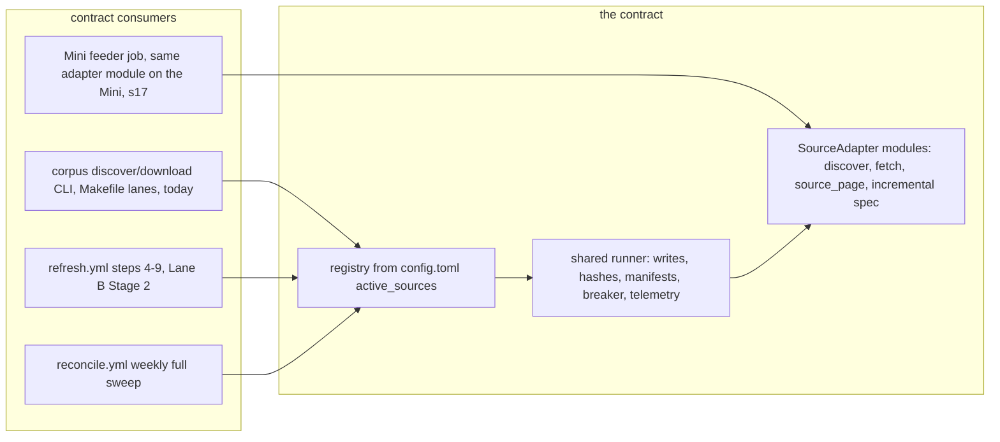

# Source Onboarding Pattern + Euronext Dublin Adapter: Stage 1 Spec

**Date:** 2026-07-19 (v1)
**Status:** Draft for council review (Codex xhigh required per doctrine), then Teal sign-off. Next after sign-off: Stage 2 branch plan, separate session.
**Owner:** Teal Emery. **Architect session:** Fable 5, Claude Code, per Project Shell Runbook v0.2 Stage 1.
**Linear:** wave-1 source batch to be minted on sign-off (roadmap section 9, item 2: Dublin adapter with dedup policy + ToS conclusion; ESMA PRIII adapter with archive routing; SGX via the Mini feeder lane).
**Grounding:** 2026-07-17 consolidation roadmap sections 7/11 (source ranking, live probes, dedup and ToS rulings); 2026-07-18 self-running-corpus spec v3.1 (the platform this plugs into); code read this session: `src/corpus/sources/{nsm,edgar,luxse,provenance}.py`, `src/corpus/cli.py` discover/download wiring, `config.toml`, `sql/001_corpus.sql`, `src/corpus/snapshot.py` filing_url path; live probes this session (2026-07-18/19, plain fetches, no bot-wall circumvention): Dublin bond directory page 200 with a bulk-download endpoint and `#dublin-issuer-list` widget visible, `?letter=K` returning no server-rendered rows, DOL URL 403 twice (details in section 7.1); interview with Teal 2026-07-19 (three decisions in section 3).

**BLUF:** One adapter contract, six seams (discovery, retrieval, provenance, incremental refresh, ledger wiring, per-source alarms), enforced by a registry, a shared runner, and a parametrized contract test suite, so that a new source is exactly: one module, one config block, one ToS line, one fixture set, one reference-data file if needed, and zero edits anywhere else. A synthetic toy source in the test suite proves that bar mechanically. Dublin instantiates the pattern first: allowlist-scoped discovery over the exchange directory, S3 document retrieval, a daily incremental signal (Daily Official List or directory diff, spike-decided), and the corpus-wide exact-dedup pass (SHA-256 hard key, one document with multi-venue listings) that the Lux/Dublin duopoly makes necessary. ESMA and SGX are validated against the contract on paper in this spec and become config-plus-one-module builds in their own turns. The how-to doc, written with Dublin as the worked example, makes the pattern the product.

## 1. The job and the users

The corpus stands at 9,795 documents across five sources (LuxSE 4,965; EDGAR 3,339; PDIP 823; NSM 665; LSE 3). Source expansion serves the repeat visitor whose country is not yet covered (the Janet He class of gap report), and Dublin is ranked first because it is the other half of the historic Lux/Dublin listing duopoly: likely new sovereigns none of the five sources hold (Albania, Armenia, Azerbaijan, Kenya confirmed on the live directory), heavy Turkiye quasi-sovereign and Gulf/Indonesia sukuk paper, plus every Lux/Dublin dual listing that LuxSE keyword discovery misses. The pattern, not the source, is the durable asset: ESMA (archive recovery), SGX (Asia coverage via the feeder), and later sources should each cost one module.

## 2. Locked decisions (inherited; built on, not reopened)

1. Wave 1 order: Dublin, then ESMA, then SGX on the Mini feeder (decided 2026-07-17/18).
2. Dedup: PDF SHA-256 is the only hard key. (canonical issuer + class + publication date) is a soft near-dup signal routed to review, never a uniqueness constraint. ISINs are a multi-valued attribute, never a dedup key.
3. Every source records a one-line ToS and reproduction-rights conclusion before its adapter ships. Fetch feasibility alone clears nothing.
4. ESMA backfill routes to the archive strip, never the new feed.
5. Platform invariants from the self-running spec v3.1: adapters return `skipped_exists` for known files and never re-fetch; skip decisions key on recorded source hashes, not local disk; content-addressed originals; watermarks advance only at state commit; per-source freshness alarms; quarantine never blocks a run; the Mini feeder is fetch-and-stage only (its section 17).
6. Ratified architecture decisions 2, 6, 7 (breadth within sovereign issuers; core table + JSON metadata; `{source}__{native_id}` storage keys, no country in paths) and the NSM lessons (two-phase discover/download; name-search false positives; circuit breakers tested; config read in the CLI layer).

## 3. Decisions made in the Stage 1 interview (2026-07-19)

1. **Dublin crawl perimeter: sovereign + linked SPVs.** Central governments plus sovereign sukuk SPVs and explicit state-linked quasi-sovereigns, via a curated allowlist built from one full directory sweep, classified once, committed as reference data. New issuers surfaced by the incremental signal route to review before joining the crawl. `issuer_type` tags per the existing schema (sovereign / quasi-sovereign / corporate).
2. **Exact-dup resolution: one document, multi-venue listings.** A SHA-256 match attaches a listing record to the incumbent document instead of minting a second document row. ISINs union across venues at the listing level. Forward-only: a one-time audit reports existing cross-source duplicate clusters, and no already-published document row is merged away in wave 1 (no published URL changes).
3. **Near-dup review lane: non-blocking advisory.** Candidates appear in the refresh PR body and a register section; both documents publish normally in the meantime; dispositions are batched into a committed decisions file the pipeline consults. A "duplicate" disposition demotes via `scope_status='excluded'` plus a listing row on the canonical document, so the page stays reachable and browse hides it (URL stability preserved).

## 4. Where the contract sits (consumers on both sides)



The contract is the seam the self-running spec's refresh.yml already assumes ("discover per source with incremental windows from state watermarks"). It must work in both worlds: the manual CLI/Makefile world that exists today (Dublin can build and backfill before refresh.yml exists) and the scheduled world when Lane B Stage 2 lands (Dublin joins `active_sources` and appears in refresh, register, health, and alarms with zero further edits). Feeder-staged sources run the same adapter module on the Mini; GHA consumes their `incoming/` output through the identical ingest path (self-running spec sections 9.5 and 17).

**Division of labor with Lane B, explicit:** this spec owns the contract, the registry, the runner, the dedup pass, and the Dublin adapter. Lane B owns the schedulers, state shuttle, register/health/alarm **evaluation**, and the feeder plumbing. The contract **declares** per-source register fields, health fields, and alarm thresholds; Lane B's builders iterate the registry to evaluate them. Either can land first; neither edits the other per new source.

## 5. The adapter contract

### 5.1 Shape: registry, descriptor, protocol, runner

- **Registry:** `config.toml` gains `[corpus] active_sources = ["nsm", "edgar", "pdip", "luxse", "dublin"]` (order = display order). The registry resolves each name to `corpus.sources.<name>` and validates it implements the protocol at startup. Adding a source appends one name and one config block.
- **Descriptor (config block per source),** extending the existing `[<source>]` convention:

```toml
[dublin]
display_name = "Euronext Dublin (GEM + MSM)"
cadence_class = "active-feed"      # active-feed | archive | feeder-staged
execution_venue = "gha"            # gha | feeder
feed_routing = "new-feed-eligible" # new-feed-eligible | archive-only
delay = 1.0
max_retries = 3
timeout = 60
[dublin.circuit_breaker]
total_failures_abort = 10
[dublin.alarms]                    # optional overrides of cadence-class defaults
```

- **Protocol (`src/corpus/sources/base.py`),** typed, minimal, names fixed here so Stage 2 is transcription:

```python
class SourceAdapter(Protocol):
    name: str
    def discover(self, ctx: DiscoveryContext) -> Iterator[DocRecord]: ...
    def fetch(self, record: DocRecord, ctx: FetchContext) -> FetchResult: ...
    def source_page(self, record: DocRecord) -> tuple[str | None, str]: ...
    incremental: IncrementalSpec
```

`DiscoveryContext` carries the HTTP client, source config, mode (`incremental` | `full`), the watermark window, and read-only access to reference data. `FetchResult` is a status plus optional `(bytes, ext)`. `DocRecord` is the manifest record formalized as a TypedDict: `source, native_id, storage_key, title, issuer_name, lei (optional), isins (list, may be empty), doc_type (raw source code), publication_date (optional), submitted_date (optional), download_url, file_ext, issuer_type (optional), source_metadata (dict)`. Dublin sets `issuer_type` from the allowlist; legacy shims omit it so existing DB defaults and behavior are unchanged. `IncrementalSpec` declares the source's cheap daily signal and its full-reconcile behavior (section 5.5).

- **Runner (`src/corpus/sources/runner.py`):** owns everything adapters currently copy-paste: existence checks against recorded manifests (never `target.exists()` alone; Gate 1 keys skips on recorded source hashes), safe_write to `data/original/` today and content-addressed originals under Lane B, SHA-256 hashing, manifest append, JSONL telemetry with real statuses (NSM lesson 7), the circuit breaker (failures count, skips never do; NSM lesson 5), per-source delay and rate-limit backoff, and discovery-output persistence. Adapters never write files and never sleep.
- **Status vocabulary, closed:** `downloaded | skipped_exists | skipped_no_url | skipped_no_document | failed_http | failed_invalid_content | rate_limited`. `skipped_no_document` generalizes NSM's `no_pdf_link` (a skip, not a failure). `rate_limited` triggers runner backoff per config, never the breaker.
- **Coverage honesty:** discovery must report `total_available` vs `total_captured` per query and log any cap or dropped page loudly. The register can only state "what we hold, what we know we lack" if adapters never truncate silently.

### 5.2 Discovery

`discover()` yields DocRecords; the runner persists the discovery JSONL (existing two-phase pattern kept: inspectable discovery, re-runnable download). Modes:

- `incremental`: driven by the source's IncrementalSpec signal and the watermark window. Must be cheap (a handful of requests).
- `full`: the complete sovereign-scoped sweep (backfill and the weekly reconcile cross-check).

Watermark semantics: the adapter receives a window (`since`), yields records, and reports a candidate new watermark (per-source meaning: EDGAR filing date, ESMA record timestamp, Dublin DOL date or directory-snapshot marker). The platform owns watermark storage (locally `data/config/watermarks.json`; under Lane B, inside the state revision) and advances it only at commit.

### 5.3 Retrieval

`fetch()` returns bytes plus extension or a skip/fail status. The runner validates content (`%PDF` magic for pdf ext; non-empty for html/txt), hashes, writes, appends the manifest record enriched with `file_path` (relative, lesson 11), `file_hash`, `file_size_bytes`. Retrieval must use only stable or refreshable URLs; if a source hands out expiring signed URLs (LuxSE's defect, issue #93), the adapter must re-derive a fresh URL at fetch time rather than persisting the signed form.

### 5.4 Provenance

`source_page()` is required and must return a **stable, human-facing deep link** (`filing_index | artifact_html | artifact_pdf | search_page | none`). The current `provenance.py` dict covers only edgar/nsm/pdip; LuxSE falls through to `COALESCE(source_page_url, download_url)` in the snapshot, which is how expiring signed URLs reached the site (issue #93). The contract moves resolution into the adapter protocol; `provenance.py` becomes a thin dispatcher over the registry with the legacy functions kept for the existing sources. Contract rule, enforced by test: `source_page()` never returns a URL with credential or expiry query material.

### 5.5 Incremental refresh (IncrementalSpec)

Each source declares:

- `signal`: how the daily run finds deltas cheaply (EDGAR: submissions recency; NSM: dated query; Dublin: DOL or directory diff, section 7; ESMA: Solr timestamp filter; SGX: feeder-side discovery).
- `reconcile`: what the weekly full sweep re-checks (full-window re-discovery per the self-running spec section 11; also the cross-check leg of the zero-finds alarm).
- Requirement: a new listing on the source is discoverable within one daily cycle for `active-feed` sources; `archive` sources run on the weekly lane only; `feeder-staged` sources run on the Mini's cadence and are observed via incoming-age.

### 5.6 Ledger and register wiring

Per-source register row fields the contract guarantees (Lane B's builder renders them): display name, cadence class, holdings count, last-ingest run id, known-gap notes (config-declared, e.g. "adapter pending"), quarantine count, dedup attestation count, near-dup pending count, ToS pointer (section 5.9). Health beacon fields per source (Lane B evaluates): last discovery success, last new document date, discovery outcome of the latest run. The adapter contributes outcomes through runner telemetry; it never writes the register itself.

### 5.7 Per-source alarms (declaration here, evaluation in Lane B)

Cadence-class defaults, overridable per source in `[<source>.alarms]`:

| Class | discovery-stale | zero-finds | other |
|---|---|---|---|
| active-feed | 3 days red | 21 consecutive zero-find days AND weekly reconcile also zero | standard |
| archive | 10 days red (weekly lane) | exempt (an archive source finding nothing new is normal) | backfill-complete flag in register |
| feeder-staged | n/a (GHA does not discover) | exempt | incoming/ age > 7 days red (self-running s14) |

This closes the gap the self-running spec left open for non-daily sources: ESMA must never page Teal for the crime of being an archive.

### 5.8 The dedup pass (lands with Dublin, corpus-wide mechanism)

**Hard key: SHA-256 of the document bytes. Nothing else is hard.**

- **New table `document_listings`** (generic, not source-specific, consistent with decision 6): `listing_id, document_id FK, source, native_id, storage_key UNIQUE(source, native_id), source_page_url, publication_date, isins JSON, is_primary, detected_at`. Every document gets its primary listing row at ingest; a one-time migration backfills primary rows for the existing 9,795 documents (mechanical INSERT..SELECT).
- **Ingest rule:** a new record whose `file_hash` matches an existing document attaches as a non-primary listing on that document (oldest `document_id` wins if several existing rows share the hash) and mints no document row. The manifest record persists on disk regardless (per-venue provenance is never discarded). Within a single ingest batch, records process in deterministic order (publication_date nulls-last, then storage_key) so the canonical pick is stable across re-runs.
- **ISINs:** union across a document's listings; listing-level `isins` is the multi-valued home (144A/RegS pairs share a document; base prospectuses are programme-level with many or zero).
- **Soft near-dup advisory:** after each ingest batch, pairs with equal normalized issuer (casefold, collapse whitespace), equal raw `doc_type`, equal non-null `publication_date`, and DIFFERENT hashes, not already dispositioned, are written to the register's near-dup section and the refresh PR body. Never blocks, never auto-suppresses. Once the vocabulary and issuer-canonicalization pilots land, the key upgrades to (canonical issuer + document class + date); until then this is explicitly the degraded approximation.
- **Decisions file:** `docs/coverage/dedup-decisions.jsonl`, committed, append-only: `{pair: [storage_key_a, storage_key_b], disposition: "distinct" | "duplicate", note, decided, by}`. Ingest consults it to silence dispositioned pairs. `corpus dedup apply` executes "duplicate" dispositions: newcomer demoted to `scope_status='excluded'` plus a listing row on the canonical (page stays live, browse hides it; interview decision 3).
- **One-time audit:** a read-only report of existing exact-hash clusters across the current corpus (expected: LuxSE-internal and LuxSE/PDIP overlaps), committed as `docs/coverage/duplicate-audit-<date>.md`. Informational in wave 1; feeds later curation. No retroactive merging.
- **Edge recorded:** if a monthly revalidation (self-running Gate 1) finds changed bytes at a non-primary listing's URL, that listing's venue copy has diverged; it routes to the near-dup advisory rather than the update path (the update path serves primary listings in v1).
- **Explorer surface:** none in wave 1. `also_listed` data is available for a later additive snapshot column (parquet contract is additive-only), and nothing here blocks or requires it.

### 5.9 The ToS gate (mechanically enforced)

`docs/sources.md`, one section per source: a one-line terms-of-use and reproduction-rights conclusion, the date, who concluded it, and a link to the source's terms page. A contract test fails if any name in `active_sources` lacks its section, so the gate is CI-enforced, not remembered. This build backfills the five existing sources' entries (EDGAR, NSM, PDIP, LuxSE, LSE; LuxSE's rides the Lane B spike conclusion if that lands first; Teal confirms wording). Dublin's entry lands in the spike PR before the adapter ships (section 7.1). The register row links each entry.

### 5.10 Feed routing

`feed_routing` declares whether a source's documents may ever appear in "new this month" surfaces: `new-feed-eligible` (Dublin: backfill items self-select out because those views key on publication date) or `archive-only` (ESMA, locked: even a 2026-dated ESMA record routes to the archive strip). The flag rides the manifest record into the DB (`source_metadata.feed_routing` in v1; Lane A's feed builder consumes it), so routing is data, not UI convention.

### 5.11 CLI

`corpus discover <source>` and `corpus download <source>` become registry-generic commands (source name validated against `active_sources`; existing flags preserved: `--discovery-file`, `--output-dir`, `--run-id`; new `--mode` and `--since` expose incremental windows). The four existing per-source command bodies (near-identical ~90-line blocks in `cli.py`) delegate to the shared runner; behavior parity locked by the existing CLI tests. `corpus source list` prints the registry with cadence, venue, routing, and ToS status (small, and it makes the registry inspectable).

### 5.12 Contract test suite (what makes one-module additions safe)

`tests/sources/test_contract.py`, parametrized over the registry: discovery fixtures parse to valid DocRecords (schema-checked); status vocabulary respected; circuit breaker fires (NSM lesson 8, generalized to every source forever); breaker ignores skips; `source_page()` returns stable URLs (no expiry material); discovery reports available-vs-captured; dedup attach path exercised with a fixture hash collision; ToS section present. Plus a **synthetic `toysource`** registered only in test config, with canned fixtures, proving end to end that a source needs exactly one module + config: the toysource test invokes the real CLI commands, the real runner, and the real ingest against fixtures with zero edits outside its module.

### 5.13 What a new source requires (the bar, exhaustively)

1. `src/corpus/sources/<name>.py` implementing the protocol.
2. One `[<name>]` config block and its name appended to `active_sources`.
3. One `docs/sources.md` ToS section.
4. `tests/sources/test_<name>.py` with recorded fixtures (the parametrized contract suite picks the source up automatically).
5. Reference data if the source needs scoping (e.g. Dublin's issuer allowlist).

And explicitly zero edits to: `cli.py`, the runner, register/health/alarm builders, `refresh.yml`, the snapshot builder, the schema. If onboarding source N+1 requires touching any of those, the contract failed and that is a defect, not a workaround.

## 6. Migration of the four existing adapters (shims, not rewrites)

nsm/edgar/pdip/luxse keep their working internals; each gains a thin protocol shim (a `discover`/`fetch`/`source_page` wrapper over the existing functions) so the registry, runner telemetry, contract tests, and generic CLI see five uniform sources. No behavioral rewrite, no re-download, no manifest format change (existing absolute `file_path` values stay; new writes are relative). The copy-paste CLI bodies collapse into delegation. This is deliberately the smallest change that makes the pattern total over the registry; deeper unification of adapter internals is not wave-1 work.

## 7. Dublin instantiation

### 7.1 Spike D0 (the first implementation task, before adapter code)

The memo's hour-one question plus what this session's probes added. Recorded findings, both sessions:

- 2026-07-17 (memo research pass): A-Z list server-rendered with sovereigns visible on letter pages; documents on an open S3 bucket (HTTP 206 `application/pdf` from a datacenter IP); DOL at `live.euronext.com/sites/default/files/statistics/dol/DOLYYYY-MM-DD.pdf` described as a predictable-URL daily PDF.
- 2026-07-18/19 (this session, plain fetches): the directory page returns 200 and embeds first-page issuer rows plus a bulk-download endpoint (`/en/markets/dublin/bonds/list/download?product_data=` and a "Directory List" download route) and a `#dublin-issuer-list` widget; `?letter=K` returned NO server-rendered rows (no Kenya in the HTML), implying the table body loads through a data endpoint; the DOL URL for 2026-07-17 returned 403 (S3-style AccessDenied, 111-byte XML) from two fetch shapes while the directory page fetched clean from the same client. A separate `govbonds/list` route exists.

Spike burn-downs, each with a recorded answer on the Linear issue:

1. **Directory discovery mechanism:** does the bulk-download endpoint return the full securities directory (issuer, security name, ISIN, market) to a plain scripted request? If yes it becomes the discovery backbone (one request beats 26 letter crawls). If not, capture the data endpoint behind the issuer table (one AJAX endpoint is fine per the no-Selenium rule; a headless-browser requirement is a STOP-and-report).
2. **Documents mechanism (the memo's hour-one question):** from an issuer or security row to its document PDFs: server-rendered tab or one AJAX endpoint; the native document id (the stable `native_id` candidate); the S3 URL shape; metadata fields available (title, type, date). Confirm S3 objects fetch from a datacenter-shaped client (memo probe says yes).
3. **DOL:** resolve the 403-vs-clean-probe conflict: exact URL pattern (date format, path), required headers, weekend/holiday behavior, and access from a hosted-runner IP. Confirm the PDF's new-admissions section is extractable. If DOL stays closed or brittle, the fallback incremental signal is a daily directory diff (fetch the directory, diff against the prior snapshot's security set, act on additions), which burn-down 1 may make one cheap request anyway.
4. **`govbonds/list`:** one look: does it list sovereign issues absent from `bonds/list`?
5. **Volume bound:** count securities and documents for two allowlist-shaped issuers (one sovereign, one sukuk SPV) to size the backfill and the per-day request budget.
6. **ToS read:** draft the one-line conclusion for `docs/sources.md` from Euronext's website terms; flag anything that constrains public rehosting for Teal's confirmation before the adapter PR.

Spike exit: all six answered with evidence, or a STOP-and-report naming what is blocked. Timebox one session.

### 7.2 Discovery design

- **Allowlist (interview decision 1):** one full directory sweep enumerates issuers; a one-time classification pass (name heuristics + LLM assist + hand check of the sovereign/quasi boundary) produces `src/corpus/reference/dublin_issuers.csv`: issuer name as listed, normalized key, `issuer_type` (sovereign | quasi-sovereign), country (ISO alpha-3, same vendored reference as elsewhere; do not worsen issue #80), status (`active | review | excluded`), evidence note. Committed, reviewed in the PR, and the single place the crawl perimeter lives.
- **Daily incremental:** the spike-chosen signal (DOL parse or directory diff) yields new/changed securities. Securities of allowlisted issuers route to targeted document discovery. Securities of UNKNOWN issuers that match sovereign-candidate heuristics (name patterns, sukuk markers) are flagged `review` in the register and PR body; they join the crawl only when the allowlist row flips to `active` (perimeter conservatism per the interview).
- **Weekly reconcile:** full directory sweep + full document re-list for allowlisted issuers (bounded: allowlist-only, not the exchange), which is also the zero-finds cross-check.
- **Backfill:** full document crawl for every `active` allowlist issuer, breadth within the perimeter (every document on their tabs, no type filter, ratified decision 2). Runs locally on the Mac/Mini with a recorded run id (the LuxSE April pattern); if Lane B's S3 cutover has happened first, the backfill lands as a state revision. The adapter is venue-agnostic so either order works.

### 7.3 Retrieval, provenance, identity

- Retrieval: direct GET of the S3-hosted PDF; `%PDF` validation; politeness delay 1.0s; low volume by design (diff-driven after backfill).
- `native_id`: the stable per-document identifier the spike pins down (document id from the documents endpoint, else a stable S3 object key). `storage_key = dublin__<native_id>`. Never an ISIN (multi-valued) and never a title hash.
- `source_page()`: the issuer or security page on `live.euronext.com` (stable, deep-linkable, kind `filing_index`). Never the S3 object as the human-facing link.
- `isins`: attached per record from the security rows the document appears under (a base prospectus attaches every ISIN it covers as discovery encounters them).
- `issuer_type` from the allowlist; countries mapped via the standard reference; sukuk SPV records carry the obligor sovereign in `document_countries` with the appropriate role and the linkage note in `source_metadata`.

### 7.4 Dedup expectations

The backfill is the first real exercise of section 5.8 at volume: every Lux/Dublin dual listing should attach as a listing, not a new document. Acceptance requires at least one real cross-venue pair attested (issuer chosen at spike time from confirmed dual listings) and the backfill report stating documents minted vs listings attached vs near-dup advisories raised.

### 7.5 Register, alarms, routing, config

`cadence_class = "active-feed"`, `execution_venue = "gha"` (memo probes: Dublin fetches clean from datacenter IPs; if the spike contradicts this from a hosted runner, Dublin flips to `feeder-staged` by config, which is exactly the flexibility the contract exists for), `feed_routing = "new-feed-eligible"`. Joins `active_sources` at adapter merge; joins refresh.yml's default source list only after the walking skeleton plus clean scheduled runs (Lane B's earn-your-way-in posture).

## 8. ESMA on paper (proof 1 of the config-plus-one-module bar)

- `discover`: Solr GETs against the ESMA PRIII register (`registers.esma.europa.eu/solr/...`, JSON to plain requests), windowed on the record timestamp fields (incremental is native). Full mode = the same query unwindowed.
- `fetch`: the PDF-download URL template, pinned by ESMA's own one-session spike (E0: one DevTools session, per the memo).
- `source_page`: the register record URL (stable, public).
- Config: `cadence_class = "archive"` (weekly lane, zero-finds exempt, backfill-complete flag), `execution_venue = "gha"`, `feed_routing = "archive-only"` (locked decision 4; even new-dated records route to the archive strip).
- Dedup posture: high expected overlap with LuxSE and PDIP (Egypt, Ghana, Kenya, Angola, Benin, Ukraine, Morocco, Senegal, Jordan verified in the register); the hard key absorbs exact duplicates as listings; yield is counted AFTER dedup, per the memo.
- ToS: EU public register, the cleanest posture surveyed; one line in `docs/sources.md` regardless.
- Cost check against section 5.13: one module, one config block, one ToS line, fixtures, no reference data expected. Zero platform edits identified.

## 9. SGX on paper (proof 2, the feeder-staged case)

- `execution_venue = "feeder"`: the same adapter module runs on the Mini via the self-running spec's section 17 contract (launchd job, fetch-and-stage only): `discover` against `api.sgx.com` (Akamai-blocked from datacenter IPs, confirmed; open from residential), `fetch` from `links.sgx.com` FileOpen URLs (probed open), writing content-addressed originals + manifest-fragment JSONL to `incoming/sgx/<run-ts>/`. GHA validates and ingests through the identical path (refresh.yml step 5, already specified; currently a no-op awaiting a feeder).
- `cadence_class = "feeder-staged"`: observed via incoming-age (> 7 days red), zero-finds exempt on the GHA side.
- Spike S0 (when its turn comes): endpoint shapes from the Mini, FileOpen URL stability, ToS line (SGX terms are stricter than EU registers; the ToS gate is load-bearing here, and "park" is an acceptable conclusion).
- Cost check: one module, one config block, one ToS line, fixtures, plus the first real feeder launchd job (Lane B's contract, built once, templated for later walled sources). Zero contract edits identified.

## 10. The how-to doc (the pattern as product)

`docs/how-to/add-a-source.md`, written WITH the Dublin build while it is fresh, using Dublin as the worked example end to end: ToS gate first, the spike shape, the five artifacts from section 5.13, contract hooks with Dublin code pointers, fixture recording, the contract test suite, register/alarm verification, dedup expectations, backfill etiquette, ship checklist. Lands as repo markdown in the Dublin PR; the Lane C docs site ingests it into the How-to quadrant unchanged. This closes the roadmap's "add a source adapter (Dublin as the worked example)" docs commitment.

## 11. Non-goals

1. **LSE/RNS completion** (TEA-1008, separate issue; proceeds with the rns-pdf note attached).
2. **DMO/restructuring-document hand-collection** (its own bounded issue per roadmap section 7).
3. **Building the vocabulary or issuer-canonicalization pilots** (Lane A; the near-dup key upgrades when they land, section 5.8).
4. **Retroactive dedup merging of the existing corpus** (audit report only; URL stability wins in wave 1).
5. **Explorer UI changes** (no "also listed on" surface yet; snapshot columns stay additive-later).
6. **Building refresh.yml, the state shuttle, register/health/alarm evaluation, or the feeder plumbing** (Lane B owns them; this spec only declares the per-source data they consume).
7. **Implementing ESMA or SGX** (paper-validated here; built in their own turns per the locked wave order, expected WITHOUT a new Stage 1 unless their spikes contradict this contract).
8. **Rewriting the four existing adapters' internals** (shims only, section 6).
9. **Any parser/Docling change** (Gate 0 is Lane B's).
10. **Selenium or headless browsers in any GHA lane** (ratified; a source that requires one routes to the feeder or parks).

## 12. Risks (each mitigated or accepted, in writing)

| # | Risk | Disposition |
|---|---|---|
| 1 | DOL URL 403s persist (this session) despite the memo's clean probe | Mitigated: spike burn-down 3 resolves it; the directory-diff fallback signal is designed in from the start; DOL is an optimization, not a dependency |
| 2 | The documents tab needs a real browser (violates no-Selenium) | Mitigated: spike answers hour one; STOP-and-report trigger; feeder venue exists as the escape hatch; park is acceptable |
| 3 | Euronext later walls datacenter IPs | Mitigated: `execution_venue` is config; Dublin flips to feeder-staged with zero code change |
| 4 | Allowlist misclassification (sukuk SPV missed, corporate included) | Mitigated: classification committed and PR-reviewed; new-issuer review lane; `issuer_type` filters downstream; misses fixable by one CSV row |
| 5 | Backfill volume larger than expected | Mitigated: spike burn-down 5 sizes it; politeness delays; local execution unconstrained by job caps |
| 6 | `document_listings` migration touches every existing row | Mitigated: additive table + mechanical backfill INSERT..SELECT; no existing column changes; tested on a DB copy first |
| 7 | Near-dup advisory noisy at backfill (degraded key) | Accepted: advisory is non-blocking by design; precision-first key (all three fields non-null); dispositions batchable |
| 8 | Two sources ingest the same bytes in one batch race (Dublin + LuxSE same day) | Mitigated: deterministic batch ordering; single-writer ingest (Lane B lock) |
| 9 | ISIN extraction incomplete (programme docs with many tranches) | Accepted: ISINs are an attribute, not a key; union improves over time; never blocks ingest |
| 10 | ToS conclusion unfavorable for a probed-clean source | Accepted by design: the gate exists precisely to park such a source before build effort compounds; SGX is the live candidate |
| 11 | Contract abstraction misfits a future source (e.g. OTC portal with no per-document ids) | Accepted: the bar is config-plus-one-module for ESMA and SGX specifically; a source that breaks the protocol gets a pivot memo, not a workaround |

## 13. Walking skeleton (slice 1)

Contract + registry + runner + shims landed with the toysource proving the bar; spike D0 dispositioned. Then one slice, run locally: Kenya (or the spike-chosen dual-listed sovereign) flows end to end: allowlist row active; incremental signal fetched and parsed (or full-mode fallback if the signal is still under spike); documents discovered with native ids and ISINs; PDFs fetched from the S3 host and validated; manifest written; ingest mints documents WITH primary listing rows; at least one real Lux/Dublin duplicate attaches as a non-primary listing instead of a new document; the near-dup advisory section renders (empty or populated); `corpus source list` shows dublin with ToS recorded; a local snapshot build serves the new document's text; the one-time duplicate audit report generates. Everything after (full backfill, remaining allowlist, refresh.yml membership, ESMA, SGX) is addition, not architecture.

## 14. Definition of done (whole build)

- Contract, registry, runner, shims, and contract test suite merged; toysource AC green; four existing sources pass the parametrized suite via shims; CLI parity locked.
- `docs/sources.md` exists with all five existing sources' one-line conclusions (Teal-confirmed) and the CI enforcement test on.
- Spike D0 dispositioned on its Linear issue with evidence for all six burn-downs.
- Dublin adapter merged behind the full checklist of section 5.13; allowlist committed with classification evidence.
- Walking skeleton executed with a real document and a real cross-venue attestation (links on the Linear issue).
- **Dublin backfill actually run** (not just built, NSM lesson 9): counts by issuer_type and country, minted-vs-attested-vs-advisory report, recorded run id.
- Dedup pass live: `document_listings` migrated and backfilled; decisions file + `corpus dedup apply` working; duplicate audit report committed.
- Register/health/alarm declarations in config consumed by whatever Lane B evaluation exists at merge time (or verified available to it by test if Lane B lands later).
- `docs/how-to/add-a-source.md` merged, written against the real Dublin build.
- ESMA and SGX paper checks (sections 8, 9) revisited post-Dublin: any contract friction recorded as a delta, or "holds as specified" recorded on the wave-1 Linear batch.
- Build metrics line per branch in `docs/build-metrics.md`.

## 15. Acceptance criteria (testable, when/then)

1. When `active_sources` gains `toysource` in test config with only its module, config block, ToS section, and fixtures present, then generic discover/download CLI, runner, ingest, and register-field exposure all work against fixtures with zero edits elsewhere (asserted by the toysource suite).
2. When any adapter's discovery hits a cap or drops a page, then the run log and discovery stats state available-vs-captured explicitly (no silent truncation).
3. When a fetched document's bytes hash-match an existing document, then no new document row is minted, a non-primary listing attaches to the oldest matching document, the manifest record persists, and the register's attestation count increments.
4. When the same batch contains two identical-hash records, then processing order (publication_date nulls-last, storage_key) makes the canonical pick deterministic across re-runs.
5. When issuer, raw doc_type, and non-null publication_date all match an existing document but hashes differ, then a near-dup advisory row appears in the register section and PR body, both documents remain published, and a dispositioned pair never re-surfaces.
6. When `corpus dedup apply` executes a "duplicate" disposition, then the newcomer's `scope_status` becomes `excluded`, a listing row lands on the canonical document, and the newcomer's page remains reachable.
7. When a source's section is missing from `docs/sources.md` while listed in `active_sources`, then the contract test suite fails.
8. When the Dublin incremental signal reports a new security for an allowlisted issuer, then its documents are discovered and fetched within that run; when the issuer is unknown but sovereign-shaped, then it appears in the review lane and is NOT crawled until its allowlist row is `active`.
9. When the Dublin backfill completes, then every document carries `issuer_type` from the allowlist, ISINs as a list, a stable `source_page_url` on `live.euronext.com`, and at least one real Lux/Dublin pair is attested (skeleton evidence).
10. When an `archive`-class source finds zero new documents for months, then no zero-finds alarm fires; when an `active-feed` source's discovery has not succeeded within its threshold, then its per-source alarm fires (evaluation in Lane B; thresholds and exemptions asserted from config here).
11. When ESMA is later built to this contract, then its records carry `feed_routing = "archive-only"` into the DB and no ESMA document appears in any new-feed surface regardless of its date.
12. When a source's `execution_venue` flips between `gha` and `feeder` in test config, then the adapter's discover and fetch behave identically through the runner (the venue is consumed only by platform launchers, never inside adapter modules).
13. When `source_page()` returns a URL for any source, then it contains no expiry or credential query material (contract test), and snapshot `filing_url` never falls back to a signed download URL for registry sources.
14. When ruff, pyright, and pytest run per CI, then all green including the new suite.

## 16. Explainer principles (adopted / skipped on purpose)

From `building-big-things.md`: walking skeleton (section 13); spikes before adapters (D0 burns down the riskiest unknown first; the memo's hour-one framing kept); modularity as the headline (the contract IS the module boundary; Gall's law: a working simple system, five uniform sources, before ESMA/SGX extend it); pre-mortem shape in section 12. Skipped: calendar estimates (dependency order only). From `writing-for-busy-readers.md`: BLUF, skim-test headings, tables for enumerables. `interface-design-for-small-data-tools.md`: skipped (no human interface in this build; the review lane rides existing PR/register surfaces by design).

## 17. Licensing and terms posture

The pipeline and contract stay MIT in the open repo. Per-source reproduction posture is exactly what section 5.9 institutionalizes: a recorded one-line conclusion per source before its adapter ships, backfilled for the five existing sources, CI-enforced thereafter. Dublin's conclusion is a spike deliverable gating its adapter PR; ESMA's is expected clean (EU public register); SGX's is expected to be the hardest and "park" is a legitimate outcome. Reference data committed to the repo (the Dublin allowlist) contains only facts (names, ISINs, classifications) with evidence notes.
